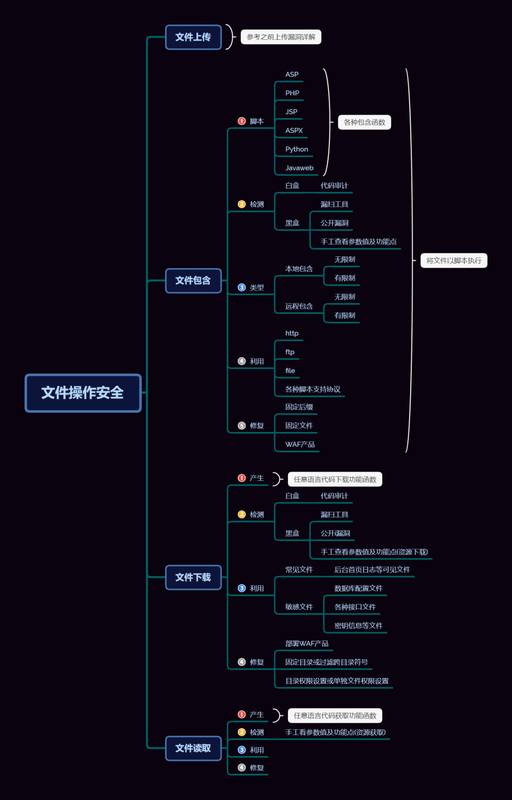

## 导图



### 漏洞判断

1.文件被解析，则是文件包含漏洞
2.显示源代码，则是文件读取漏洞
3.提示文件下载，则是文件下载漏洞

## 任意文件下载

### 漏洞介绍

一些网站由于业务需求，往往需要提供文件查看或文件下载功能，但若对用户查看或下载的文件不做限制，则恶意用户就能够**查看或下载任意敏感文件**，这就是文件查看与下载漏洞

### 漏洞产生原因

任意语言代码下载功能函数

### 漏洞检测

### 白盒检测

- 代码审计

  ### Javaweb 文件下载代码

  https://blog.csdn.net/Cheng_May/article/details/78600833

  ```javascript
  <%@ page language="java" import="java.util.*" pageEncoding="UTF-8"%>
  <%
  String path = request.getContextPath();
  String basePath =
  request.getScheme()+"://"+request.getServerName()+":"+request.getServerPort()+path+"/";
  %>
  <a href="/download/DownloadServlet?filename=1.jpg">文件下载</a>
  public void doGet(HttpServletRequest request, HttpServletResponse response)
  throws ServletException, IOException {
  response.setCharacterEncoding("UTF-8");
  //设置 ContentType 字段值
  response.setContentType("text/html;charset=utf-8");
  //获取所要下载的文件名称
  String filename = request.getParameter("filename");
  //下载文件所在目录
  String folder = "/filename/";
  //通知浏览器以下载的方式打开
  response.addHeader("Content-type", "appllication/octet-stream");
  response.addHeader("Content-Disposition", "attachment;filename="+filename);
  //通知文件流读取文件
  InputStream in = getServletContext().getResourceAsStream(folder+filename);
  //获取 response 对象的输出流
  OutputStream out = response.getOutputStream();
  byte[] buffer = new byte[1024];
  int len;
  //循环取出流中的数据
  while((len = in.read(buffer)) != -1){
  out.write(buffer,0,len);
  }
  }
  ```

  

### 黑盒检测

- 漏洞扫描工具

- 公开漏洞
- 手工查看参数值及功能点（资源下载）

### 一般链接形式

- download.php?path=
- download.php?file=

- down.php?file=

- data.php?file=

- readfile.php?file=

- read.php?filename=


### 包含参数

- &RealPath=
- &FilePath=
- &filepath=
- &Filepath=
- &Path=
- &path=
- &inputFile=
- &Inputfile=
- &url=
- &urls=
- &Lang=
- &dis=
- &data=
- &Data=
- &readfile=
- &filep=
- &src=
- &menu=
- META-INF
- WEB-INF

### 漏洞利用

任意文件下载漏洞的利用主要是为了信息收集，我们通过对服务器配置文件的下载，获取到大量的配置信息、源码，从而根据获取的信息来进一步挖掘服务器漏洞从而入侵。

**index.php?f=…/…/…/…/…/…/etc/passwd**

**index.php?f=…/index.php**

**index.php?f=file:///etc/passwd**

**readfile.php?file=/etc/passwd**

#### 常见文件

- 后台首页日志等可见文件

#### 敏感文件

- 数据库配置文件
- 各种接口文件
- 密钥信息等文件

### 常见的敏感文件路径

### Windows

C:\boot.ini //查看系统版本

C:\Windows\System32\inetsrv\MetaBase.xml //IIS配置文件

C:\Windows\repair\sam //存储系统初次安装的密码

C:\Program Files\mysql\my.ini //Mysql配置

C:\Program Files\mysql\data\mysql\user.MYD //Mysql root

C:\Windows\php.ini //php配置信息

C:\Windows\my.ini //Mysql配置信息

C:\Windows\win.ini //Windows系统的一个基本系统配置文件

### Linux

/root/.ssh/authorized_keys //如需登录到远程主机，需要到.ssh目录下，新建authorized_keys文件，并将id_rsa.pub内容复制进去

/root/.ssh/id_rsa //ssh私钥,ssh公钥是id_rsa.pub

/root/.ssh/id_ras.keystore //记录每个访问计算机用户的公钥

/root/.ssh/known_hosts //记录每个访问计算机用户的公钥

/etc/passwd //账户信息

/etc/shadow //账户密码文件

/etc/my.cnf //mysql配置文件

/etc/httpd/conf/httpd.conf //apache配置文件

/root/.bash_history //用户历史命令记录文件

/root/.mysql_history //mysql历史命令记录文件

/proc/mounts //记录系统挂载设备

/porc/config.gz //内核配置文件

/var/lib/mlocate/mlocate.db //全文件路径

/porc/self/cmdline //当前进程的cmdline参数

/usr/local/app/php5/lib/php.ini //PHP配置文件

## 漏洞修复

- 部罢WAF产品

- 过滤“.(点)”，使用户在url中不能回溯上级目录
- 正则严格判断用户输入参数的格式
- 配置限定文件访问范围，目录权限设置或单独文件权限设置

- 将下载区独立出来，放在项目路径外，给每个下载资源固定的URL，而不是所有的下载资源都是统一的URL：http://www.test.com/download?filename=文件名
- 净化数据：对用户传过来的文件名参数进行硬编码或统一编码，对文件类型进行白名单控制，对包含恶意字符或者空字符的参数进行拒绝。
- 任意文件下载漏洞也有可能是web所采用的中间件的版本低而导致问题的产生，例如ibm的websphere的任意文件下载漏洞，需更新其中间件的版本可修复。
- 要下载的文件地址保存至数据库中。
- 文件路径保存至数据库，让用户提交文件对应ID下载文件。
- 用户下载文件之前需要进行权限判断。
- 文件放在web无法直接访问的目录下。
- 不允许提供目录遍历服务。
- 公开文件可放置在web应用程序下载目录中通过链接进行下载。
- 记录文件下载日志。


## 任意文件读取

### 漏洞介绍

任意文件读取是属于文件操作漏洞的一种，一般任意文件读取漏洞可以读取配置信息甚至系统重要文件。

### 漏洞产生原因

任意语言代码读取功能函数

#### 文件读取函数

readfile()、file_get_contents()、fopen()中

$filename没有经过校验或者校验不合格

用户可控制变量读取任意文件，如/etc/passwd、./index.php、/config.ini

### 漏洞检测

手工查看参数值及功能点（资源下载）

### 漏洞利用

读取文件：配置文件（数据库，平台，各种敏感文件等）

### 漏洞修复


## 涉及案例：

### Pikachu-文件下载测试-参数

###  Zdns-文件下载真实测试-功能点

下在漏洞在哪里测?下载漏洞怎么判断存在
拿到下载文件的url, 再观察路径规律;然后再拿到你想下载的文件的ur,
根据url的规律，是否加密

### 小米路由器-文件读取真实测试-漏洞

### RoarCTF2019-文件读取真题复现-比赛

### 百度杯 2017 二月-Zone 真题复现-比赛拓展

爬虫扫描地址-分析参数名参数值-文件操作安全-对应脚本
修改提交方式测试-读取 WEB 配置文件 WEB-INF/web.xml
访问读取对应地址-访问读取 flag 对应 class 文件-
（WEB-INF/classes/com/wm/ctf/FlagController.class）

### 涉及资源：

https://www.seebug.org/vuldb/ssvid-98122
https://www.ichunqiu.com/battalion?t=1&r=57475
https://blog.csdn.net/Cheng_May/article/details/78600833
https://buuoj.cn/challenges#%5BRoarCTF%202019%5DEasy%20Java