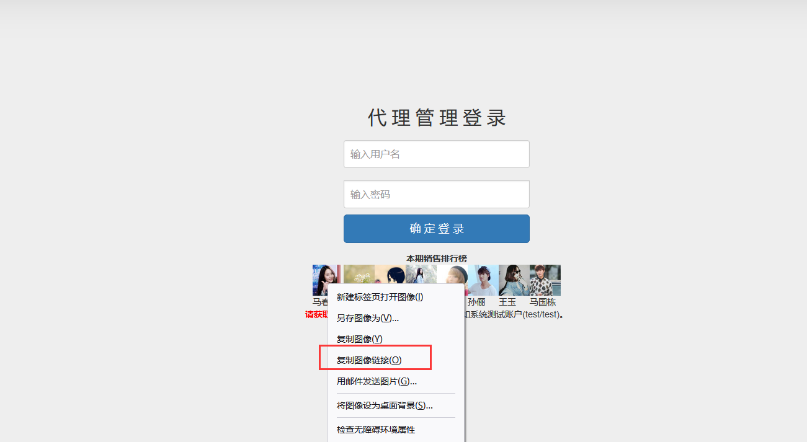

### 导图


### 越权漏洞

越权访问（Broken Access Control，简称BAC）是Web应用程序中一种常见的漏洞，由于其存在范围广、危害大，被OWASP列为Web应用十大安全隐患的第二名。

　　该漏洞是指应用在检查授权时存在纰漏，使得攻击者在获得低权限用户账户后，利用一些方式绕过权限检查，访问或者操作其他用户或者更高权限。**越权漏洞的成因主要是因为开发人员在对数据进行增、删、改、查询时对客户端请求的数据过分相信而遗漏了权限的判定。**在实际的代码审计中，这种漏洞往往很难通过工具进行自动化监测，因此在实际应用中危害很大。其与未授权访问有一定差别，目前存在着两种越权操作类型，横向越权操作（水平越权）和纵向越权操作（垂直越权）


### 水平越权

指相同权限下不同的用户可以互相访问

#### 测试方法：

主要通过看看能否通过A用户操作影响到B用户

### 垂直越权

指使用权限低的用户可以访问到权限较高的用户

#### 测试方法：

看看低权限用户是否能越权使用高权限用户的功能，比如普通用户可以使用管理员的功能。

### 漏洞产生原理：

#### 前端安全造成：界面

判断用户等级后，代码界面部分进行可选显示

#### 后端安全造成：数据库

user 表(管理员和普通用户同表)
id,username,password,usertype
1,admin,123456,1
2,xiaodi,11111,2

#### 登录用户 admin 或 xiaodi 时，代码是如何验证这个级别？（usertype 判断）

如果在访问数据包中有传输用户的编号、用户组编号或类型编号的时候，那么尝试对这个值进行修改，就是测试越权漏洞的基本。

### 修复防御方案

1.前后端同时对用户输入信息进行校验，双重验证机制
2.调用功能前验证用户是否有权限调用相关功能
3.执行关键操作前必须验证用户身份，验证用户是否具备操作数据的权限
4.直接对象引用的加密资源 ID，防止攻击者枚举 ID，敏感数据特殊化处理
5.永远不要相信来自用户的输入，对于可控参数进行严格的检查与过滤

### 演示案例：

### Pikachu-本地水平垂直越权演示（漏洞成因） 

#### 水平越权


更改username lucy——>kobe   


#### 垂直越权

##### 前提条件:获取的添加用户的数据包

1.普通用户前端有操作界面可以抓取数据包
2.通过网站源码本地搭建自己去模拟抓取
3.盲猜


**管理员账户：admin**

**普通用户：pikachu**

管理员账户界面


普通账户界面


抓取admin添加账户的包，并且更改为普通用户pikachu的phpsession


放包后，在刷新普通用户界面，出现添加账户


查看代码


数据库表


### 墨者水平-身份认证失效漏洞实战（漏洞成因）



马春生图片链接

http://124.70.64.48:47325/static/img/20128880316.jpg

登录test账户，抓包

```txt
GET /user_info.php HTTP/1.1
Host: 124.70.64.48:47325
User-Agent: Mozilla/5.0 (Windows NT 10.0; Win64; x64; rv:98.0) Gecko/20100101 Firefox/98.0
Accept: text/html,application/xhtml+xml,application/xml;q=0.9,image/avif,image/webp,*/*;q=0.8
Accept-Language: zh-CN,zh;q=0.8,zh-TW;q=0.7,zh-HK;q=0.5,en-US;q=0.3,en;q=0.2
Accept-Encoding: gzip, deflate
Referer: http://124.70.64.48:47325/index.php?a=login
Connection: close
Cookie: PHPSESSID=2a14ujvvjk9puum9qvpelkaae2; uid=test; mid=6927071f788211ee17211be0b89ef1e6
Upgrade-Insecure-Requests: 1
Cache-Control: max-age=0


```

```txt
GET /json.php?card_id=20128880322 HTTP/1.1
Host: 124.70.64.48:47325
User-Agent: Mozilla/5.0 (Windows NT 10.0; Win64; x64; rv:98.0) Gecko/20100101 Firefox/98.0
Accept: */*
Accept-Language: zh-CN,zh;q=0.8,zh-TW;q=0.7,zh-HK;q=0.5,en-US;q=0.3,en;q=0.2
Accept-Encoding: gzip, deflate
Connection: close
Referer: http://124.70.64.48:47325/user_info.php
Cookie: PHPSESSID=2a14ujvvjk9puum9qvpelkaae2; uid=test; mid=6927071f788211ee17211be0b89ef1e6
Cache-Control: max-age=0
```


card_id 存在水平越权漏洞

获取到
card_id=20128880316的数据

```txt
getProfile({"card_id":"20128880316",
"user":"m233241",
"password":"71cc568f1ed55738788751222fb6d8d9",
"email":"hhh222@gmail.com","tel":"13922137899",
"login_ip":"110.21.43.66",
"name_uid":"520181197603155771"})  

密码形式：观察应该是md5加密

md5查询：
71cc568f1ed55738788751222fb6d8d9
9732343
```

根据账号密码，尝试登录，获取到key（一个个遍历尝试也行，如果没发现图片的id）


### 越权检测-小米范越权漏洞检测工具（工具使用）

### 越权检测-Burpsuite 插件 Authz 安装测试（插件使用）

### 涉及资源：

[https://github.com/ztosec/secscan-authcheck](https://github.com/ztosec/secscan-authcheck)
[http://pan.baidu.com/s/1pLjaQKF](http://pan.baidu.com/s/1pLjaQKF) (privilegechecker)
[https://www.mozhe.cn/bug/detail/eUM3SktudHdrUVh6eFloU0VERzB4Zz09bW96aGUmozhe](https://www.mozhe.cn/bug/detail/eUM3SktudHdrUVh6eFloU0VERzB4Zz09bW96aGUmozhe)