### 导图

### 登录应用功能点安全问题

检测功能点，检测，危害，修复方案等
1.登录点暴力破解
2.HTTP/HTTPS 传输
3.Cookie 脆弱点验证
4.Session 固定点测试
5.验证密文比对安全测试

### 数据篡改安全问题

原理，检测，危害，修复等
参考：https://www.secpulse.com/archives/67080.html

### 商品购买流程：

选择商品和数量->选择支付及配送方式->生成订单编号->订单支付选择->完成支付

### 常见篡改参数：

商品编号 ID，购买价格，购买数量，支付方式，订单号，支付状态等

### 常见修改方法：

替换支付，重复支付，最小额支付，负数支付，溢出支付，优惠券支付等
6000 大米测试产品
/index.php?m=Member&a=gobuy&iscart=0&id=127&name=%E5%A4%A7%E7%B1%B3%E6%B5%8B%E8%
AF%95%E4%BA%A7%E5%93%81&qty=1&price=6000&gtype=%E7%81%B0%E8%89%B2&pic=/Public/Uplo
ads/thumb/thumb_1393218295.jpg
5400 大米手机 cms
/index.php?m=Member&a=gobuy&iscart=0&id=70&name=%E5%A4%A7%E7%B1%B3%E6%89%8B%E6%9
C%BACMS&qty=2&price=5400&gtype=%E7%81%B0%E8%89%B2&pic=/Public/Uploads/thumb/thumb_13
93218295.jpg
index.php?s=/wap/pay/wchatQrcodePay 微信支付
index.php?s=/wap/pay/alipay 支付宝支付
index.php?s=http://www.xiaodi8.com/alipay 调用其他的支付接口
$pay_name=$_GET['s'];

6000 是存储到数据库里，**安全的做法：以数据库的数据值为准**

### 演示案例：

### HTTP/HTTPS 协议密文抓取

http    账号密码一般采用明文传输

https  账号密码一般采用加密形式进行传输

### 后台登录帐号密码爆破测试

字典很重要！

密码采用md5加密

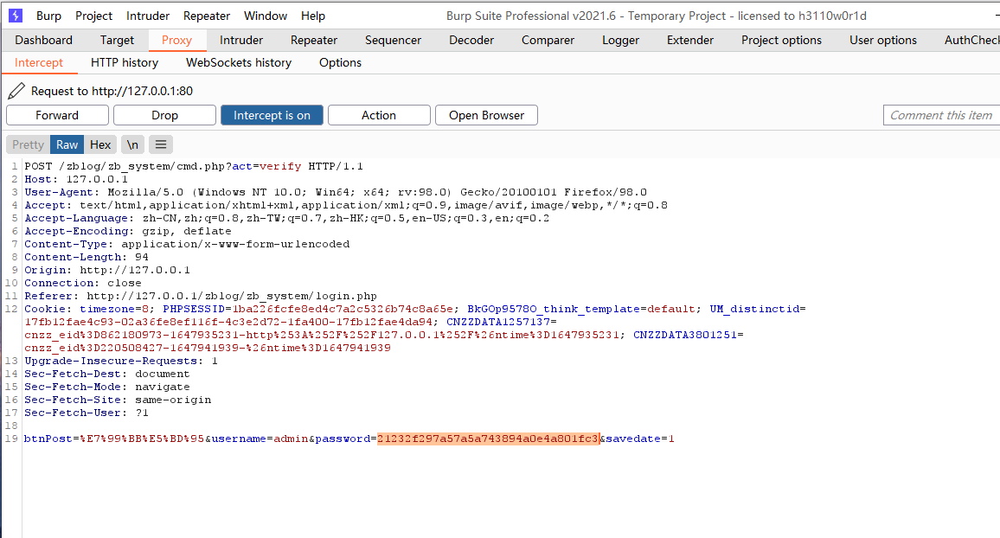

暴力破解的时候要先把字典转换成md5形式

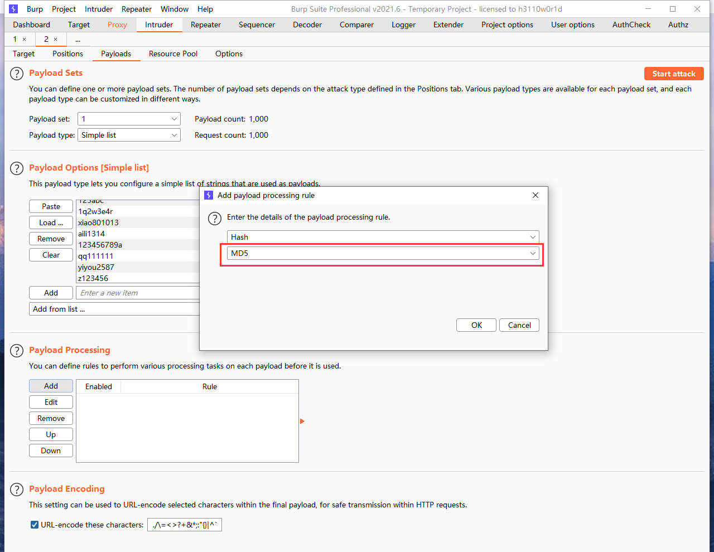

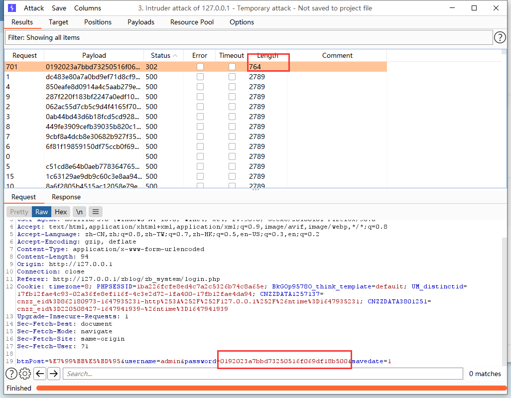

### Cookie 脆弱点验证修改测试

代码审计

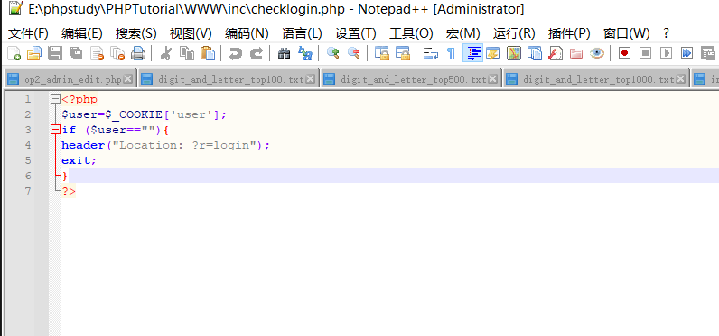

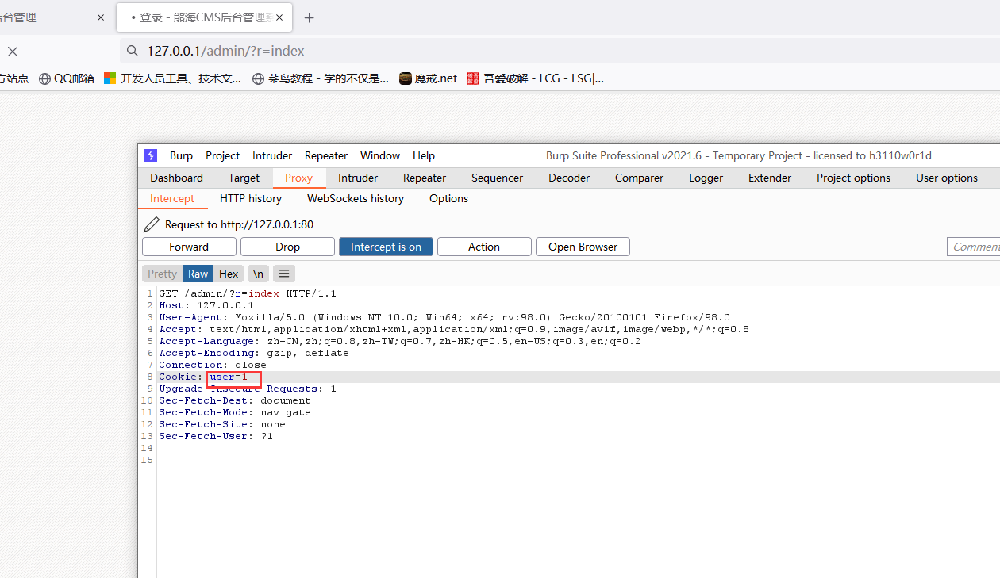

直接进入后台

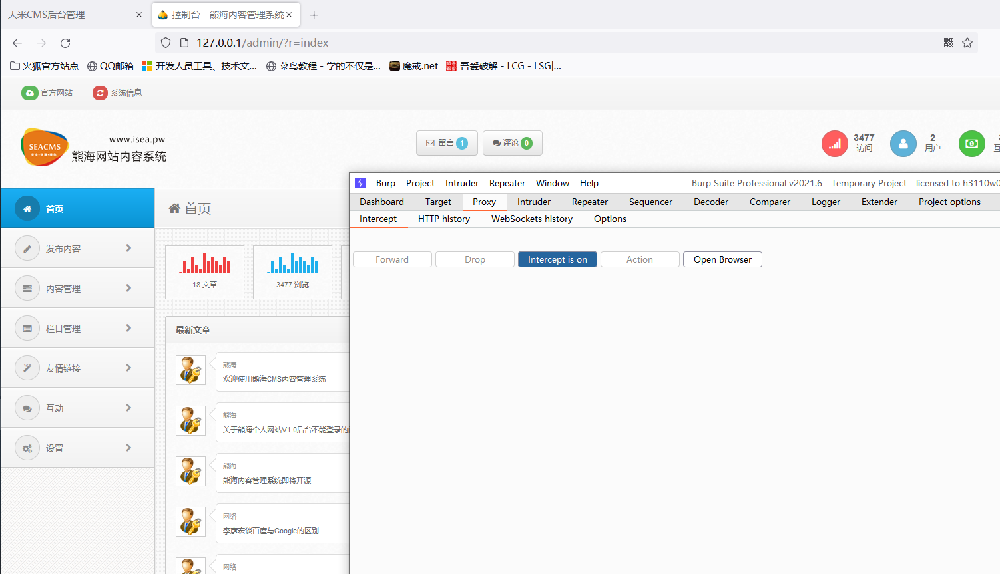

实战中如果没有源码，cookie很难突破

### 某商场系统商品支付逻辑测试-数量,订单

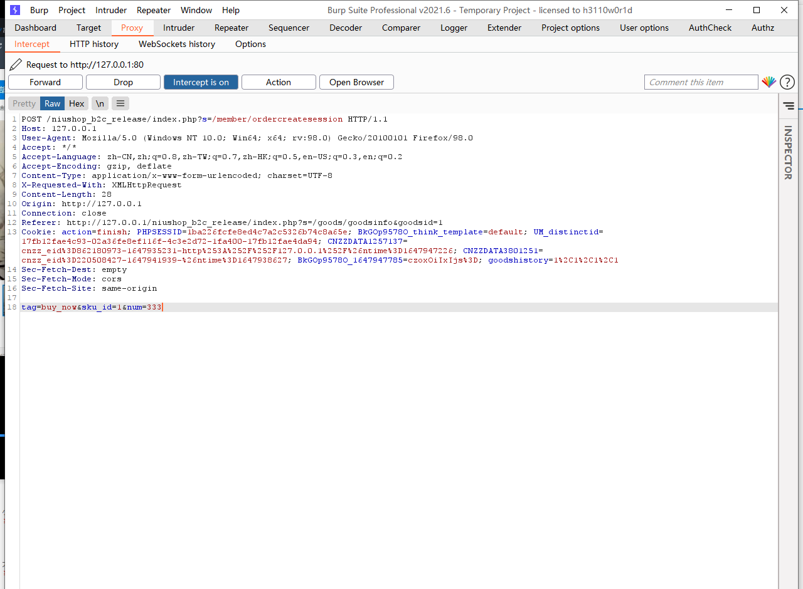

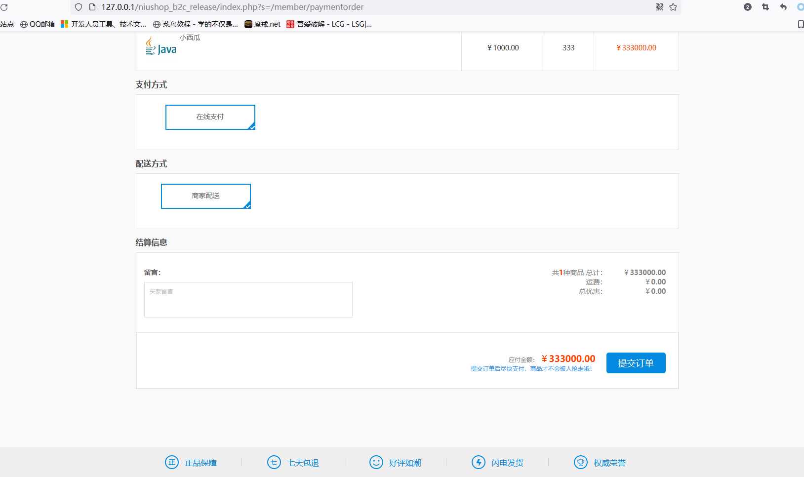

修改数量

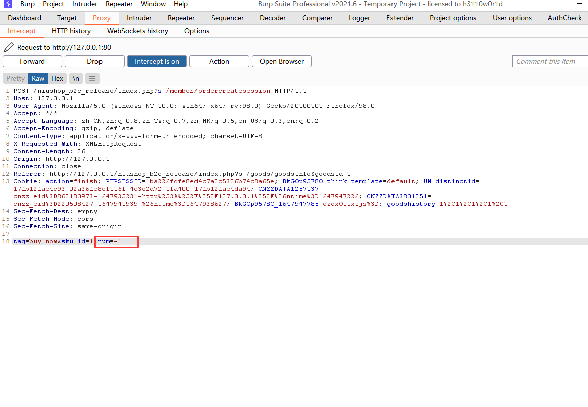

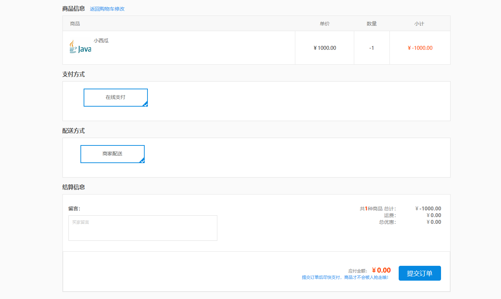

更换订单号，也可以花1000的钱买10000的商品

### 某建站系统商品支付逻辑测试-价格,商品

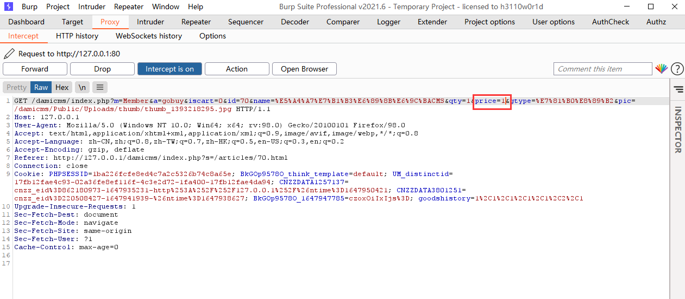

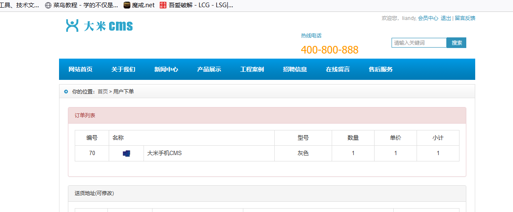

更改商品id和name

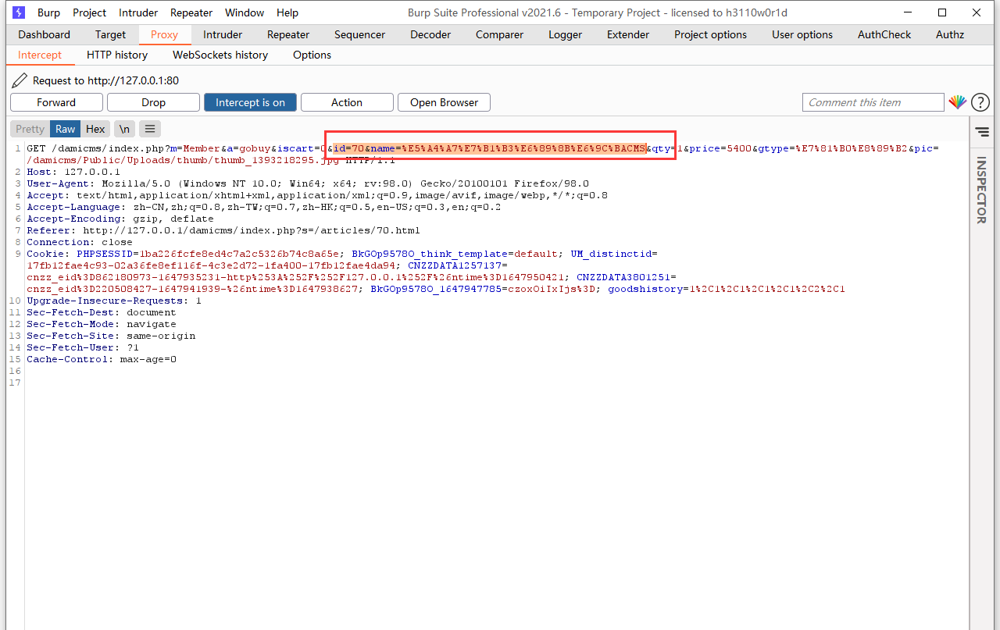

以5400的价格买到6000的商品

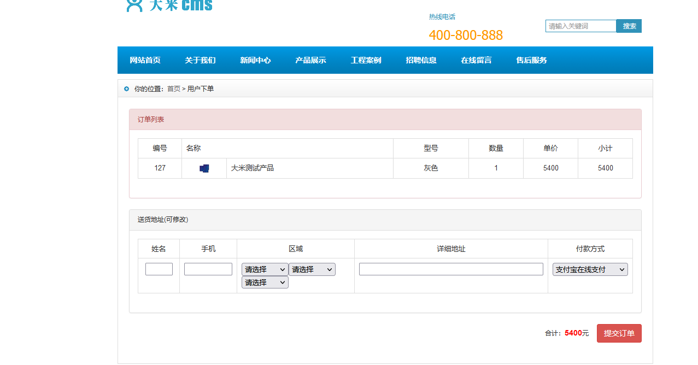

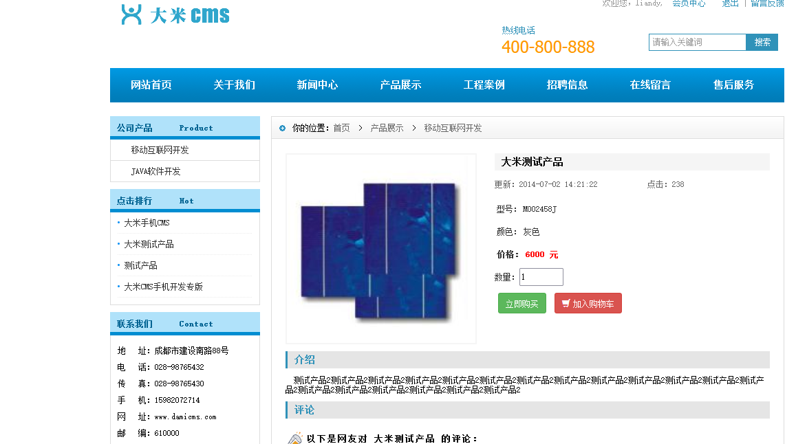

**安全的做法：以数据库的数据值为准**

### 涉及资源：

https://www.zblogcn.com/zblogphp/
https://github.com/huyuanzhi2/password_brute_dictionary
https://pan.baidu.com/s/1fJaW23UdcXcSFigX0-Duwg 提取码：xiao
https://pan.baidu.com/s/1fJaW23UdcXcSFigX0-Duwg 提取码：xiao