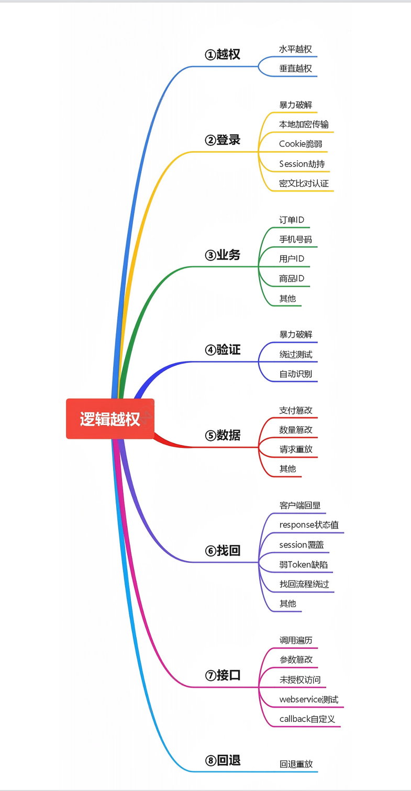

## 导图

## 验证码安全

分类：图片，手机或邮箱，语音，视频，操作等
原理：验证生成或验证过程中的逻辑问题
危害：账户权限泄漏，短信轰炸，遍历，任意用户操作等
漏洞：客户端回显(已讲)，验证码复用，验证码爆破(已讲)，绕过等

## token 安全

基本上述同理，主要是验证中可存在绕过可继续后续测试
token 爆破，token 客户端回显等
#验证码识别插件工具使用
captcha-killer，Pkav_Http_Fuzz,reCAPTCHA 等

## 接口安全问题

调用，遍历，未授权，篡改等
调用案例：短信轰炸
遍历案列：UID 等遍历
callback 回调 JSONP
参数篡改：墨者靶场

## 水平越权：

xiaodi uid=10
1-1000 尝试能不能获取到其他编号对应的用户信息

## 未授权访问：

与越权漏洞区别
Jboss 未授权访问
Jenkins 未授权访问
ldap 未授权访问
Redis 未授权访问
elasticsearch 未授权访问
MenCache 未授权访问
Mongodb 未授权访问
Rsync 未授权访问
Zookeeper 未授权访问
Docker 未授权访问

## 更多细节见笔记文档打包的 PDF

Web 攻防之业务安全实战指南
未授权访问漏洞集合带环境及解题

## 涉及案例：

## 验证码识别插件及工具操作演示-实例

[爆破验证码 PKav HTTP Fuzzer+captcha-killer](https://www.cnblogs.com/sunny11/p/14357016.html)

###  PKav HTTP Fuzzer

找到带验证码的后台，复制验证码的路径到工具，测试验证码识别效果。

### captcha-killer

### 

### 验证码绕过本地及远程验证-本地及实例

#### pikachu本地靶场

**client**

-本地验证-该验证码根本与服务端没有交互（前端验证）-->直接抓包，bp代理绕过

**server**

验证码没有修改的情况下， 输入不同的用户名和密码出现如下图所示

存在验证码重用 

错误的账号密码

正确的账号密码

### Token 客户端回显绕过登录爆破演示-本地

客户端访问服务器, 服务器返回一个签名的token给客户端, 服务器和客户端各自保存token

以后每次请求服务器都会携带token

token的主要作用:

​      1 防止表单重复提交

​      2 身份验证

### 某 URL 下载接口 ID 值调用遍历测试-实例

xiaodi uid=10
1-1000 尝试能不能获取到其他编号对应的用户信息

### Callback 自定义返回调用安全-漏洞测试-实例

比如支付之后，如何确定你是否支付了呢？

微信登录回调确认是否登录

### 补：上述在实战中如何做到漏洞发现-bp 功能点

## 涉及资源：

https://www.lanzous.com/i1z2s3e
https://www.cnblogs.com/nul1/p/12071115.html
https://github.com/c0ny1/captcha-killer/releases/tag/0.1.2
https://github.com/bit4woo/reCAPTCHA/releases/tag/v1.0

