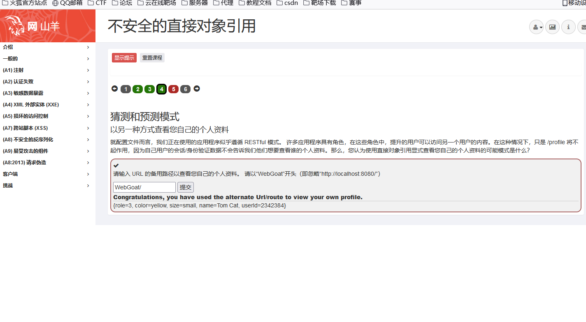
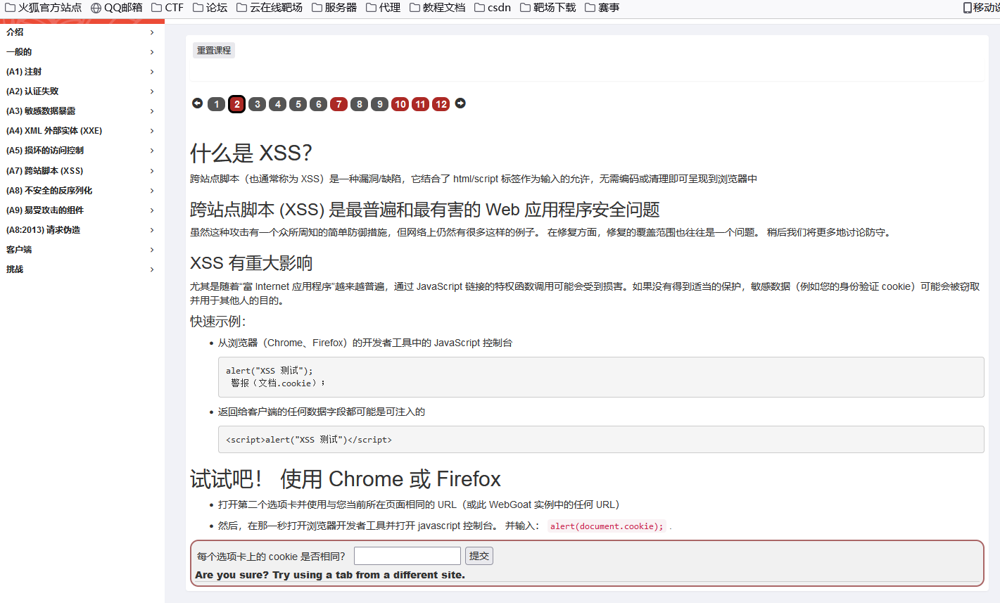
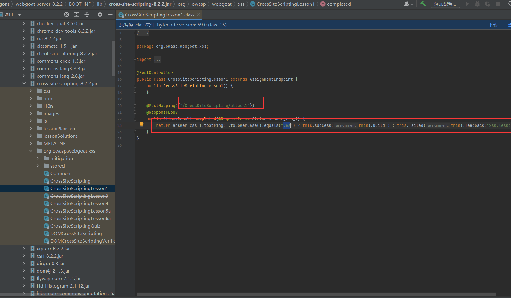

## 前言

注重代码分析，熟悉 javaweb 开发结构，掌握 javaweb 代码审计流程，其次才是相关漏洞解释（因前期漏洞原理已基本讲解完毕），通过本次直播大家务必学会分析相关代码路径，结构，框架等知识点。

### 思维导图


## 知识点


```txt
#文件上传配合目录遍历覆盖-文件自定义文件存储地址-基于用户名存储问题
#代码解析及框架源码追踪：
第一关：
Payload: ../x
第二关：
Payload: ....//x
```


```txt
#不安全登录 Insecure Login-基于前端认证
#熟悉代码结构及硕源代码文件
#访问控制对象-逻辑越权
#代码分析过关逻辑
枚举用户参数对应数据库的其他数据信息
role,userid
通过参数值构造 URL 获取用户更多的信息
WebGoat/IDOR/profile/2342384
```


```txt
**#XSS 跨站
代码分析结合页面解释过关
```


```txt
#核心知识点：Java 代码分析 === Apk_App 分析
模块引用（框架,自带等），路由地址，静态文件（html.js 等）,简易代码理解等
```


## 演示案例：

### Javaweb 代码分析-目录遍历安全问题

#### less-1


抓包查看路径


#### less-2


### Javaweb 代码分析-前端验证安全问题

登录


抓包


查看源码


检查输入的账号&密码是否等于CaptainJack&BlackPearl等于就返回成功，否者失败！

```java
        return username.toString().equals("CaptainJack") && password.toString().equals("BlackPearl") ? this.success(this).build() : this.failed(this).build();

```


```java
	var _0xb7f9=["\x43\x61\x70\x74\x61\x69\x6E\x4A\x61\x63\x6B","\x42\x6C\x61\x63\x6B\x50\x65\x61\x72\x6C","\x73\x74\x72\x69\x6E\x67\x69\x66\x79","\x73\x65\x6E\x64"];xhttp[_0xb7f9[3]](JSON[_0xb7f9[2]]({username:_0xb7f9[0],password:_0xb7f9[1]}))

```


使用CaptainJack&BlackPearl登录


### Javaweb 代码分析-逻辑越权安全问题

#### less-1


```Java
String[] diffAttribs = attributes.split(",");
```

```java
            return (!diffAttribs[0].toLowerCase().trim().equals("userid") || !diffAttribs[1].toLowerCase().trim().equals("role")) && (!diffAttribs[1].toLowerCase().trim().equals("userid") || !diffAttribs[0].toLowerCase().trim().equals("role")) ? this.failed(this).feedback("idor.diff.failure").build() : this.success(this).feedback("idor.diff.success").build();

```

可以观察到只有5个属性，只有role 和userid是隐藏未显示的属性，且代码进一步验证,输入role,userid 即可


#### less-2


直接抓包看看源码


WebGoat/IDOR/profile/2342384



### Javaweb 代码分析-XSS 跨站安全问题



抓包


看源码



```java
        return answer_xss_1.toString().toLowerCase().equals("yes") ? this.success(this).build() : this.failed(this).feedback("xss.lesson1.failure").build();

```

直接输入yes即可


#### less-2


查看源码


```java
public class CrossSiteScriptingLesson5a extends AssignmentEndpoint {
    public static final Predicate<String> XSS_PATTERN = Pattern.compile(".*<script>(console\\.log|alert)\\(.*\\);?</script>.*", 2).asMatchPredicate();
    @Autowired
    UserSessionData userSessionData;

    public CrossSiteScriptingLesson5a() {
    }

@GetMapping({"/CrossSiteScripting/attack5a"})
    @ResponseBody
    public AttackResult completed(@RequestParam Integer QTY1, @RequestParam Integer QTY2, @RequestParam Integer QTY3, @RequestParam Integer QTY4, @RequestParam String field1, @RequestParam String field2) {
        if (XSS_PATTERN.test(field2)) {
            return this.failed(this).feedback("xss-reflected-5a-failed-wrong-field").build();
        } else {
            double totalSale = (double)QTY1 * 69.99D + (double)QTY2 * 27.99D + (double)QTY3 * 1599.99D + (double)QTY4 * 299.99D;
            this.userSessionData.setValue("xss-reflected1-complete", "false");
            StringBuffer cart = new StringBuffer();
            cart.append("Thank you for shopping at WebGoat. <br />Your support is appreciated<hr />");
            cart.append("<p>We have charged credit card:" + field1 + "<br />");
            cart.append("                             ------------------- <br />");
            cart.append("                               $" + totalSale);
            if (this.userSessionData.getValue("xss-reflected1-complete") == null) {
                this.userSessionData.setValue("xss-reflected1-complete", "false");
            }

            if (XSS_PATTERN.test(field1)) {
                this.userSessionData.setValue("xss-reflected-5a-complete", "true");
                return field1.toLowerCase().contains("console.log") ? this.success(this).feedback("xss-reflected-5a-success-console").output(cart.toString()).build() : this.success(this).feedback("xss-reflected-5a-success-alert").output(cart.toString()).build();
            } else {
                this.userSessionData.setValue("xss-reflected1-complete", "false");
                return this.failed(this).feedback("xss-reflected-5a-failure").output(cart.toString()).build();
            }
        }
    }
```


 继续绕过xss过滤即可


### 拓展-安卓 APP 反编译 JAVA 代码（审计不香吗？）

打开decompileApk.cmd,然后把apk拖进cmd界面就行。


idea查看源码（打不开的话右键添加为库）


apk数据提取

## 涉及资源：

[https://pan.baidu.com/s/19-w0GeDVYvHH6yRz9cNpGw 提取码：oms7](https://pan.baidu.com/s/19-w0GeDVYvHH6yRz9cNpGw 提取码：oms7)


