## 导图

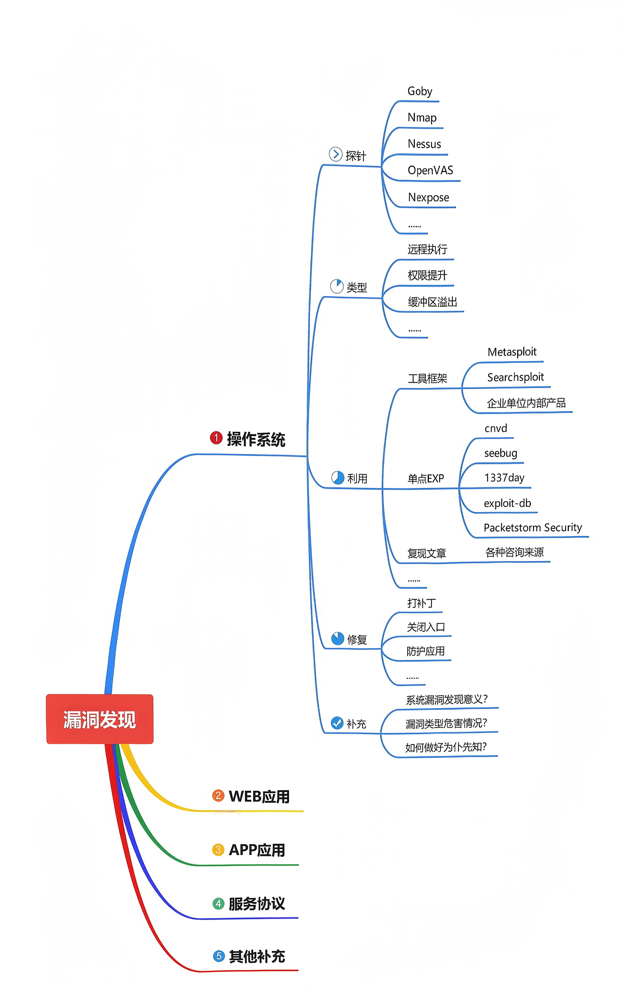

## 补充

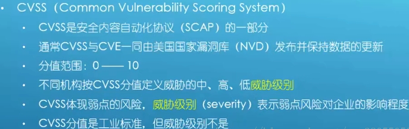

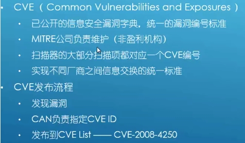

#### 系统漏洞发现意义?

目标（网站或者应用）寄生在服务器上面，（抛开网站本身网站的安全本身不说），如果服务器系统存在漏洞，且能够通过操作系统漏洞的危害获取权限或者信息，能够帮助你得到网站或者应用的权限。可以帮助你对目标进行安全测试！

#### 漏洞类型危害情况?

漏洞有各种各样，有可以提权的，也有可能是触发蓝屏的，

许多漏洞是有前提的，所以需要了解漏洞的种类、类型！

#### 如何做好为仆先知?

提前预知，可能存在安全问题存在哪里，需要大量的经验！

## 演示案例：

###  漏洞扫描工具演示-Goby,Nmap,Nessus(操作)

#### #Goby,Nmap,Nessus

Goby 忍者系统测试

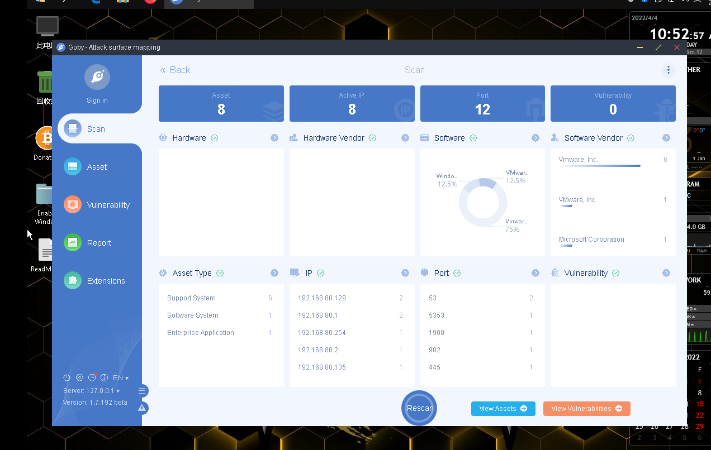

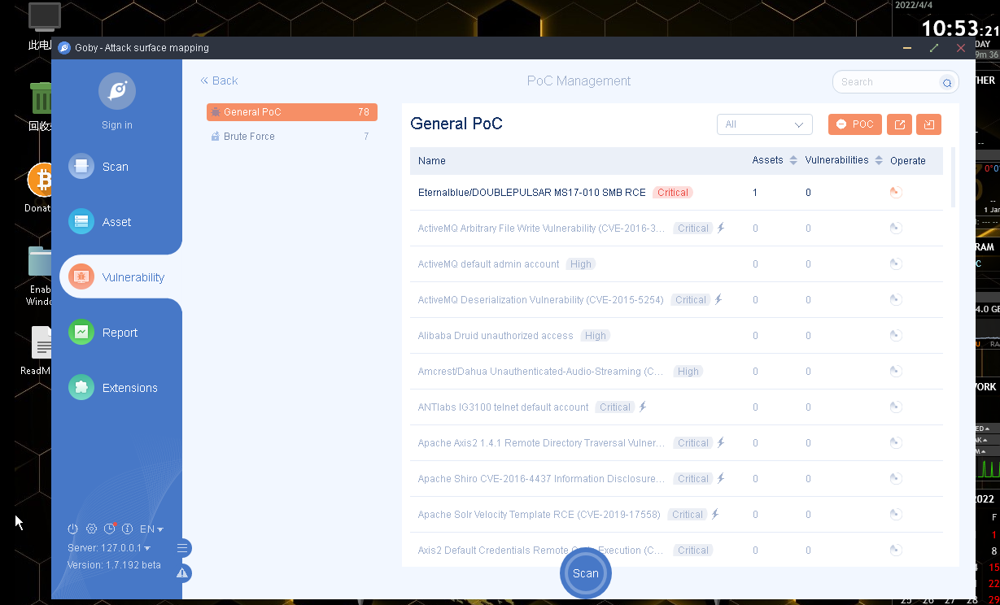

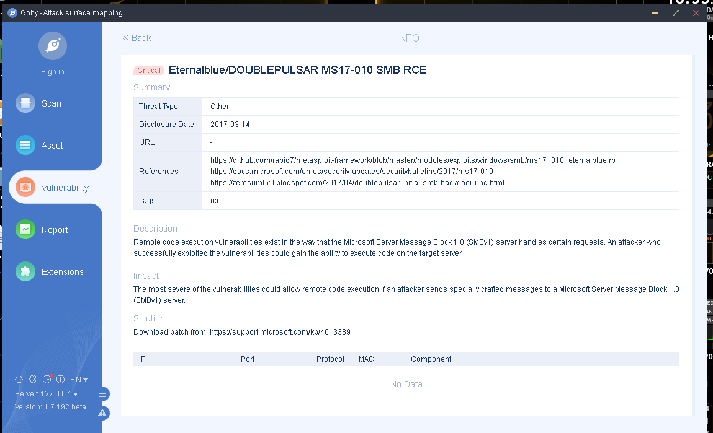

Nmap --script=vuln 默认 nse 插件
Nmap vulscan vulners 调用第三方库探针
https://www.cnblogs.com/shwang/p/12623669.html

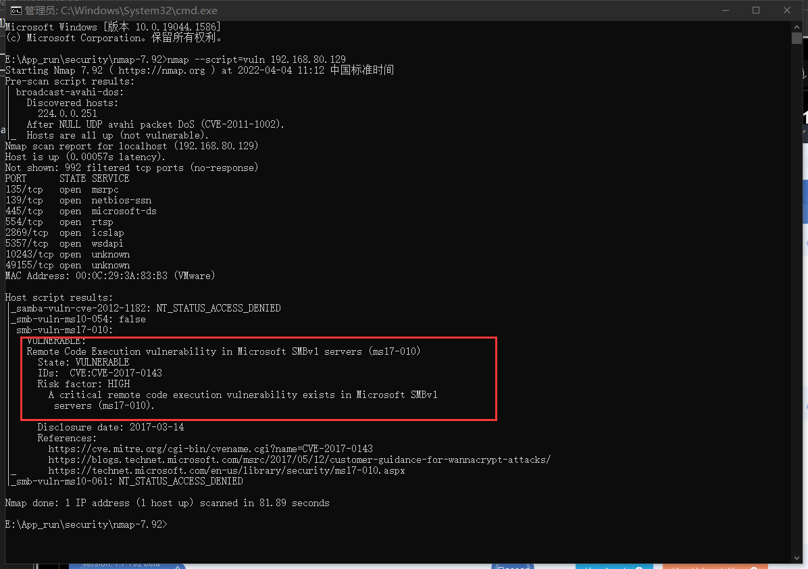

Nessus 安装-使用-插件库加载扫描

**安装 nessus 执行命令的时候一定要管理员运行执行**

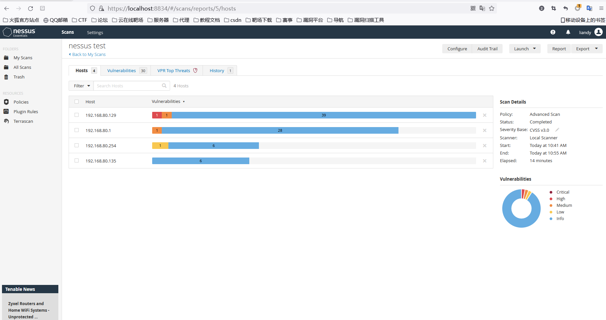

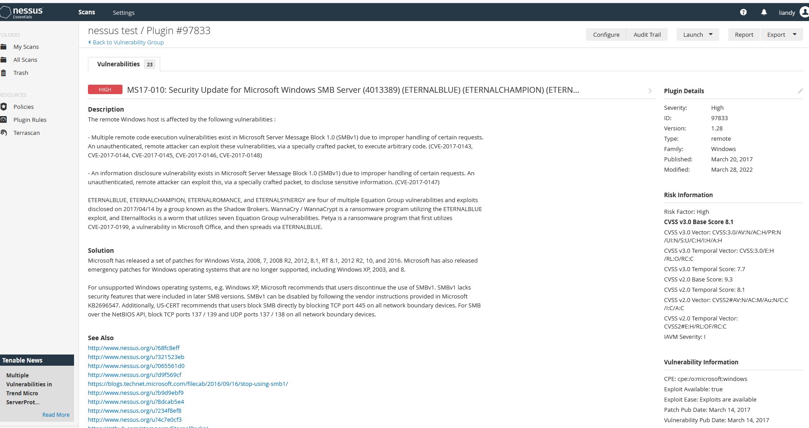

### 漏洞类型区分讲解-权限提升,远程执行等(思路)

### 漏洞利用框架演示-Metasploit,Searchsploit 等(操作)

#### CVE-2019-0708 MS12-020 - 牛啤忍者系统全程测试

我的虚拟机上没有视频里的系统，只开了一个win7 和win8 

漏洞扫描结果是，win7 没问题，win8 有一个高危---MS17-010

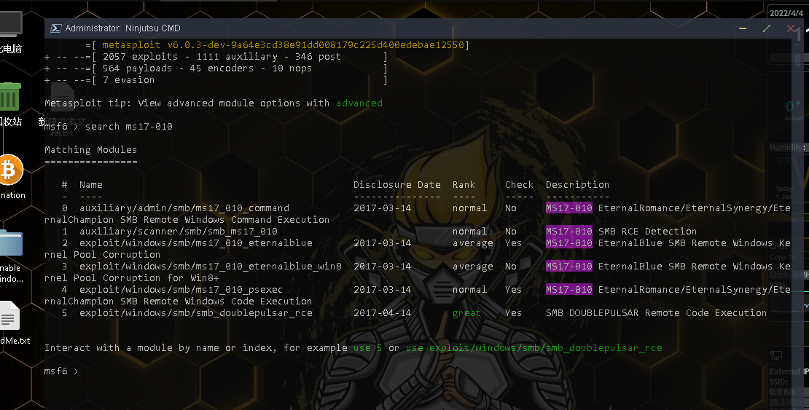

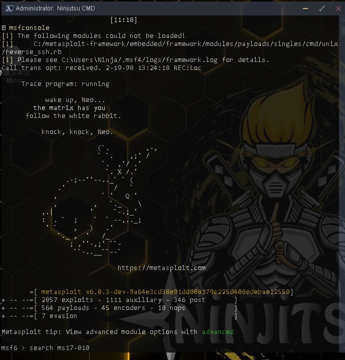

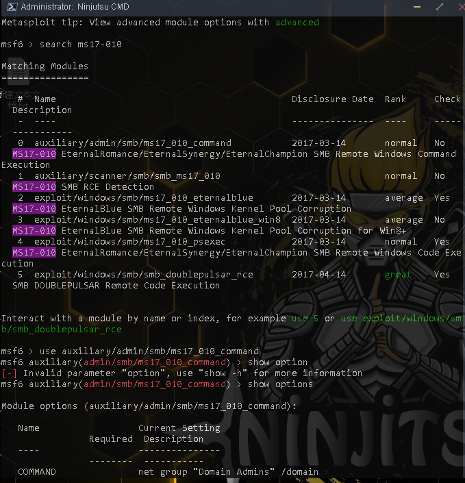

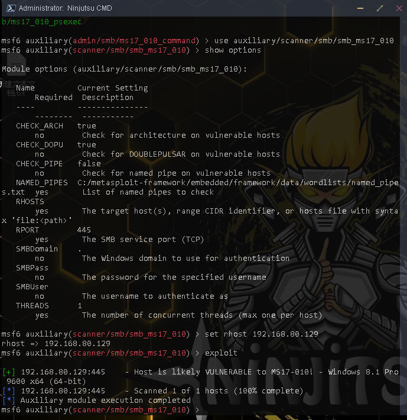

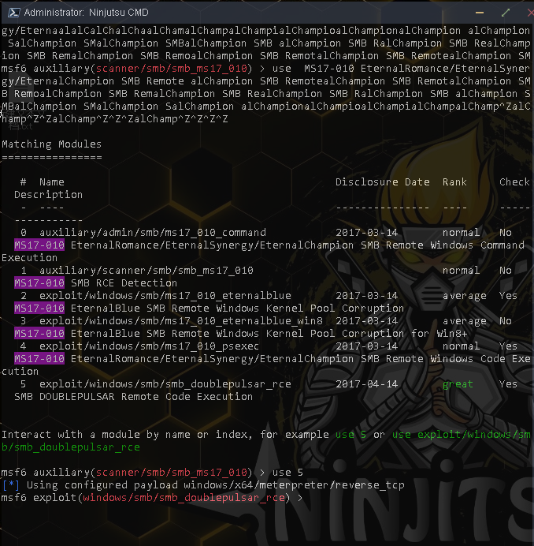

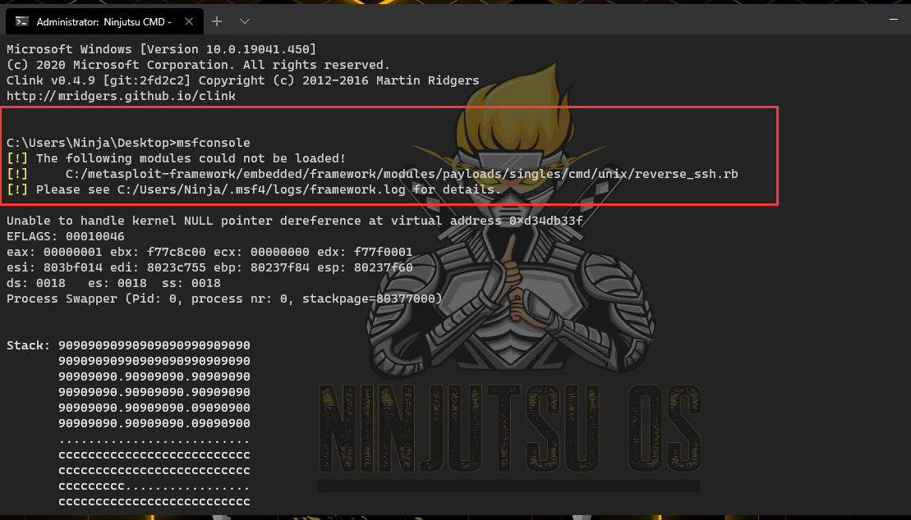

有一模块没有启动，exploit 没能成功!

[https://www.jianshu.com/p/bd8213c53717](https://www.jianshu.com/p/bd8213c53717)
-c, --case[Term]执行区分大小写的搜索，缺省是对大小写不敏感。
-e, --exact [Term]对 exploit 标题执行 EXACT 匹配（默认为 AND）
-h, --help 在屏幕上显示帮助
-j, --json[Term]以 JSON 格式显示结果
-m, --mirror [EDB-ID]将一个漏洞利用镜像（副本）到当前工作目录，后面跟漏洞 ID 号
-o, --overflow [Term]Exploit 标题被允许溢出其列
-p, --path[EDB-ID]显示漏洞利用的完整路径（如果可能，还将路径复制到剪贴板），后面跟漏洞 ID 号
-t, --title[Term]仅仅搜索漏洞标题（默认是标题和文件的路径）
-u, --update 检查并安装任何 exploitdb 软件包更新（deb 或 git）
-w, --www [Term]显示 Exploit-DB.com 的 URL 而不是本地路径（在线搜索）
-x, --examine[EDB-ID]使用$ PAGER 检查（副本）漏洞利用
--colour 在搜索结果中禁用颜色突出显示.
--id 显示 EDB-ID 值而不是本地路径
--nmap[file.xml]使用服务版本检查 Nmap XML 输出中的所有结果（例如：nmap -sV -oX file.xml）。
使用“-v”（详细）来尝试更多的组合
--exclude="term"从结果中删除值。通过使用“|”分隔多个值，例如--exclude
=“term1 | term2 | term3”

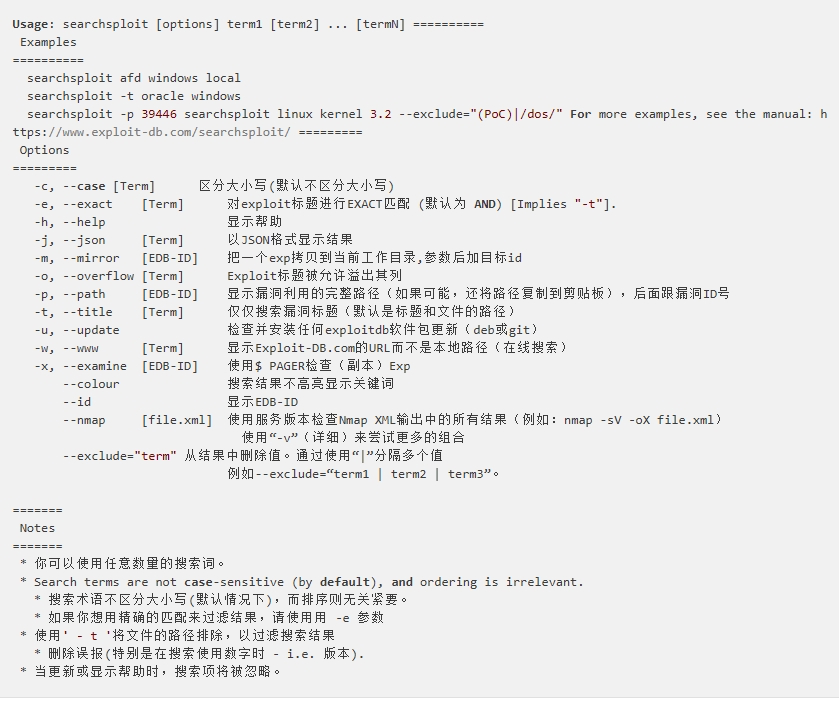

### 漏洞修复方案讲解说明-补丁,防护软件,手工修复等(操作及思路)

## 涉及资源：

涉及资源：
[https://nmap.org](https://nmap.org)
[https://gobies.org](https://gobies.org)
[https://www.cnvd.org.cn](https://www.cnvd.org.cn)
[https://www.seebug.org](https://www.seebug.org)
[https://www.exploit-db.com](https://www.exploit-db.com)
[https://github.com/scipag/vulscan](https://github.com/scipag/vulscan)
[https://github.com/vulnersCom/nmap-vulners](https://github.com/vulnersCom/nmap-vulners)
[https://github.com/offensive-security/exploitdb](https://github.com/offensive-security/exploitdb)
[https://www.cnblogs.com/shwang/p/12623669.html](https://www.cnblogs.com/shwang/p/12623669.html)
[https://blog.csdn.net/qq_38055050/article/details/80214684](https://blog.csdn.net/qq_38055050/article/details/80214684)
[https://pan.baidu.com/s/17uA2OmJbV_cDG2C6QnHqqA 提取码：cxd4](https://pan.baidu.com/s/17uA2OmJbV_cDG2C6QnHqqA 提取码：cxd4)
