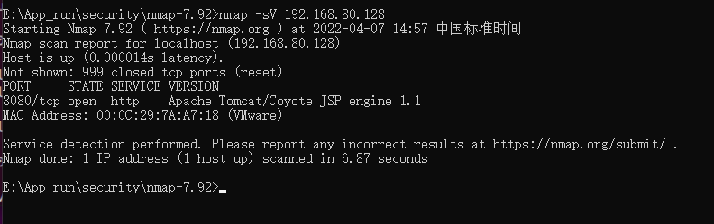
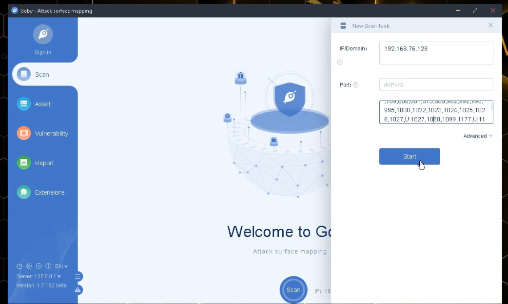
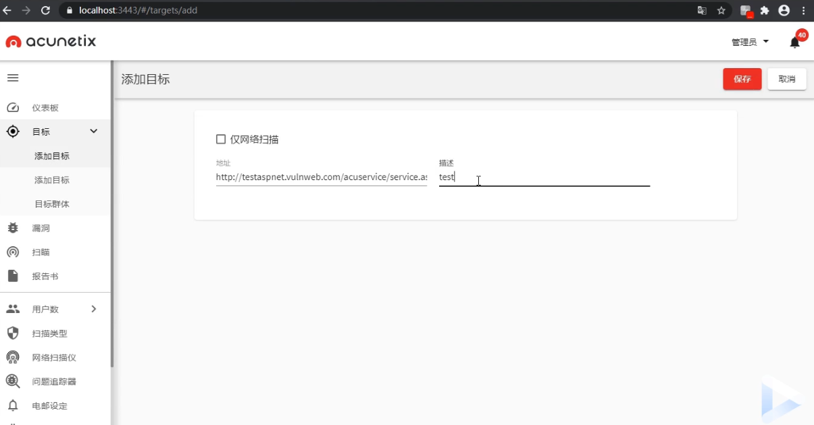
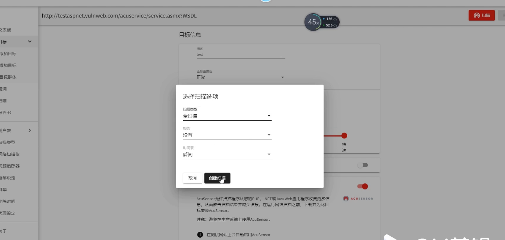

## 思维导图


信息收集之信息利用
第一步：首先识别网站是否有cdn，waf等产品，有则绕过。
第二步：扫描收集到网站的端口信息，真实ip地址，ip绑定的其他域名。
第三步：网站敏感路径扫描
第四步：域名+端口敏感信息扫描
第五步：ip+端口敏感目录扫描

备注：字典不应该只是敏感路径，还应该有备份文件 zip rar tar tar.gz等格式文件


### 端口服务类安全测试

根据前期信息收集针对目标端口服务类探针后进行的安全测试，主要涉及攻击方法：口令安全，WEB
类漏洞，版本漏洞等，其中产生的危害可大可小。属于端口服务/第三方服务类安全测试面。一般在
已知应用无思路的情况下选用的安全测试方案。

### API 接口-WebServiceRESTful API

https://xz.aliyun.com/t/2412
根据应用自身的功能方向决定，安全测试目标需有 API 接口调用才能进行此类测试，主要涉及的安
全问题：自身安全，配合 WEB，业务逻辑等，其中产生的危害可大可小，属于应用 API 接口网络服
务测试面，一般也是在存在接口调用的情况下的测试方案。

WSDL（网络服务描述语言，Web Services Description Language）是一门基于 XML 的语言，用于描述
Web Services 以及如何对它们进行访问。

### 漏洞关键字：

配合 shodan，fofa,zoomeye 搜索也不错哦~
inurl:jws?wsdl
inurl:asmx?wsdl
inurl:aspx?wsdl
inurl:ascx?wsdl
inurl:ashx?wsdl
inurl:dll?wsdl
inurl:exe?wsdl
inurl:php?wsdl
inurl:pl?wsdl
inurl:?wsdl
filetype:wsdl wsdl

http://testaspnet.vulnweb.com/acuservice/service.asmx?WSDL

### 常见漏洞


## 演示案例

### 端口服务类-Tomcat弱口令安全问题 


IP地址


nmap 扫描 



访问192.168.80.128：8080


/manager     

tomcat/tomcat 弱口令

进入后台上传war包

getshell

tomcat漏洞网上一大堆文章，看着搞。

### 端口服务类-Glassfish任意文件读 

环境启动


端口扫描




### 其他补充类-基于端口WEB站点又测试 

有端口


不见端口


有端口和无端口可能是两套程序，两个目标！


### 其他补充类-基于域名WEB站点又测试

子域名搜集，搜集的站点越多，目标越多，机会越多，可能越多！


#### 注册人


#### 域名登记


#### 特有信息

键镁乐 （公司名称、商标等明显特征）


搜索引擎，搜索特有信息，查询相关域名


### 其他补充类-基于IP配合端口信息再收集

域名和ip地址 映射的目录不同

扫目录的话，扫ip，和域名是两个意思！

都要扫描


### 口令安全脚本工具简要使用-Snetcracker


字典在这儿，可更改拓展


### API接口类-网络服务类探针利用测试-AWVS

 







请求报文保存下来，wsdl.txt  


随便设置一个参数，设置*号，标明注入点


--batch  设置一直是Y


爆出数据库


后面继续跑就行

```sql
sql.map  -D xxxxx --Tables

sql.map  -D xxxxx -T  yyyyy --columns

sql.map  -D xxxxx -T  yyyyy -C zzzzz  --dump
```


AWVS扫描web ，NESSUS 扫描系统

## 涉及资源

[https://www.west.cn/](https://www.west.cn/)  查寻注册域名

 [https://xz.aliyun.com/t/2412]( https://xz.aliyun.com/t/2412)

 [https://github.com/SmartBear/soapui]( https://github.com/SmartBear/soapui )  

[https://github.com/shack2/SNETCracker](https://github.com/shack2/SNETCracker ) 

[https://www.cnblogs.com/xyongsec/p/12370488.html](https://www.cnblogs.com/xyongsec/p/12370488.html)