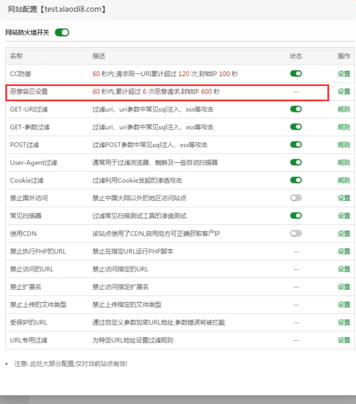

## 思维导图


## 演示案例：

### Safedog-默认拦截机制分析绕过-未开 CC

safedog ——CC攻击防护默认是关闭的


1—用目录扫描工具扫


字典的所有的结果都有，明显错误！

抓取进程的抓包工具抓包，与浏览器数据包对比，明显请求方式不同


改为GET请求方式，就是正常的扫描结果!


### Safedog-默认拦截机制分析绕过-开启 CC

开启CC防护


查看防护规则


开启CC之后，再次使用扫描工具，并且访问网站。


频繁访问（访问频率过快，绝对是工具），触发安全狗防护机制，被拦截


设置延时扫描时间


或者也可以通过白名单


模拟搜索引擎请求头User-Agent就可以了。进行扫描


扫描没有结果！

#### python脚本

使用python脚本模拟用户正常来访问

```python
import requests
import time

headers = {
    'Accept':'text/html,application/xhtml+xml,application/xml;q=0.9,image/webp,image/apng,*/*;q=0.8,application/signed-exchange;v=b3;q=0.9',
    'Accept-Encoding': 'gzip, deflate, br',
    'Accept-Language': 'zh-CN,zh;q=0.9,en;q=0.8,en-GB;q=0.7,en-US;q=0.6',
    'Cache-Control': 'max-age=0',
    'Connection': 'keep-alive',
    'Cookie': 'PHPSESSID=4d6f9bc8de5e7456fd24d60d2dfd5e5a',
    'sec-ch-ua': '"Chromium";v="92", " Not A;Brand";v="99", "Microsoft Edge";v="92"',
    'sec-ch-ua-mobile': '?0',
    'Sec-Fetch-Dest': 'document',
    'Sec-Fetch-Mode': 'navigate',
    'Sec-Fetch-Site': 'none',
    'Sec-Fetch-User': '?1',
    'Upgrade-Insecure-Requests': '1',
    'User-Agent': 'Mozilla/5.0 (compatible; Baiduspider-render/2.0; +http://www.baidu.com/search/spider.html)'
}

for paths in open('php_b.txt', encoding='utf-8'):
    url = "http://127.0.0.1/pikachu"
    paths = paths.replace('\n', '')
    urls = url + paths
    proxy = {
        'http': '127.0.0.1:7777'
    }
    try:
        code = requests.get(urls, headers=headers, proxies=proxy).status_code
        # time.sleep(3)
        print(urls + '|' + str(code))
    except Exception as err:
        print('connect error')
        time.sleep(3)

```

使用自定义headers


未使用自定义headers，很明显服务器能够识别出是python脚本


未使用爬虫的UA，因为开启了CC，访问过快，扫描会被拦截，产生误报！


在脚本headrs中使用爬虫引擎的UA，就能正常扫描。


#### 使用http代理池


检测ip代理，一般是CC防护，但是使用代理，扫描目录，大概率是可行的。


### Aliyun_os-默认拦截机制分析绕过-简要界面

阿里云-无法模拟搜索引擎爬虫绕过，只能采用代理池或者延时。

一般访问频率过快，站点直接就访问不了，一个小时后才可以访问。

### BT(防火墙插件)-默认拦截机制分析绕过-简要界面


扫描3个后就不行，不是alliyun拦截的，而是BT的防火墙拦截的




绕过

字典拆开使用 ，绕过他的恶意容忍机制60秒内6次

字典优化

index.php.bak  ------> index.php.bak. 

等等

## 涉及资源：

https://www.bt.cn/
http://free.safedog.cn/website_safedog.html
https://www.cnblogs.com/iack/p/3557371.html

```python
#搜索引擎爬虫模拟及模拟真实用户
import requests
import time
headers={
'Connection': 'keep-alive',
'Cache-Control': 'max-age=0',
'Upgrade-Insecure-Requests': '1',
#模拟用户 Kit/537.36 (KHTML, like Gecko) Chrome/84.0.4147.105 Safari/537.36
#模拟引擎 Mozilla/5.0 (compatible; Baiduspider-render/2.0; +http://www.baidu.com/search/spider.html)
#更多爬虫引擎：https://www.cnblogs.com/iack/p/3557371.html
'User-Agent': 'Mozilla/5.0 (compatible; Baiduspider-render/2.0;
+http://www.baidu.com/search/spider.html)',
'Sec-Fetch-Dest': 'document',
'Accept':
'text/html,application/xhtml+xml,application/xml;q=0.9,image/webp,image/apng,*/*;q=0.8,application/si
gned-exchange;v=b3;q=0.9',
'Sec-Fetch-Site': 'none',
'Sec-Fetch-Mode': 'navigate',
'Sec-Fetch-User': '?1',
'Accept-Encoding': 'gzip, deflate, br',
'Accept-Language': 'zh-CN,zh;q=0.9,en-US;q=0.8,en;q=0.7',
'Cookie': 'xxx',#根据当前访问 cookie
}


for paths in open('php_b.txt',encoding='utf-8'):
	url='http://192.168.0.103:8081/'
	paths=paths.replace('\n','')
	urls=url+paths
	#如需测试加代理，或加入代理池需加代理
	proxy = {
		'http': '127.0.0.1:7777'
	}
	try:		
        code=requests.get(urls,headers=headers,verify=False).status_code
		print(urls+'|'+str(code))
		if code==200 or code==403:
			print(urls+'|'+str(code))
	except Exception as err:
		print('connecting error')
		#time.sleep(3)模拟用户需延时 引擎可用可不用（根据请求速度）
```


