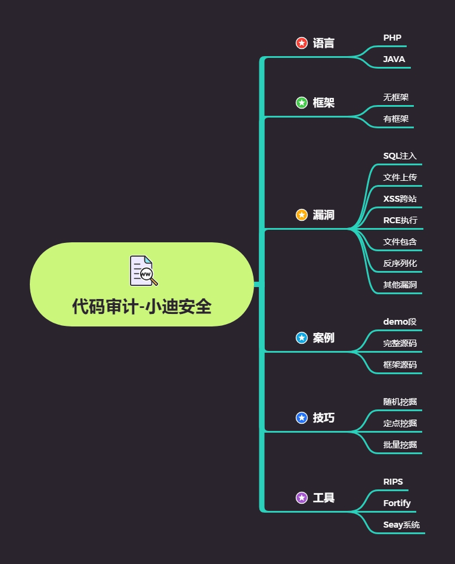

# 思维导图

# 知识点

## 知识点 1：

#关键字搜索：(函数，键字，全局变量等)
文件上传，$_FILES，move_uploaded_file 等
#应用功能抓包：（任何可能存在上传的应用功能点）
前台会员中心，后台新闻添加等可能存在上传的地方

## 知识点 2：

MVC 开发框架类：https://www.cnblogs.com/wsybky/p/8638876.html

## 知识点 3：

Thinkphp 框架：https://sites.thinkphp.cn/1556331

# 演示案例：

## PHP 文件上传全局变量$_FILES

## PHPStorm+xdebu 断点调试演示

## Beescms 无框架后台任意文件上传

## Finecms 基于前台 MVC 任意文件上传

## Cltphp 基于前台 TP5 框架任意文件上传

## 漏洞挖掘过程

- 搜索$_FILES->后台中心->上传图像->跟踪代码->逻辑判断
- 业务功能分析->会员中心->上传图像->跟踪代码->逻辑判断
- 搜索文件上传->会员中心->上传图像->跟踪代码->逻辑判断

# 涉及资源：

[Thinkphp导航](https://sites.thinkphp.cn/1556331)
[MVC框架实例教程](https://www.cnblogs.com/wsybky/p/8638876.html)
[phpstorm+xdebug调试详细教程](https://blog.csdn.net/yinhangbbbbb/article/details/79247331)

[程序下载_BEESCMS提供免费企业网站建设方案!](http://beescms.com/cxxz.html)

[企业cms,免费cms,php免费cms,企业网站建站系统 (finecms.net)](http://www.finecms.net/)

[CLTPHP 后台管理系统 v5.5.3-CLTPHP 后台管理系统 v5.5.3下载-CMS建站-易采下载站 (easck.com)](https://down.easck.com/code/34209.html)