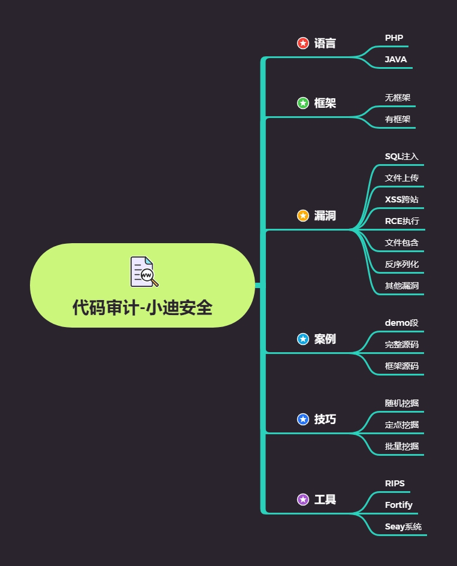

# 思维导图



## 漏洞关键字：

### SQL 注入：

select insert update mysql_query mysqli 等

### 文件上传：

$_FILES，type="file"，上传，move_uploaded_file()等

### XSS 跨站：

print print_r echo sprintf die var_dump var_export 等

### 文件包含：

include include_once require require_once 等

### 代码执行：

eval assert preg_replace call_user_func call_user_func_array 等

### 命令执行：

system exec shell_exec `` passthru pcntl_exec popen proc_open

### 变量覆盖：

extract() parse_str() importrequestvariables() $$等

### 反序列化：

serialize() unserialize() __construct __destruct 等

### 其他漏洞：

unlink() file_get_contents() show_source() file() fopen()等

### 通用关键字：

$_GET,$_POST,$_REQUEST,$_FILES,$_SERVER 等

功能点或关键字分析可能存在漏洞
抓包或搜索关键字找到代码出处及对应文件
追踪过滤或接受的数据函数，寻找触发此函数或代码的地方进行触发测试
http://192.168.0.102:91/?r=../../index.txt%00
http://192.168.0.102:94/admin/save.php?act=delfile
path=/upload/../install/install.lock


# 演示案例：

## xhcms-无框架-文件包含跨站-搜索或应用-include

```txt
通过应用及 URL 地址等分析可能存在 xss 及包含安全
抓包找到 XSS 无过滤代码块及文件包含有后缀需绕过代码块
```


## earmusic-无框架-文件下载-搜索或应用功能-down 等

```txt
通过应用分析或搜索判断可能存在文件下载操作
抓包分析下载地址找到对应代码块，文件下载地址由$file 控制
$file 从数据库查询语句得知，追踪那里可更新或更改此类数据
尝试修改发现过滤，追踪过滤机制分析绕过，采用全路径地址绕过
```


## zzzcms-无框架-文件删除 RCE-搜索或应用-unlink,eval

```txt
文件删除搜索关键字 unlink,对应函数 del_file，查看调用此的地方
后台 delfile 函数调用，如何处罚 delfile 函数，受参数控制，进行测试
代码执行搜索关键字 eval,对应配置模版解析文件，查看调用此的地方
判断后台可修改模版文件，前台触发模版文件，构造 payload 进行测试
```


# 涉及资源：

[熊海CMS|熊海CMS v1.0下载_网站源码 - 站长源码 (chinaz.com)](https://down.chinaz.com/soft/36930.htm)

[GBK耳朵音乐(Ear Music) 免费下载-其它模板-php中文网源码](https://www.php.cn/xiazai/code/5574#elYxjsBoxId)

**zzzcms**

链接：https://pan.baidu.com/s/1mOhnBvhJEHKC6ozHxtJTfw?pwd=d8u0 
提取码：d8u0
