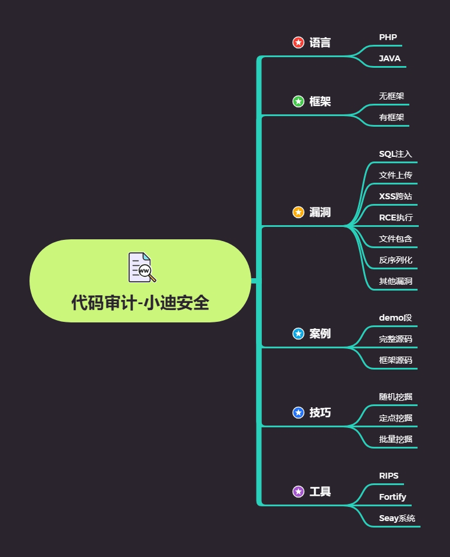
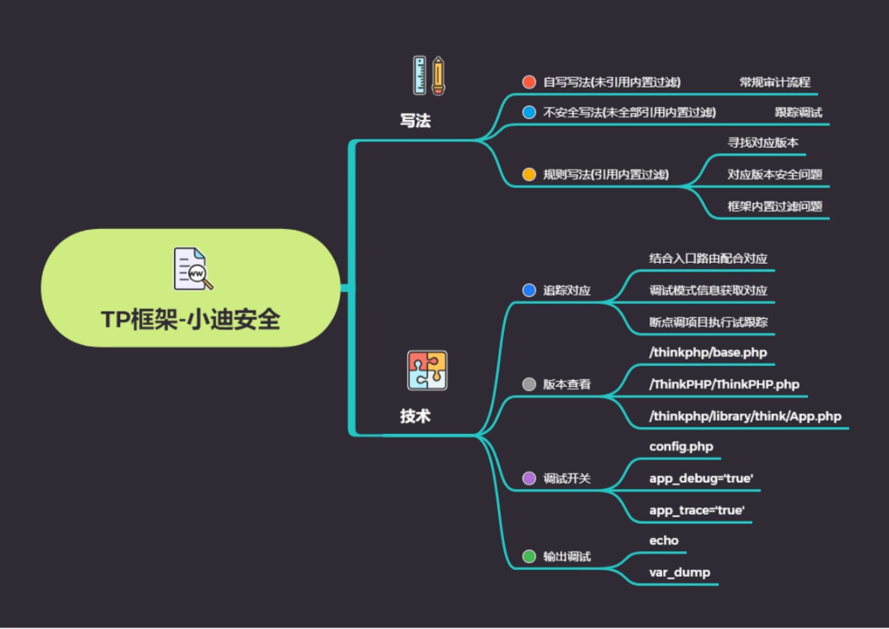
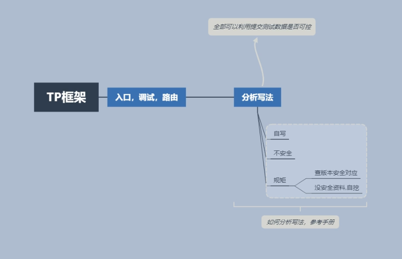

# 思维导图








```php
#知识点1
调试，访问，路由，配置，版本等

#知识点2
自写写法，不安全写法，规则写法

#知识点3
调试模式信息获取对应
结合入口路由配合对应
项目断点调试执行跟着
```

# 演示案例：

## demo 代码段自写和规则写分析

## hsycms-TP 框架-不安全写法-未过滤

## weipan21-TP 框架-规则写法-内置过滤

# 涉及资源：

https://github.com/Mochazz/ThinkPHP-Vuln
https://pan.baidu.com/s/1miETaZcez30jmUEA5n2EWw 提：xiao

```php 
<?php
namespace app\index\controller;
use think\Controller;
use think\Db;
class Test extends Controller
{
public function x()
{
echo 'x test';
}
public function testsqlin()
{
//自写数据库查询，存在注入
$id=$_GET['x'];
$conn=mysql_connect("127.0.0.1","root","root");
$sql="select * from injection.users where id=$id";
echo $sql;
$result=mysql_query($sql,$conn);
}
public function testsqlin1()
{
//table('users')->where('id',1)->select();
$id=$_GET['x'];
db('users')->where('id',$id)->select();
}
public function index()
{
$username = request()->get('id/a');
db('users')->insert(['id' => $username]);
return 'Update success';
}
}
```

