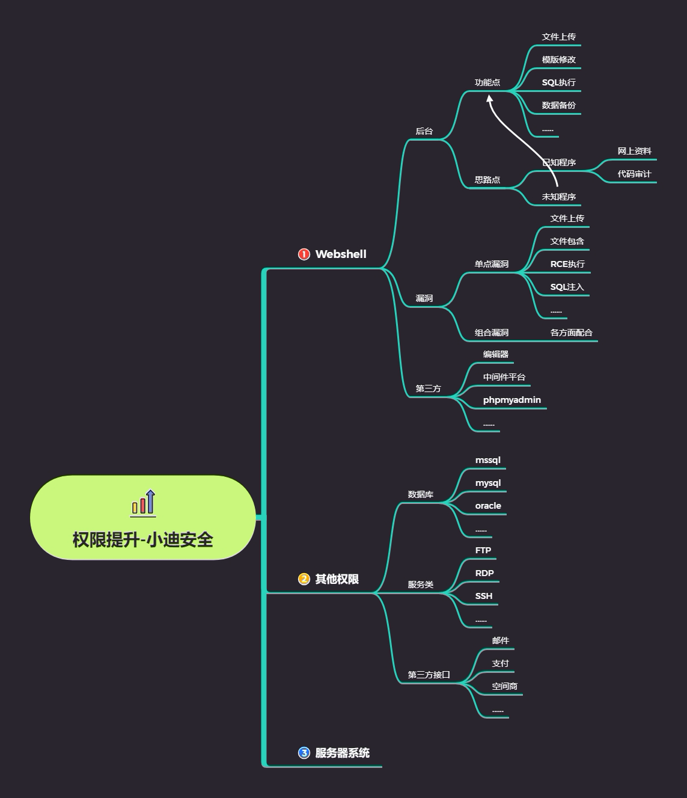

# 思维导图



# 思路

```
#当前知识点在渗透流程中的点
前面-中期-后期对应知识关系
    
#当前知识点在权限提升的重点
知识点顺序，理解思路，分类介绍等
    
#当前知识点权限提升权限介绍
注重理解当前权限对应可操作的事情
    
#利用成功后的思想需要总结的思路
相关的操作被拒绝无法实现的时候就会涉及到权限提升
```

# 知识点

```php
#具体有哪些权限需要我们知道和了解掌握的？
后台权限，网站权限，数据库权限，接口权限，系统权限，域控权限等
    
后台权限：（获得方式：爆破，注入猜解，弱口令等获取的帐号密码配合登录）
一般网站或应用后台只能操作应用的界面内容数据图片等信息，无法操作程序的源代码或服务器上
的资源文件的。（如后台功能存在文件操作的话也可以操作文件数据）

网站权限：（获得方式：以上三种思路获取）
查看或修改程序源代码，可以进行网站或应用的配置文件读取（接口配置信息，数据库配置信息等），
还能收集服务器操作系统相关的信息，为后续系统提权做准备。

数据库权限：
操作数据库的权限，数据库的增删改等，源码或配置文件泄漏，也可能是网站权限(webshell)进行的
数据库配置文件读取获得。

接口权限：（邮件，短信，支付，第三方登录等）

后台或网站权限后的获取途径：后台（修改配置信息功能点），网站权限（查看的配置文件获取），
具体可以操作的事情大家自己想想。
```


# 演示案例：

## 某挂壁程序后台权限提升-后台功能

- **前提：已经获取了后台账号密码**（获得方式：爆破，注入猜解，弱口令等获取的帐号密码配合登录 ）


后台权限和网站权限不同，后台权限不能对网站代码的层次进行修改

- 分析网站的CMS，
- （已知cms）
- ①在网上搜索CMS对应的漏洞，尝试复现。
- ②网上未能找到相应版本漏洞，下载网站源码，进行代码审计，进行分析，寻找可以提权的漏洞
- ③用功能点配合网站源码进行测试，在上传点抓包找到对应的代码
- （未知cms）
- 没有代码：直接常规测试，测试围绕文件上传、模板修改、SQL执行、数据备份等功能

## 某 BC 广告导航页权限提升-漏洞层面

信息收集，发现中间件有漏洞

抓包了解网站使用的Apache和OpenSSL版本，凭借经验发现是基于PHPstudy的网站

根据网络资料复现PHPstudy的后门漏洞，实现命令执行 

## 苏丹大西瓜 GlassFish 中间件-第三方

通过FOFA信息收集，搜索使用GlassFish的网站作为目标

根据网络资料复现GlassFish的任意文件读取漏洞（注意使用条件是否匹配）

获取敏感信息，进行下一步渗透 