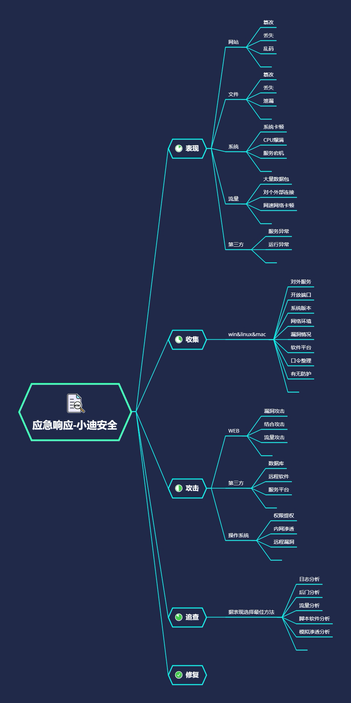

# 思维导图

**内网渗透**

（待续）

**应急响应**




# 演示案例：

# MSF&CobaltStrike 联动 Shell

（待续）

### 应急响应

攻击者可能拿到了哪些权限，攻击可能发生在哪个部分，从最可能的开始排查

可疑文件看文件有没有毒，有没有外部链接

结合攻击指搭建平台的漏洞 

# WEB 攻击应急响应朔源-后门,日志

**故事回顾：某客户反应自己的网站首页出现篡改，请求支援**

```shell
分析：涉及的攻击面，涉及的操作权限，涉及的攻击意图，涉及的攻击方式

思路1：利用日志定位修改时间基数，将前时间进行攻击分析，后时间进行操作分析

思路2：利用后门webshell查杀脚本或工具找到对应后门文件，定位第一次时间分析
```

知识点：

netstat -ano    查看端口和对应进程

tasklist /svc    查看pid进程号

查看日志文件access.log 

- 执行netstat -ano命令，通过开放的端口找到对应的PID。
- 执行tasklist -svc命令，通过PID找到对应的进程名称。
- 在任务管理器，右击进程名称，选择打开文件位置，直接定位到具体位置。
- 根据不同的服务名，找寻对应的日志存储目录。
- 打开日志，分析异常操作，发现有人上传了x.php文件。
- 通过网站目录找到x.php
- 打开看一下，是后门文件。
- 还可以去网站目录查看首页修改时间，查找网站相关日志，定位修改时间基数，将该时间之前的日志进行攻击分析（是如何修改首页内容的），该时间之后的日志进行操作分析（修改网页之后还进行了什么操作）
- 利用后门webshell查杀脚本或工具找到对应后门文件，网上有很多查杀工具(视频中演示的是河马，还有许多！)
- 使用河马查杀，扫描，发现两个后门。然后去日志搜索相关关键字，找到是谁访问了这个后门，如何操作等。

# WIN 系统攻击应急响应朔源-后门,日志,流量

**故事回顾：某客户反应服务器出现卡顿等情况，请求支援**

```shell
分析：涉及的攻击面，涉及的操作权限，涉及的攻击意图，涉及的攻击方式
思路：利用监控工具分析可疑文件，利用接口工具抓流量
获取进行监控：PCHunter64 (还有很多其他功能，可以进一步分析该进程是否是后门或者勒索病毒等。)
获取执行列表：UserAssistView
AppCompatCacheParser.exe --csv c:temp -t 
```

- PCHunter64发现可以进程。
- 在网络模块，发现该进程与外部IP地址进行网络连接，很可疑。
- PCHunter64工具还有很多其他功能，可以进一步分析该进程是否是后门或者勒索病毒等。
- UserAssistView可以看到windows系统所有文件的执行时间记录，比如我们可以查看一下artifact.exe上次修改的时间。说明在这个**时间点前后**攻击者一定对系统进行了一些操作，相应地，我们就可以以此时间为基数，定位查找日志将该时间之前的日志进行攻击分析（分析攻击者是如何攻击服务器的），该时间之后的日志进行操作分析（分析攻击者登录服务器后进行了什么操作) 

# 临时给大家看看学的好的怎么干对应 CTF 比赛


# 涉及资源：

[UserAssistView 1.02](https://www.onlinedown.net/soft/628964.htm)
[10款常见的Webshell检测工具](https://www.cnblogs.com/xiaozi/p/12679777.html)
[PCHunter64](http://www.pc6.com/softview/SoftView_195167.html )
[https://github.com/EricZimmerman/AppCompatCacheParser/releases/](https://github.com/EricZimmerman/AppCompatCacheParser/releases/)

