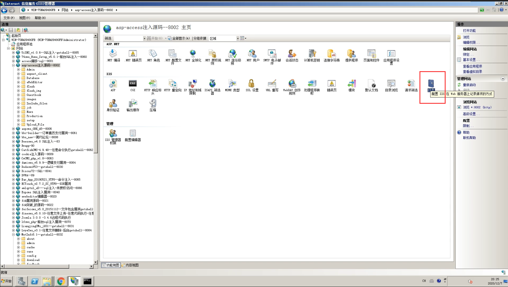
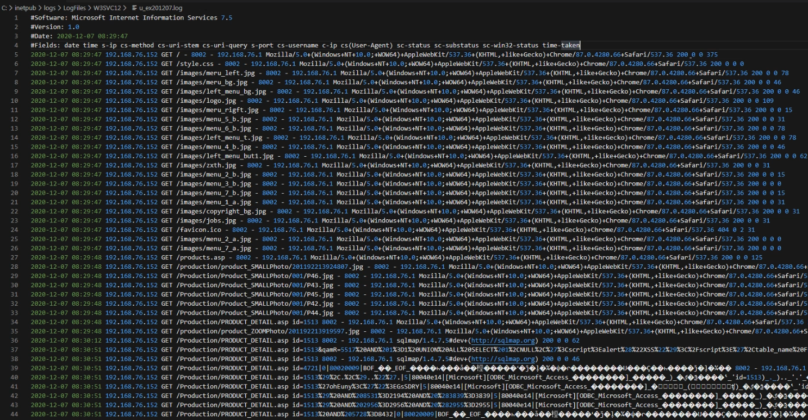
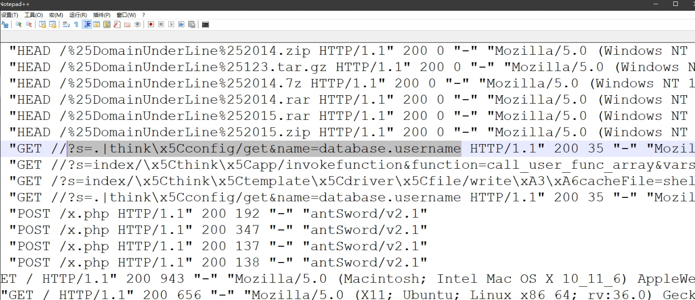

# 思维导图

# 知识点

### **应急响应：**

保护阶段，分析阶段，复现阶段，修复阶段，建议阶段
目的：分析出攻击时间，攻击操作，攻击后果，安全修复等并给出合理解决方案。

### **必备知识点：**

1.熟悉常见的 WEB 安全攻击技术
2.熟悉相关日志启用及存储查看等
3.熟悉日志中记录数据分类及分析等

### **准备工作：**

1.收集目标服务器各类信息
2.部署相关分析软件及平台等
3.整理相关安全渗透工具指纹库
4.针对异常表现第一时间触发思路
从表现预估入侵面及权限面进行排查

### **有明确信息网站被入侵：**

基于时间 基于操作 基于指纹 基于其他

### **无明确信息网站被入侵：**

1.WEB 漏洞-检查源码类别及漏洞情况
2.中间件漏洞-检查对应版本及漏洞情况
3.第三方应用漏洞-检查是否存在漏洞应用
4.操作系统层面漏洞-检查是否存在系统漏洞
5.其他安全问题(口令,后门等)-检查相关应用口令及后门扫描

### **常见分析方法：**

**指纹库搜索**，**日志时间分析**，**后门追查分析**，**漏洞检查分析等**

# 演示案例：

##  Windows+IIS+Sql-日志,搜索

**故事回顾:某小企业反应自己的网站出现异常，请求支援**

查找日志路径

日志功能IIS是默认开启的（如果站长关闭了日志，那就很遗憾只能从别的方面进行分析）

查找日志文件

查看日志文件

日志默认记录事项（可自由设置）

可以进行指纹库搜索，比如sqlmap

也可以进行关键字搜索，比如select

## Linux+BT_Nginx+tp5-日志,后门

**故事回顾:某黑x哥哥反应自己的网站出现异常，请求支援**

#### 日志分析

- ##### **查找日志**

- 

- 

- ##### **日志分析**

- ##### 典型目录文件扫描

- ##### 蚁剑连接后门

- 利用ThinPhP5 漏洞

- ##### 尝试模拟访问攻击（按照日志一条条测试）

360星图

## Linux+Javaweb+st2-日志,后门,时间

根据webshell关键字找到是谁，在何时上传了后门，何时利用

日志太多，使用工具-FileSeek文件搜索工具

##  360 星图日志自动分析工具-演示,展望

**缺点：**
支持的日志类型较少，智能用于小网站日志分析，对于数据量很大的网站不适合

**下载地址：**
目前官方已经停止维护，可自己百度下载

# 涉及资源：

[360星图](https://www.pcsoft.com.cn/soft/15718.html)

[推荐 | 10个好用的Web日志安全分析工具](https://www.cnblogs.com/xiaozi/p/13198071.html)https://www.cnblogs.com/xiaozi/p/13198071.html
[10款常见的Webshell检测工具 ](https://www.cnblogs.com/xiaozi/p/12679777.html)
https://pan.baidu.com/s/1tQS1mUelmEh3I68AL7yXGg 提取码：xiao