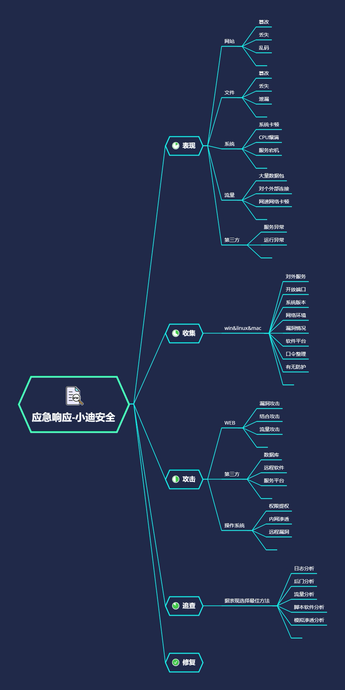

# 思维导图



# 知识点

**必须知识点：**

- 1.第三方应用由于是选择性安装，如何做好信息收集和漏洞探针也是获取攻击者思路的重要操作，除去本身漏洞外，提前预知或口令相关攻击也要进行筛选。
- 2.排除三方应用攻击行为，自查漏洞分析攻击者思路，人工配合工具脚本
- 3.由于工具或脚本更新迭代快，分类复杂，打造自己的工具箱迫在眉睫

# 演示案例

## 系统日志-Win 日志自动神器 LogonTracer-外网内网日志

```shell
案例 1-Win 日志自动神器 LogonTracer-外网内网
如何安装使用：https://github.com/JPCERTCC/LogonTracer/wiki/
linux 安装使用笔记：阿里云主机记得开放端口及关闭防火墙
1.下载并解压 neo4j：tar -zvxf neo4j-community-4.2.1-unix.tar
2.安装 java11 环境：sudo yum install java-11-openjdk -y
3.修改 neo4j 配置保证外部访问：
dbms.connector.bolt.listen_address=0.0.0.0:7687
dbms.connector.http.listen_address=0.0.0.0:7474
./bin/neo4j console &
4.下载 LogonTracer 并安装库：
git clone https://github.com/JPCERTCC/LogonTracer.git
pip3 install -r requirements.txt
5.启动 LogonTracer 并导入日志文件分析
python3 logontracer.py -r -o [PORT] -u [USERNAME] -p [PASSWORD] -s [IP 地址]
python3 logontracer.py -r -o 8080 -u neo4j -p xiaodi -s 47.98.99.126
python3 logontracer.py -e [EVTX 文件] -z [时区] -u [用户名] -p [密码] -s [IP 地址]
python3 logontracer.py -e Security.evtx -z -13 -u neo4j -p xiaodi -s 127.0.0.1
6.刷新访问 LogonTracer-web_gui 查看分析结果
```


## 应用分析-数据库 Mysql&Mssql&Oracle 等分析-爆破注入操作

```shell
案例 2-数据库 Mysql&Mssql&Oracle 等日志分析-爆破注入操作
常见的数据库攻击包括弱口令、SQL 注入、提升权限、窃取备份等。对数据库日志进行分析，可以
发现攻击行为，进一步还原攻击场景及追溯攻击源。
Mysql：启用，记录，分析（分析 SQL 注入及口令登录爆破等）
show variables like '%general%';
SET GLOBAL general_log = 'On';
SET GLOBAL general_log_file = '/var/lib/mysql/mysql.log';
Mssql：查看，跟踪，分析（配置跟踪可分析操作，查看日志可分析登录等）
```


## 模拟测试-自查漏洞模拟渗透测试寻找攻击源头-漏洞口令检索

```shell
案例 3-自查漏洞模拟渗透测试寻找攻击源头-漏洞口令检索
1.日志被删除或没价值信息
2.没有思路进行分析可以采用模拟渗透
1.windows，linux 系统漏洞自查:
WindowsVulnScan,linux-exploit-suggester
D:\Myproject\venv\Scripts\python.exe cve-check.py -C -f KB.json
./linux-exploit-suggester.sh
2.windows，linux 服务漏洞自查:
windows：Get-WmiObject -class Win32_Product
linux：LinEnum.sh
searchsploit weblogic
利用前期信息收集配合 searchsploit 进行应用服务协议等漏洞检索
3.windows，linux 协议弱口令自查-工具探针或人工获取判断-snetcraker
```


## 专业要求-自动化 ir-rescue 应急响应取证工具箱-实时为您提供服务

```shell
案例 4-自动化 ir-rescue 应急响应工具箱-实时为您提供服务
https://github.com/diogo-fernan/ir-rescue
分析脚本工具原理，尝试自己进行编写修改，成为自己的工具箱杀器
```

# 涉及资源：

[https://github.com/rebootuser/LinEnum](https://github.com/rebootuser/LinEnum)
[https://github.com/diogo-fernan/ir-rescue](https://github.com/diogo-fernan/ir-rescue)
[https://github.com/offensive-security/exploitdb](https://github.com/offensive-security/exploitdb)
[https://github.com/chroblert/WindowsVulnScan](https://github.com/chroblert/WindowsVulnScan)
[https://github.com/JPCERTCC/LogonTracer.git](https://github.com/JPCERTCC/LogonTracer.git)
[https://github.com/mzet-/linux-exploit-suggester](https://github.com/mzet-/linux-exploit-suggester)
[https://pan.baidu.com/s/1tQS1mUelmEh3I68AL7yXGg 提取码：xiao](https://pan.baidu.com/s/1tQS1mUelmEh3I68AL7yXGg 提取码：xiao)

