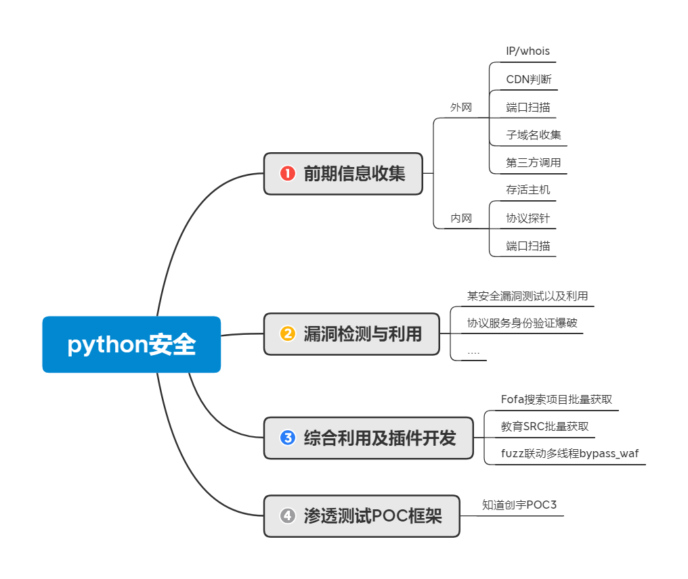

# 思维导图




### 知识点

应急响应补充知识点
挖矿靶机分析 PDF 外加其他

[应急响应资源包 提取码：xiao](https://pan.baidu.com/s/1tQS1mUelmEh3I68AL7yXGg 提取码：xiao)

#### Python 开发相关知识点

- 1.开发基础环境配置说明

  Windows10+Pycharm

- 2.Python 开发学习的意义

  学习相关安全工具原理

  掌握自定义工具及拓展开发

  解决实战中无工具或手工麻烦批量化等情况

  在二次开发 Bypass，日常任务，批量测试利用等方面均有帮助

  如：SRC 批量收集并利用，AWD 批量利用获取 FLAG，CTF 加解密脚本等

- 3.本篇直播涉及的技术方向

  Socket，爬虫，正则表达式，框架开发等

本次直播涉及知识点：

Socket 部分技术，进程命令执行，交互参数执行，NMAP 工具模块使用，异常处理等


# 演示案例：

## IP&Whois&系统指纹获取代码段-外网

```python
import os
import socket
import urllib.request
from scapy.utils import whois


# ip 查询-socket
"""
Pyhton 域名为ip的方法
调用socket 模块
一  打印有详细信息
import socket
host = 'www.baidu.com'
ip = socket.getaddrinfo(host, port)
print(ip[0][4][0])
二 
import socket
host = 'www.baidu.com'
ip = socket.gethostbyname(host)
print(ip)

"""
# pythton 实现whois 查询
"""
一 调用网络接口
站长之家等接口
import urllib.request
url='www.baidu.com'
req_whois = urllib.request.urlopen('http://whois.chinaz.com/'+url)
print(req_whois.read().decode())
二 使用 whois 库查询
import whois
url='www.baidu.com'
data = whois(url)
print(data)


"""

# python  实现系统调指令用
"""
https://blog.csdn.net/u011119817/article/details/119744799
# os.system
import os
os.system('whoami')
"""
def ip_checks(url):
    # ip = socket.getaddrinfo(url,'80')
    ip = socket.getaddrinfo(url,None)
    print(ip)
def ip_check(url):
    ip = socket.gethostbyname(url)
    print(ip)
def whois_check(url):
    data=whois(url)
    print(data)
    req_whois = urllib.request.urlopen('http://whois.chinaz.com/' + url)
    print(req_whois.read().decode())

if __name__ == '__main__':
    ip_check('www.baidu.com')
    ip_checks('www.baidu.com')
    # whois_check('www.baidu.com')
    os.system('whoami')
```


## CDN&子域名&端口扫描&交互代码段-外网

```python

"""
cdn&子域名&端口扫描&交互代码段-外网
交互代码段
import sys
if __name__ == '__main__':
x =sys.argv[1]
y =sys.argv[2]
xxx(x,y)
"""
import os
import socket

"""
# cdn 识别-利用返回IP数目进行判断
"""
# 子域名查询
"""

#1.利用字典记载爆破进行查询
#2.利用 bing 或第三方接口进行查询
"""
# 端口扫描
"""
#端口扫描
#1.自写 socket 协议 tcp,udp 扫描
#2.调用第三方 masscan,nmap 等扫描
"""


def cdn_check(url):
    ns = 'nslookup  ' + url
    data = os.popen(ns, 'r').read()
    if data.count('.') > 8:
        print('exist cdn')
    else:
        print('None!')


def zym_check(url):
    url = url.replace('www', '')
    for zym_dic in open('dic.txt'):
        zym_dic = zym_dic.replace('\n', '')
        zym_dic = zym_dic + url
        try:
            ip = socket.gethostbyname(zym_dic)
            print(zym_dic + '--------->' + ip)
        except Exception as e:
            # print(zym_dic + '--------->' + 'Error!')
            pass


def port_scan(url):
    ip = socket.gethostbyname(url)
    # ports = ('21', '22', '135', '443', '445', '80', '1433', '3306', "3389", '1521', '8000', '7002', '7001', '8080',
    #          "9090", '8888', "4848")
    # ports=range(200)
    server = socket.socket(socket.AF_INET, socket.SOCK_STREAM)
    # for port in ports:
    try:
        data = server.connect_ex((ip, 80))
        if data == 0:
            print(ip + ':' + '80' + '------>' + 'open')
        else:
            print(ip + ':' + '80' + '------>' + 'close')
            pass
    except  Exception as e:
        print('Error')


if __name__ == '__main__':
    cdn_check('www.baidu.com')
    # zym_check('www.baidu.com')
    port_scan('isecnoob.club')

```


## IP&计算机名&存活主机&端口扫描代码段-内网

```python
"""
cdn&子域名&端口扫描&交互代码段-外网

"""
import os
import socket

"""
# cdn 识别-利用返回IP数目进行判断
"""
# 子域名查询
"""

#1.利用字典记载爆破进行查询
#2.利用 bing 或第三方接口进行查询
"""
# 端口扫描
"""
#端口扫描
#1.自写 socket 协议 tcp,udp 扫描
#2.调用第三方 masscan,nmap 等扫描
"""
"""
#系统判断-
#1.基于TTL值进行判断
#2.基于第三方脚本进行判断
"""


def cdn_check(url):
    ns = 'nslookup  ' + url
    data = os.popen(ns, 'r').read()
    if data.count('.') > 8:
        print('exist cdn')
    else:
        print('None!')


def zym_check(url):
    url = url.replace('www', '')
    for zym_dic in open('dic.txt'):
        zym_dic = zym_dic.replace('\n', '')
        zym_dic = zym_dic + url
        try:
            ip = socket.gethostbyname(zym_dic)
            print(zym_dic + '--------->' + ip)
        except Exception as e:
            # print(zym_dic + '--------->' + 'Error!')
            pass


def port_scan(url):
    ip = socket.gethostbyname(url)
    # ports = ('21', '22', '135', '443', '445', '80', '1433', '3306', "3389", '1521', '8000', '7002', '7001', '8080',
    #          "9090", '8888', "4848")
    # ports=range(200)
    server = socket.socket(socket.AF_INET, socket.SOCK_STREAM)
    # for port in ports:
    try:
        data = server.connect_ex((ip, 80))
        if data == 0:
            print(ip + ':' + '80' + '------>' + 'open')
        else:
            print(ip + ':' + '80' + '------>' + 'close')
            pass
    except  Exception as e:
        print('Error')
def os_check(url):
    data = os.popen("nmap\\nmap -O "+url, "r").read()
    print(data)


if __name__ == '__main__':
    cdn_check('www.baidu.com')
    # zym_check('www.baidu.com')
    port_scan('isecnoob.club')
    os_check('isecnoob.club')

```

```python
import nmap

#内网主机信息探针
#1.原生利用ping进行获取
#2.原生利用icmp,tcp,udp等协议获取
#3.利用第三方模块库nmap等加载扫描获取
def nmapscan():
    nm = nmap.PortScanner()
    try:
        data=nm.scan(hosts='192.168.80.0/24', arguments='-T4 -F')
        print(nm.all_hosts())
        print(nm.csv())
        print(data)
    except Exception as err:
        print("error")

if __name__ == '__main__':
    nmapscan()
```

[Python-nmap模块报错object has no attribute ‘PortScanner’解决办法_clur3n的博客-CSDN博客](https://blog.csdn.net/qq_41320827/article/details/105811022)

## Py 格式解析环境与可执行程序格式转换-Pyinstaller

- 使用pyInstaller可以将python脚本打包成可执行文件，方便在没有python环境的计算机中执行
- [Python打包方法——Pyinstaller - 晴空行 - 博客园 (cnblogs.com)](https://www.cnblogs.com/gopythoner/p/6337543.html)

```python
#安装pyinstaller
pip install pyinstaller
pyinstaller -F  xxx.py
```


# 涉及资源：

[https://www.jb51.net/softs/598504.html](https://www.jb51.net/softs/598504.html)
[[Python中python-nmap模块的使用](https://www.cnblogs.com/csnd/p/11807823.html)](https://www.cnblogs.com/csnd/p/11807823.html)
[Python开发 提取码xiao](https://pan.baidu.com/s/13y3U6jX3WUYmnfKnXT8abQ 提取码xiao)
[应急响应资源包 提取码：xiao](https://pan.baidu.com/s/1tQS1mUelmEh3I68AL7yXGg 提取码：xiao)

视频中python代码

```python
import socket,os,time,sys
from whois import whois

#ip查询
def ip_check(url):
    ip=socket.gethostbyname(url)
    print(ip)

#whois查询
def whois_check(url):
    data=whois(url)
    print(data)

#CDN判断-利用返回IP条数进行判断
def cdn_check(url):
    ns="nslookup "+url
    #data=os.system(ns)
    #print(data) #结果无法读取操作
    data=os.popen(ns,"r").read()
    if data.count(".")>8:
        print("存在CDN")
    else:
        print("不存在CDN")

#子域名查询-
#1.利用字典记载爆破进行查询
#2.利用bing或第三方接口进行查询
def zym_list_check(url):
    url=url.replace("www.","")
    for zym_list in open("dic.txt"):
        zym_list=zym_list.replace("\n","")
        zym_list_url=zym_list+"."+url
        try:
            ip=socket.gethostbyname(zym_list_url)
            print(zym_list_url+"->"+ip)
            time.sleep(0.1)
        except Exception as e:
            print(zym_list_url+"->"+"error")
            time.sleep(0.1)

def zym_api_check(url):
    url=url.replace("www.", "")


#端口扫描
#1.自写socket协议tcp,udp扫描
#2.调用第三方masscan,nmap等扫描
def port_check(url):
    ip = socket.gethostbyname(url)
    #ip="192.168.76.155"
    #ports={'21','22','135','443','445','80','1433','3306',"3389",'1521','8000','7002','7001','8080',"9090",'8089',"4848}
    server = socket.socket(socket.AF_INET,socket.SOCK_STREAM)
    #for port in ports:
    try:
        data=server.connect_ex((ip, 80))
        if data==0:
            print(ip+":"+str(80)+"|open")
        else:
            print(ip+":"+str(80)+"|close")
            pass
    except Exception as err:
            print("error")

#系统判断-
#1.基于TTL值进行判断
#2.基于第三方脚本进行判断
def os_check(url):
    data = os.popen("nmap\\nmap -O "+url, "r").read()
    print(data)


if __name__ == '__main__':
    print("Test：python test.py www.xiaodi8.com all")
    url = sys.argv[1]
    check = sys.argv[2]
    #print(url +"\n"+ check)
    if check=="all":
        ip_check(url)
        whois_check(url)
        cdn_check(url)
        os_check(url)
        #port_check(url)
        zym_list_check(url)

    #zym_list_check("www.xueersi.com")
    #port_check("www.xiaodi8.com")
    #os_check("www.xiaodi8.com")
```


