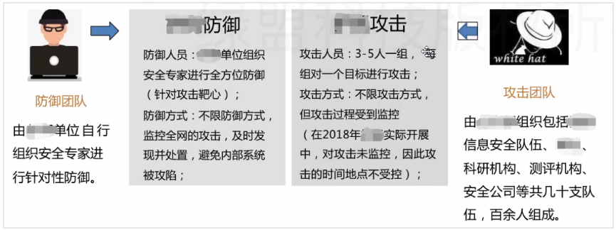
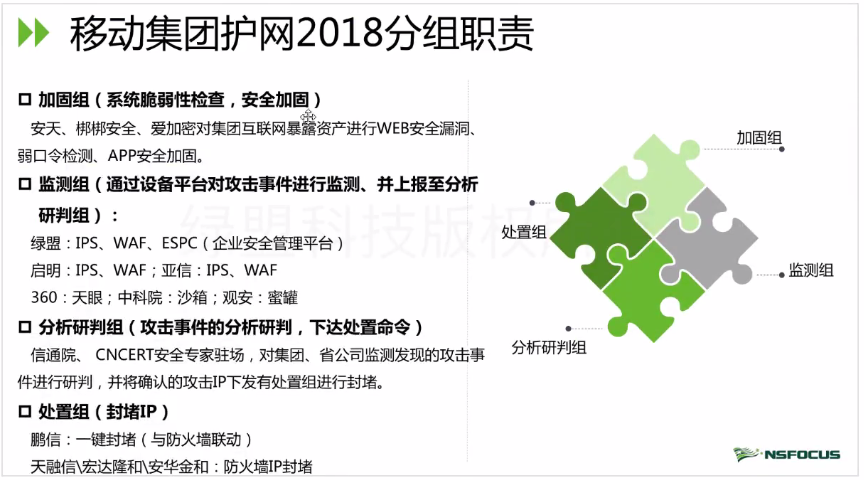
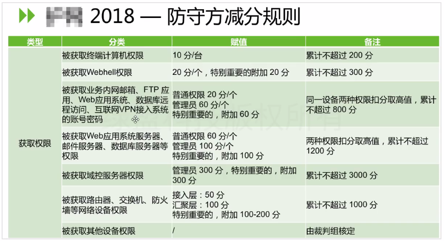
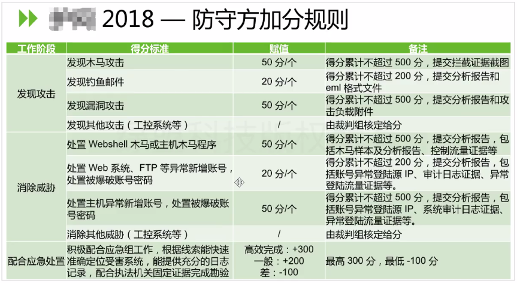
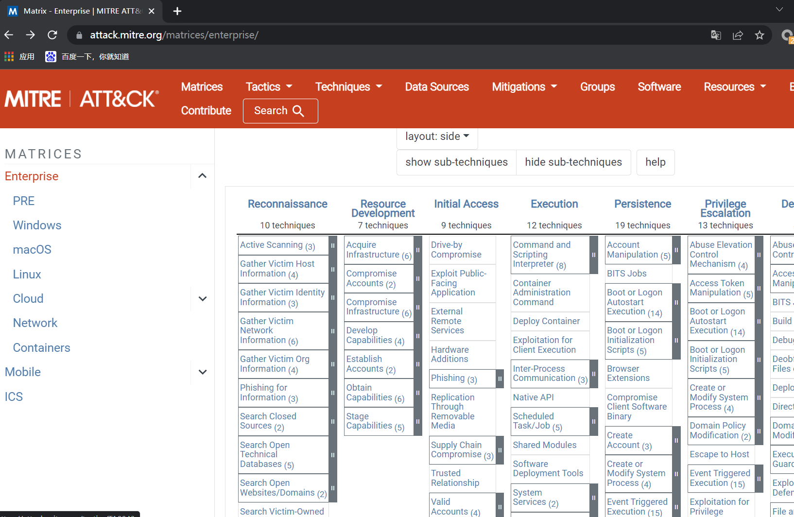
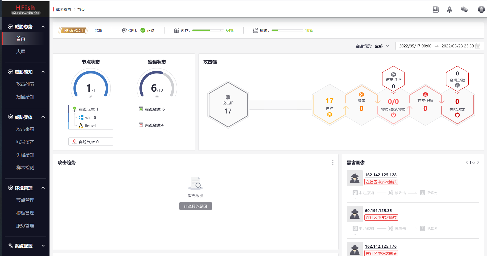
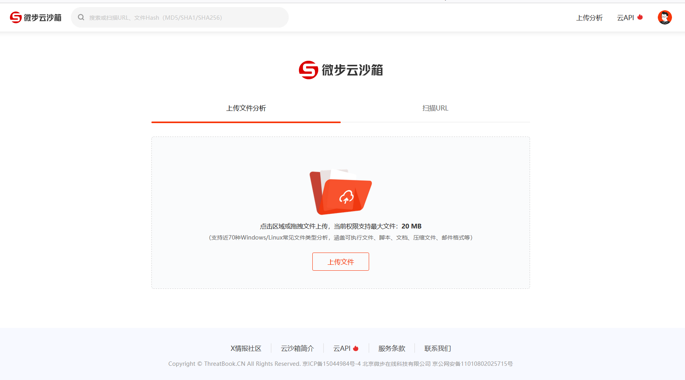

# hvv介绍

### 必备知识点：

在每年的安全活动中，红蓝队的职责，其中大部分强调学习红队技术，那么蓝队技术又有哪些呢？简要来说蓝队就是防守，涉及到应急、溯源、反制、情报等综合性认知和操作能力知识点。掌握红队攻击技术的前提下，蓝队技术能提升一个档次哦。

### 本课知识点：

1. 认识ATT&CK框架技术
2. 认识对抗的蜜罐技术的本质
3. 掌握WAF安全产品部署及应用
4. 掌握IDS在对抗中的部署使用
5. 掌握威胁情报平台对应报告分析
6. 作为一名干饭人要掌握的报告书写专业性

# 演示案例

## 案例1：专业用语-ATT&CK技术简要介绍-报告书写

原版：https://attack.mitre.org/matrices/enterprise

- 国内有ATT&CT翻译参考手册，可以下载参考学习。
- github地址：https://github.com/Dm2333/ATTCK-PenTester-Book

## 案例2：掌握了解-安全攻防蜜罐技术的利用-配合威胁

Hfish部署配合在线威胁平台实现自动分析，记录攻击者攻击手法及攻击过程，攻击IP等信息可作为黑名单。

- [反制溯源_欺骗防御_主动防御-HFish免费蜜罐平台](https://hfish.io/#/)
- [hacklcx/HFish: 安全、可靠、简单、免费的企业级蜜罐 (github.com)](https://github.com/hacklcx/HFish)

## 案例3：攻击拦截-WAF安全产品部署及反制-多种中间件

一般的waf如安全狗，D盾之类的，支持的中间件比较少，推荐使用Openrasp。

目前，OpenRASP 支持 `Java` 和 `PHP` 两种语言，开发的网站应用防护，支持多种中间件

- [OpenRASP 官方文档]( https://rasp.baidu.com/doc/)

## 案例4：追踪反制-HIDS入侵检测系统部署测试-爆破|提权|规则

#### NIDS&HIDS

- NIDS：网络入侵检测系统
- HIDS：主机入侵检测系统

这里介绍两款HIDS：yulong-hids（国产）、wazuh（国外，推荐）

- yulong-hids：优点：中文规则说明
  - https://github.com/ysrc/yulong-hids
- wazuh：ELK日志，攻击行为分析等-爆破|提权
  - 实现入侵行为分析，日志实时监控，规则触发拦截等功能
  - https://documentation.wazuh.com/4.0/index.html

实现入侵行为分析，日志实时监控，规则触发拦截等功能

## 案例5：应急溯源-威胁情报平台对于溯源分析意义-CS后门溯源

- 参考：https://blog.csdn.net/qq_29277155/article/details/79830927

威胁情报一直是安全行业热议的话题，实际上在国内的发展还比较初级。威胁情报具有优秀的预警能力、快速响应能力，并且能改善管理层之间的沟通、加强策略规划和投资。但是大部分企业机构并不具备充分利用威胁情报的能力：

- 1.数据量太大且过于复杂。
- 2.拥有相关知识的人才匮乏。

日常应用：在安全事件、应急响应中，获取威胁情报，作为重要证据，辅助事件处置

高级应用：集成到企业安全管理平台提高监控预警响应能力、结合威胁数据和其他解决方案实现数据安全、优秀的数据展示功能

github链接：https://github.com/ym2011/SecurityTechnique/blob/master/威胁情报/威胁情报.xmind

[值得推荐的威胁情报平台](https://blog.csdn.net/qq_29277155/article/details/79830927)

- [[微步在线X情报社区-威胁情报查询_威胁分析平台_开放社区 (threatbook.cn)](https://x.threatbook.cn/)](https://x.threatbook.cn/)
- [奇安信威胁情报中心 (qianxin.com)](https://ti.qianxin.com/)
- [360威胁情报中心](https://ti.360.net/#/homepage)
- [绿盟威胁情报中心（NTI） (nsfocus.com)](https://nti.nsfocus.com/)
- [VenusEye威胁情报中心](https://www.venuseye.com.cn/)
- [安恒威胁分析平台 (dbappsecurity.com.cn)](https://ti.dbappsecurity.com.cn/)

